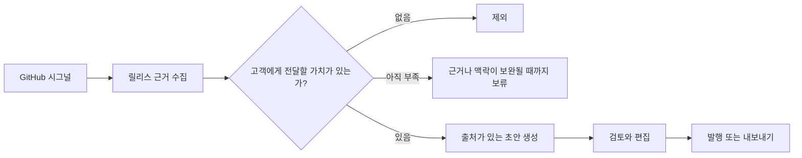

<div align="center">
  
  <h1>Plot</h1>
  <p><strong>빠르게 출시하고, 적게 쓰세요.</strong></p>
  <p>출시된 작업을 고객이 발견하고 이해하는 업데이트로 만듭니다.</p>
</div>

[English](README.md) | [한국어](README.ko.md)

## 제품

에이전트 시대에 출시는 빨라졌습니다. 하지만 고객이 무엇이 출시됐는지 이해하게 만드는 일은 여전히 느립니다. Plot은 이 격차를 메우기 위해 존재합니다.

Plot은 연결된 소스를 살펴보고 초안을 쓰기 전에 이 판단부터 합니다. 고객에게 무의미한 변경은 제외하고, 내용이 더 필요한 변경은 보류하며, 근거가 부족하면 기다립니다. 전달할 가치가 충분해지면 출처를 확인할 수 있는 초안을 준비합니다. 사용자는 검토하고 수정한 뒤 발행 시점을 결정합니다.

**첫 번째 소스는 GitHub이고, 첫 번째 자동 결과물은 릴리스 Changelog입니다.** 이를 시작으로 Blog, B2B Email 등 제품의 진전을 전달하는 다양한 콘텐츠로 확장합니다.

## 현재 동작



- **연결된 작업을 관찰합니다.** 검증된 GitHub webhook을 영속적인 시그널 수집함에 저장합니다. 릴리스 자동화는 기본 활성화되며 별도의 Autonomy 모드를 설정하지 않습니다.
- **의미 있을 때 초안을 만듭니다.** 자동 생성에는 고객 가치 판단과 발행된 릴리스의 근거가 모두 필요합니다. PR 병합, 태그 생성, 시간 경과만으로는 생성하지 않습니다.
- **작업 과정을 확인할 수 있습니다.** 초안의 출처와 리비전을 보존합니다. 실행 기록은 수동 요청과 함께 **History**의 대화로 표시됩니다.
- **발행은 사용자가 결정합니다.** Plot에서 콘텐츠를 준비하고 수정한 뒤 호스팅된 Changelog에 발행하거나 Markdown으로 내보냅니다. 자동 초안 생성이 발행 승인을 대신하지 않습니다.

현재는 여러 릴리스에 걸쳐 보류된 변경을 자동으로 묶지 않습니다. 평가를 우회하는 생성을 막기 위해 기존 예약·일반 이벤트 Routine 실행은 보류되며, 명시적인 수동 실행은 사용할 수 있습니다. 실행 규칙과 구현 범위는 [Autonomy 런타임 문서](docs/architecture/autonomy-runtime.md)를 참고하세요.

## 워크스페이스

| 영역 | 역할 |
| --- | --- |
| **Home** | Plot이 준비 중인 작업과 검토할 내용을 확인합니다. |
| **Chat** | Plot에 지시하거나 질문하고 콘텐츠를 함께 작업합니다. |
| **Automation** | 자동화 설정을 관리합니다. |
| **Contents** | 생성된 콘텐츠를 검토·편집하고 발행하거나 내보냅니다. |
| **Connections** | 제품 소스를 연결하고 관리합니다. |

사이드바의 **History**에서 수동 대화와 자동 실행 기록을 함께 확인합니다.

## 앞으로의 방향

다음 단계는 **Automation을 자동 작업의 단일 설정으로 통합**하고, 콘텐츠별 작성 방법을 재사용 가능한 **콘텐츠 Skill**로 정의하는 것입니다.

- **Skill**은 Changelog, Blog, B2B Email 각각의 작성 지침, 필요한 근거, 결과물 구조, 품질 기준을 정의합니다.
- **Automation**에서는 소스, 이벤트 또는 일정, 사용할 콘텐츠 Skill을 선택합니다. 에이전트는 확보된 자료로 초안을 만들 가치가 있는지 판단합니다.
- 이후 **콘텐츠 자동 선택**을 추가해 허용된 Skill 중 적합한 것을 고르고, 하나의 고객 커뮤니케이션 목표에서 여러 결과물을 준비하도록 확장합니다.

Skill 기반 자동화, 여러 콘텐츠 종류의 자동 선택, Linear·Slack 어댑터는 계획된 확장입니다. 현재 GitHub 릴리스 런타임에는 아직 포함되지 않습니다.

## 저장소

```txt
apps/
  web/  Next.js 애플리케이션과 same-origin API proxy
  api/  Kotlin Spring Boot API, 외부 연동, 영속적인 에이전트 작업 실행

packages/
  api-client/  Plot API용 타입이 정의된 브라우저 클라이언트

contracts/
  plot-api/    버전 관리되는 API contract manifest와 fixtures
```

PostgreSQL에 시그널, 판단, 실행, 콘텐츠를 저장합니다. `apps/api/src/main/resources/db/migration`의 Flyway migration이 스키마를 정의합니다. 백엔드는 Kotlin, Spring Boot, Spring AI, jOOQ를 사용합니다.

## 개발

필요 환경: Java 21, Bun, Docker, `just`.

각 `.env.example`을 바탕으로 `apps/api/.env.local`과 `apps/web/.env.local`을 만들고 필요한 설정을 입력합니다. GitHub 이벤트 처리에는 GitHub App과 webhook 설정이, 콘텐츠 생성에는 모델 제공자의 인증 정보가 필요합니다.

```bash
bun install
```

별도의 터미널에서 API와 웹 애플리케이션을 실행합니다.

```bash
just dev-api
```

```bash
just dev-web
```

검증:

```bash
just lint
just test
just build
```

API 통합 테스트는 Testcontainers로 PostgreSQL을 실행합니다. 자동 평가 테스트는 미리 정의한 모델 응답을 사용합니다.

## 문서

- [Autonomy 런타임과 현재 구현 범위](docs/architecture/autonomy-runtime.md)
- [시스템 아키텍처와 실행 책임](docs/architecture/system-overview.md)
- [비주얼 아이덴티티](DESIGN.md)
- [GitHub App 개발 smoke test](docs/operations/github-app-development-smoke-test.md)
- [GitHub 릴리스 자동화](docs/operations/github-release-automation.md)
- [비공개 저장소 운영 검증](docs/operations/private-repository-production-certification.md)
- [Polar 구독 webhook](docs/operations/polar-subscription-webhook.md)
