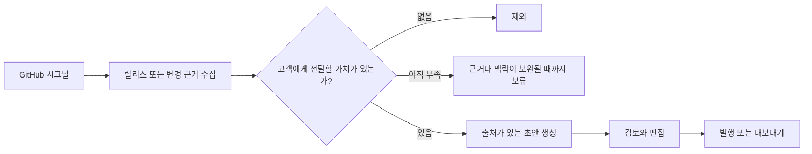

<div align="center">
  
  <h1>Plot</h1>
  <p><strong>빠르게 출시하고, 적게 쓰세요.</strong></p>
  <p>출시된 작업을 고객이 발견하고 이해하는 업데이트로 만듭니다.</p>
</div>

[English](README.md) | [한국어](README.ko.md)

## 제품

에이전트 시대에 출시는 빨라졌습니다. 하지만 고객이 무엇이 출시됐는지 이해하게 만드는 일은 여전히 느립니다. Plot은 이 격차를 메우기 위해 존재합니다.

Plot은 연결된 소스를 살펴보고 초안을 쓰기 전에 이 판단부터 합니다. 고객에게 무의미한 변경은 제외하고, 내용이 더 필요한 변경은 보류하며, 근거가 부족하면 기다립니다. 전달할 가치가 충분해지면 출처를 확인할 수 있는 초안을 준비합니다. 사용자는 검토하고 수정한 뒤 발행 시점을 결정합니다.

**첫 번째 소스는 GitHub이고, 첫 번째 자동 결과물은 릴리스 Changelog입니다.** 콘텐츠 Skill을 사용하면 같은 근거에서 다른 형태의 제품 업데이트도 만들 수 있습니다.

## 현재 동작


```mermaid
flowchart LR
  A[GitHub 시그널] --> B[릴리스 또는 변경 근거 수집]
  B --> C{고객에게 전달할 가치가 있는가?}
  C -->|없음| D[제외]
  C -->|아직 부족| E[근거나 맥락이 보완될 때까지 보류]
  C -->|있음| F[출처가 있는 초안 생성]
  F --> G[검토와 편집]
  G --> H[발행 또는 내보내기]
```

- **연결된 작업을 관찰합니다.** 검증된 GitHub webhook을 영속적인 시그널 수집함에 저장합니다. 릴리스 자동화는 기본 활성화되며 별도의 Autonomy 모드를 설정하지 않습니다.
- **의미 있을 때 초안을 만듭니다.** 릴리스 변경 기록에는 발행된 릴리스와 출처 근거가 필요합니다. 사용자가 설정한 GitHub 변경·PR 병합 Automation은 릴리스 전에 별도의 product update 검토용 초안을 만들 수 있습니다. 유지보수 변경만 있으면 제외하고 판단이 어려우면 수동 검토를 기다립니다.
- **Skill로 콘텐츠의 형태를 정합니다.** Skill은 재사용 가능한 작성 지침입니다. Plot은 `changelog`, `launch-announcement`, `humanizer`를 기본 제공하며 워크스페이스에서 직접 Skill을 추가할 수 있습니다. Automation과 Chat 요청에서 Skill을 선택하면 에이전트는 초안 작성 전에 선택된 Skill을 모두 불러오고, 필요하면 사용 가능한 다른 Skill도 불러옵니다.
- **작업 과정을 확인할 수 있습니다.** 초안의 출처와 리비전을 보존합니다. 실행 기록은 수동 요청과 함께 **History**의 대화로 표시됩니다.
- **발행은 사용자가 결정합니다.** Plot에서 콘텐츠를 준비하고 수정한 뒤 호스팅된 Changelog에 발행하거나 Markdown으로 내보냅니다. 자동 초안 생성이 발행 승인을 대신하지 않습니다.

Automation은 일정(매일·매주) 또는 GitHub 이벤트(기본 브랜치 push, 기본 브랜치로의 PR 병합, 릴리스 발행, Git tag push)에 따라 실행됩니다. 릴리스·태그 Automation은 해당 릴리스의 고정된 범위로 초안을 만듭니다. Push·PR 병합 Automation은 변경 제목의 `feat`, `fix`, `perf`, `security`, `revert` 유형을 1차 기준으로 사용합니다. 릴리스 Automation을 설정하지 않아도 발행된 릴리스는 초안으로 만들어집니다. 일정·push·PR 병합 Automation은 수동으로도 실행할 수 있습니다. 현재는 여러 릴리스에 걸쳐 보류된 변경을 자동으로 묶지 않습니다.

## 워크스페이스

| 영역 | 역할 |
| --- | --- |
| **Home** | Plot이 준비 중인 작업과 검토할 내용을 확인합니다. |
| **Chat** | Plot에 지시하거나 질문하고 콘텐츠를 함께 작업합니다. |
| **Automation** | 자동화 설정을 관리합니다. |
| **Contents** | 생성된 콘텐츠를 검토·편집하고 발행하거나 내보냅니다. |
| **Connections** | 제품 소스를 연결하고 관리합니다. |

사이드바의 **History**에서 수동 대화와 자동 실행 기록을 함께 확인합니다.

## 앞으로의 방향

콘텐츠 Skill과 Automation의 Skill 선택은 이미 동작합니다. 다음 단계는 이를 바탕으로 확장합니다.

- **콘텐츠 Skill 확대.** Blog, B2B Email 등 형식별로 작성 지침, 필요한 근거, 결과물 구조, 품질 기준을 정의한 Skill을 추가합니다.
- **하나의 목표에서 여러 결과물.** 지금은 실행 한 번에 초안 하나를 만듭니다. 같은 고객 커뮤니케이션 목표에서 여러 콘텐츠를 준비하도록 확장합니다.
- **릴리스를 넘는 보류 변경 결합.** 내용이 부족해 보류된 변경을 릴리스 단위로만 보지 않고 이후 작업과 묶습니다.
- **소스 확대.** Linear·Slack 어댑터를 계획하고 있으며, 현재 런타임에는 연결되어 있지 않습니다.

## 저장소

```txt
apps/
  web/  Next.js 애플리케이션과 same-origin API proxy
  api/  Kotlin Spring Boot API, 외부 연동, 영속적인 에이전트 작업 실행

packages/
  api-client/  Plot API용 타입이 정의된 브라우저 클라이언트

contracts/
  plot-api/    버전 관리되는 API contract manifest와 fixtures
```

PostgreSQL에 시그널, 판단, 실행, 콘텐츠를 저장합니다. `apps/api/src/main/resources/db/migration`의 Flyway migration이 스키마를 정의합니다. 백엔드는 Kotlin, Spring Boot, Koog, Exposed DSL, 파라미터 SQL을 사용합니다.

## 개발

필요 환경: Java 21, Bun, Docker, `just`.

각 `.env.example`을 바탕으로 `apps/api/.env.local`과 `apps/web/.env.local`을 만들고 필요한 설정을 입력합니다. GitHub 이벤트 처리에는 GitHub App과 webhook 설정이, 콘텐츠 생성에는 모델 제공자의 인증 정보가 필요합니다.

```bash
bun install
```

별도의 터미널에서 API와 웹 애플리케이션을 실행합니다.

```bash
just dev-api
```

```bash
just dev-web
```

검증:

```bash
just lint
just test
just build
```

API 통합 테스트는 Testcontainers로 PostgreSQL을 실행합니다. 자동 평가 테스트는 미리 정의한 모델 응답을 사용합니다.

## 문서

- [비주얼 아이덴티티](DESIGN.md)
