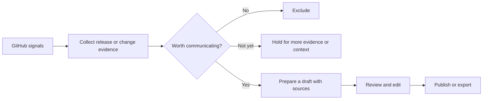

<div align="center">
  
  <h1>Plot</h1>
  <p><strong>Ship fast. Write less.</strong></p>
  <p>Turn shipped work into customer updates people notice and understand.</p>
</div>

[English](README.md) | [한국어](README.ko.md)

## Product

Agent-era shipping got faster. Making sure customers understand what shipped is still slow. Plot exists to close that gap.

Plot watches connected sources and makes that judgment before drafting. It can exclude changes with no customer value, hold changes that need more substance, or wait for missing evidence. When a change warrants communication, Plot prepares a draft with inspectable sources. You review, edit, and decide when to publish.

**GitHub is the first source. Release changelogs are the first automatic output.** They are the starting point for a broader content workflow covering blog posts, B2B emails, and other ways to communicate product progress.

## How it works today



- **Follow connected work.** Verified GitHub webhooks feed a durable signal inbox. Release automation is enabled by default, with no separate Autonomy mode to configure.
- **Draft when it matters.** Release changelogs require a published release and source evidence. Explicit GitHub change and merged PR Routines can prepare a separate product update draft from eligible changes before a release; maintenance-only changes are excluded and unclear changes are held for manual review.
- **Keep the work inspectable.** Drafts retain their source evidence and revisions. Executions appear as conversations in **History**, alongside manual requests.
- **Keep publication deliberate.** Prepare and revise content in Plot, then publish to the hosted changelog or export Markdown. Automatic drafting does not grant publication approval.

The current runtime does not yet combine held changes across releases. Scheduled Routines remain deferred; GitHub change and merged PR Routines use a conservative change-title gate (`feat`, `fix`, `perf`, `security`, or `revert`). Explicit manual runs remain available.

## Workspace

| Area | Purpose |
| --- | --- |
| **Home** | See what Plot is preparing and what needs review. |
| **Chat** | Give instructions, ask questions, and work on content with Plot. |
| **Automation** | Manage automation configuration. |
| **Contents** | Review, edit, publish, and export generated content. |
| **Connections** | Connect and manage product sources. |

**History** in the sidebar brings manual conversations and automatic executions together.

## Where we are headed

The next step is to make **Automation the single place to define automatic work**, with reusable **content Skills** describing how to produce each kind of content.

- **Skills** define writing instructions, required evidence, output structure, and quality criteria for a changelog, blog post, or B2B email.
- **Automations** select sources, event or schedule triggers, and the content Skills to use. The agent decides whether the available material warrants a draft.
- **Automatic content selection** can later choose among allowed Skills and prepare several outputs from the same customer communication goal.

Skill-based automation, automatic selection of multiple content types, and Linear/Slack adapters are planned extensions. They are not part of the current GitHub release runtime.

## Repository

```txt
apps/
  web/  Next.js application and same-origin API proxy
  api/  Kotlin Spring Boot API, integrations, and durable agent workers

packages/
  api-client/  typed browser client for the Plot API

contracts/
  plot-api/    versioned API contract manifest and fixtures
```

PostgreSQL stores signals, decisions, executions, and content. Flyway migrations under `apps/api/src/main/resources/db/migration` define the schema. The backend uses Kotlin, Spring Boot, Koog, Exposed DSL, and parameterized SQL.

## Development

Requirements: Java 21, Bun, Docker, and `just`.

Create `apps/api/.env.local` and `apps/web/.env.local` from their respective `.env.example` files and fill in the required configuration. GitHub event processing needs a configured GitHub App and webhook; generation needs model-provider credentials.

```bash
bun install
```

Start the API and web application in separate terminals:

```bash
just dev-api
```

```bash
just dev-web
```

Validation:

```bash
just lint
just test
just build
```

API integration tests use PostgreSQL through Testcontainers. Automated assessment tests use scripted model responses.

## Documentation

- [Visual identity](DESIGN.md)
- [GitHub App development smoke test](docs/operations/github-app-development-smoke-test.md)
- [GitHub release automation](docs/operations/github-release-automation.md)
- [Private repository production certification](docs/operations/private-repository-production-certification.md)
- [Polar subscription webhook](docs/operations/polar-subscription-webhook.md)
