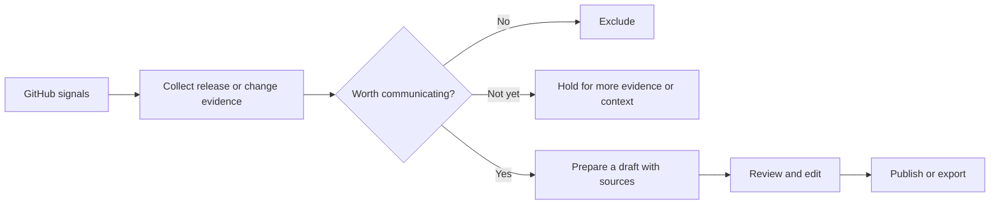

<div align="center">
  
  <h1>Plot</h1>
  <p><strong>Ship fast. Write less.</strong></p>
  <p>Turn shipped work into customer updates people notice and understand.</p>
</div>

[English](README.md) | [한국어](README.ko.md)

## Product

Agent-era shipping got faster. Making sure customers understand what shipped is still slow. Plot exists to close that gap.

Plot watches connected sources and makes that judgment before drafting. It can exclude changes with no customer value, hold changes that need more substance, or wait for missing evidence. When a change warrants communication, Plot prepares a draft with inspectable sources. You review, edit, and decide when to publish.

**GitHub is the first source. Release changelogs are the first automatic output.** Content Skills let the same workflow produce other kinds of product updates from the same evidence.

## How it works today


```mermaid
flowchart LR
  A[GitHub signals] --> B[Collect release or change evidence]
  B --> C{Worth communicating?}
  C -->|No| D[Exclude]
  C -->|Not yet| E[Hold for more evidence or context]
  C -->|Yes| F[Prepare a draft with sources]
  F --> G[Review and edit]
  G --> H[Publish or export]
```

- **Follow connected work.** Verified GitHub webhooks feed a durable signal inbox. Release automation is enabled by default, with no separate Autonomy mode to configure.
- **Draft when it matters.** Release changelogs require a published release and source evidence. Explicit GitHub change and merged PR Automations can prepare a separate product update draft from eligible changes before a release; maintenance-only changes are excluded and unclear changes are held for manual review.
- **Shape content with Skills.** Skills are reusable writing instructions. Plot includes `changelog`, `launch-announcement`, and `humanizer`, and workspaces can add their own. Automations and chat requests can select Skills; the agent loads every selected Skill before drafting and may load other available Skills when useful.
- **Keep the work inspectable.** Drafts retain their source evidence and revisions. Executions appear as conversations in **History**, alongside manual requests.
- **Keep publication deliberate.** Prepare and revise content in Plot, then publish to the hosted changelog or export Markdown. Automatic drafting does not grant publication approval.

Automations run on a schedule (daily or weekly) or on a GitHub event: a push to the default branch, a PR merged into the default branch, a published release, or a pushed Git tag. Release and tag Automations draft from the release's pinned range. Push and merged PR Automations use a conservative change-title gate (`feat`, `fix`, `perf`, `security`, or `revert`). Published releases are drafted even when no release Automation is configured. Scheduled, push, and merged PR Automations can also be run manually. The current runtime does not yet combine held changes across releases.

## Workspace

| Area | Purpose |
| --- | --- |
| **Home** | See what Plot is preparing and what needs review. |
| **Chat** | Give instructions, ask questions, and work on content with Plot. |
| **Automation** | Manage automation configuration. |
| **Contents** | Review, edit, publish, and export generated content. |
| **Connections** | Connect and manage product sources. |

**History** in the sidebar brings manual conversations and automatic executions together.

## Where we are headed

Content Skills and Skill selection in Automations are already in place. The next steps build on them.

- **More content Skills** for formats such as blog posts and B2B emails, each defining writing instructions, required evidence, output structure, and quality criteria.
- **Several outputs from one goal.** Each run currently produces one draft. Plot should be able to prepare several pieces of content from the same customer communication goal.
- **Held changes across releases.** Changes held for more substance should be combined with later work instead of being considered one release at a time.
- **More sources.** Linear and Slack adapters are planned. They do not feed the current runtime.

## Repository

```txt
apps/
  web/  Next.js application and same-origin API proxy
  api/  Kotlin Spring Boot API, integrations, and durable agent workers

packages/
  api-client/  typed browser client for the Plot API

contracts/
  plot-api/    versioned API contract manifest and fixtures
```

PostgreSQL stores signals, decisions, executions, and content. Flyway migrations under `apps/api/src/main/resources/db/migration` define the schema. The backend uses Kotlin, Spring Boot, Koog, Exposed DSL, and parameterized SQL.

## Development

Requirements: Java 21, Bun, Docker, and `just`.

Create `apps/api/.env.local` and `apps/web/.env.local` from their respective `.env.example` files and fill in the required configuration. GitHub event processing needs a configured GitHub App and webhook; generation needs model-provider credentials.

```bash
bun install
```

Start the API and web application in separate terminals:

```bash
just dev-api
```

```bash
just dev-web
```

Validation:

```bash
just lint
just test
just build
```

API integration tests use PostgreSQL through Testcontainers. Automated assessment tests use scripted model responses.

## Documentation

- [Visual identity](DESIGN.md)
