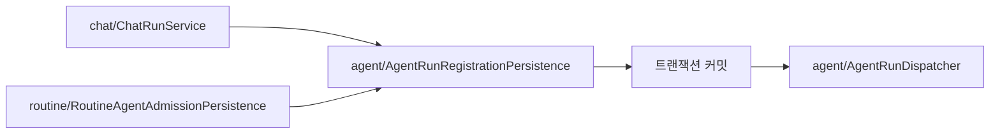

# Plot API

Kotlin / Spring Boot 백엔드입니다. 기능별 코드는 `src/main/kotlin/com/plot/api`에 있습니다.

## 도메인별 책임

| 도메인 | 담당하는 일 | 시작점 |
| --- | --- | --- |
| `chat` | 사용자 요청, 대화·응답 버전, 재시도 대상 검증 | `ChatRunService`, `ChatQueryService`, `ChatPersistence` |
| `routine` | 일정·트리거·조건 검사, 예약 실행 등록, 결과·활동 커서 반영 | `RoutineWorker`, `RoutineAgentAdmissionPersistence`, `RoutineAgentRunProjection` |
| `agent` | 공통 실행 등록, 고정 입력·도구 기록, 모델 판단, 실행권·재시도·복구 | `AgentRunRegistrationPersistence`, `AgentExecutionSnapshotPersistence`, `AgentRunWorker` |
| `artifact` | 콘텐츠 생성 작업과 결과물 저장·조회·수정·내보내기 | `workflow/ArtifactWorkflowRunService`, `ArtifactController` |

## 코드를 읽는 순서

### 실행 등록



- `chat`, `routine`, `agent.ArtifactAutomationAdmissionService`가 각 진입점의 요청 검증, 잠금, 트랜잭션을 담당합니다. `agent` 등록 저장소는 전달받은 실행·출처·입력을 저장합니다.
- 채팅의 동일 요청 재전송은 `insertChatIfAbsent`, 예약 실행의 새 등록은 `insertRequired`를 사용합니다. 기존 실행과의 충돌 판단은 호출자가 담당합니다.
- `ChatCompatibilityWriter`는 실행과 대화의 turn/version을 연결하고 실행 설정은 `AgentExecutionSnapshotPersistence`에 저장합니다. 일반 Chat은 최근 user/assistant 대화도 실행 설정에 고정해 다음 턴과 재시도에서 같은 맥락을 사용합니다.

### 실행과 완료

```text
agent/AgentRunDispatcher → AgentRunWorker
  → ReadOnlyAgentTools 또는 artifact/workflow
  → AgentRunExecutionPersistence
  → config/AgentRunCompletionProjectionAdapter
      ├→ chat/ChatPersistence: 응답의 실행 중 상태 해제
      └→ routine/RoutineAgentRunProjection: 예약 결과·활동 커서 반영
```

- 모든 실행은 같은 작업자를 사용하지만 제품 경계는 분리합니다. 일반 Chat은 평문 응답 또는 명시적인 Artifact handoff로 완료할 수 있습니다. GitHub 릴리스 자동화는 Chat turn을 만들지 않는 `AUTOMATION` 실행이고, Routine·Automation·복제 실행은 Artifact handoff가 필수입니다.
- 완료 반영은 실행 상태 변경 직후 동기로 호출하며 기존 트랜잭션 경계를 유지합니다. 성공한 실행만 활동 커서를 전진시킵니다. GitHub 릴리스 후속 처리는 커밋 뒤에 요청합니다.
- GitHub 릴리스 전용 실행 조건은 `GitHubAgentRunExecutionPolicy`가 담당합니다.

### 조회와 재시도

- `ChatQueryService`는 `ChatPersistence`에서 대화·버전을, `AgentRunQueryPersistence`에서 실행·결과를 읽어 응답 DTO를 만듭니다.
- `ChatRunService`는 재시도 가능 여부를 잠금 안에서 다시 확인하고 새 응답 버전을 연결합니다.
- 실행 설정과 도구 기록은 `AgentExecutionSnapshotPersistence`, 출처와 입력 복사는 `AgentRunRegistrationPersistence.copySourcesAndInputs`가 담당합니다. 재시도는 저장된 입력을 재사용합니다.

## 저장소와 설정

- 기능별 `*Repository` / `*Persistence`에서 DB 접근을 찾습니다. 일반 CRUD는 기능별 Exposed 테이블과 DSL을 사용하고, PostgreSQL 상태 전이는 파라미터 SQL로 그대로 표현합니다.
- `persistence/SqlExecutor`는 파라미터 SQL 실행과 Spring 예외 변환을, `TransactionExecutor`는 여러 저장 작업을 묶는 트랜잭션 경계를 담당합니다.
- 일반 서비스·저장소는 생성자 주입을 사용합니다. `AgentConfiguration`, `RoutineConfiguration`, `ArtifactWorkflowConfiguration`은 실행기와 작업자 설정을 조립합니다.
- 기존 `/api/agent-runs`, `/api/sessions` 주소와 `plot.routine-agent` 설정 키는 유지합니다.
- `agent`의 실행 설정·도구 기록은 기존 `chat_execution_*` 테이블을 사용합니다. 재시도 여부를 읽는 기존 응답 버전 연결도 유지합니다. 패키지 경계 정리를 위해 DB 마이그레이션을 추가하지 않았습니다.

## 로컬 검증

Java 21 도구 체인과 실행 중인 Docker가 필요합니다. API 폴더에서 실행합니다.

```sh
./gradlew test
./gradlew build
```

기본 테스트는 Testcontainers의 PostgreSQL을 사용하고 `live-eval` 태그는 제외합니다. 실제 모델 평가는 별도 `liveEval` 작업입니다.
