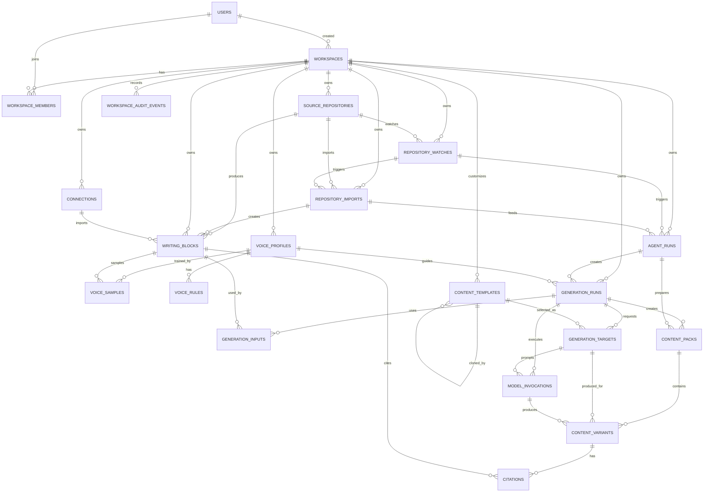

# Data Architecture

This document defines Plot's backend data model for the v0 product/data
architecture. It is intentionally framework-neutral; implementation can live in
whichever backend runtime best fits production cost and operations.

v0 proves one loop:

```txt
shipping window / release cadence
  -> source adapters (GitHub first)
  -> work session
  -> task
  -> optional automation run
  -> source watch or refresh
  -> selected shipped changes
  -> Writing Blocks + Content Templates + Voice Profile
  -> Update Agent Run
  -> direct model-provider API call
  -> editable Content Variants grouped in a Content Pack
  -> source-cited, on-style content variants
```

Uploads, paste, URL import, non-GitHub integrations, formal content checks,
direct publishing, scheduled publishing, and broad automation rules are outside
the first v0 proof. Lightweight repository watches and update-agent runs are in
v0 because the product is autonomous draft preparation, not a manual composer.

## Provider-neutral source adapter boundary

The first implemented adapter uses the additive V2 model:

```txt
Connection -> ConnectionNamespaceBinding -> SourceNamespace
                                                |-> SourceScope
                                                |     \-> SourceObservation -> SourceImport
                                                \-> WritingBlock <- WritingBlockScope -> SourceScope
```

`connections` represent credentials and provider access (GitHub App today,
Linear/Jira/Slack later). `source_namespaces` own canonical external identity;
bindings allow credentials to rotate without changing imported object identity.
`source_scopes` describe collections or queries such as a GitHub repository,
Slack channel, Linear team/project, Jira project/filter, or Drive corpus.

Provider DTOs are normalized directly into Writing Blocks. Their idempotency
key is `(workspace_id, source_namespace_id, source_kind,
external_object_key)`, independent of connection and scope. A block can belong
to multiple scopes through `writing_block_scopes`. `source_observations` record
partial or complete authority-bearing reads, and `source_imports` record the
user-visible attempt and counters. Thread messages, comments, file items, and
canvas-like sub-content can be represented as `writing_block_fragments`, while
cross-object links use `writing_block_relations` and relation observations.
No provider-specific raw-record table is required.

The older repository-specific entities later in this document remain
conceptual v0 history and must not be copied into new adapters. The implemented
V2 schema and its migration are authoritative for source adapter work.

## Design Principles

- PostgreSQL is the system of record.
- Plot is an autonomous post-shipping update agent, not a company knowledge
  base. Store the source material, generated drafts, voice/style guidance, and
  citation metadata needed to produce updates; do not model a general knowledge
  graph in v0.
- Workspace-scoped data is the default. Domain records include `workspace_id`
  unless they are global identity records or system templates.
- User identity and workspace access are separate. `users` is global identity;
  `workspace_members` is the authorization source of truth.
- Generated drafts are derived data, but they are persisted because users edit,
  copy, and compare them.
- Generation must be explainable later. Runs store snapshots of source blocks,
  templates, voice profile/rules/samples, model config, and prompt assembly
  version.
- v0 uses a direct backend-managed model-provider call. `model_invocations`
  records that call. `agent_runs` records the higher-level update-agent attempt.
- `work_sessions` and `tasks` are the user-facing agentic UX objects.
  `agent_runs` is execution detail under a task.
- Agent work must produce inspectable artifacts, not only a transcript. Use
  `task_artifacts` for plans, source maps, content pack links, citation maps,
  style notes, and verification summaries.
- Plot should not model review as a selectable mode or formal approval gate.
  Source support belongs in citations, source references, generated content
  metadata, and human-controlled publishing handoff.
- Recurring or scheduled work should be represented as visible automation
  recipes and runs, not invisible cron behavior. `automation_recipes` can be
  deferred from the first manual v0 flow, but the model should leave room for it.
- v0 implements GitHub as the first shipped-work source adapter. User-requested
  imports and lightweight repository watches are adapter behavior, not the
  visible product surface. Publishing remains human-controlled outside Plot.
- Prefer `status` fields over destructive deletes for user-visible objects.
- IDs are UUIDs. Tables use `created_at` and `updated_at` unless noted.

## PostgreSQL And Tenancy Conventions

- Enable `citext` for case-insensitive emails and slugs, or store normalized
  lowercase values with equivalent unique indexes.
- Generate UUIDs in the application or with a database default, but keep the API
  contract UUID-based from the start.
- Every workspace-scoped read and write must verify that the acting user has an
  active `workspace_members` row for the target workspace.
- Every workspace-scoped table should have `unique (workspace_id, id)` in
  addition to its primary key. This enables composite foreign keys that prevent
  cross-workspace links.
- Use composite foreign keys for high-risk links:

```sql
foreign key (workspace_id, source_repository_id)
  references source_repositories(workspace_id, id)
```

- System templates are the main exception: `content_templates.workspace_id` can
  be `null`, so template access needs explicit service-layer validation.

## Core Flow

```txt
User
  -> WorkspaceMember
  -> Workspace
  -> WorkSession
  -> Task
  -> Connection
  -> SourceRepository
  -> RepositoryWatch
  -> RepositoryImport
  -> WritingBlock
  -> ContentTemplate
  -> VoiceProfile
  -> AgentRun
  -> GenerationRun
  -> GenerationTarget
  -> ModelInvocation
  -> ContentPack
  -> ContentVariant
  -> Citation
```

## Entity Groups

```txt
Identity and tenancy
  User
  Workspace
  WorkspaceMember
  WorkspaceInvitation

First shipped-work source adapter
  Connection
  SourceRepository
  RepositoryWatch
  RepositoryImport
  WritingBlock

Sessions and tasks
  WorkSession
  SessionMessage
  Task
  TaskArtifact
  SourceSelectionItem
  AutomationRecipe
  AutomationRun

Deferred supporting inputs
  UploadedFile

Voice and style
  VoiceProfile
  VoiceSample
  VoiceRule

Agent orchestration
  AgentRun

Templates
  ContentTemplate

Generation
  GenerationRun
  GenerationInput
  GenerationTarget
  ModelInvocation
  ContentPack
  ContentVariant
  Citation
  WorkspaceAuditEvent
```

## Identity And Tenancy

### User

`users` is global identity. It does not grant workspace access by itself.

```sql
users (
  id uuid primary key,
  email citext not null unique,
  display_name text,
  avatar_url text,
  status varchar not null,
  last_login_at timestamptz,
  created_at timestamptz not null,
  updated_at timestamptz not null
);
```

`status`:

```txt
ACTIVE
DISABLED
DELETED
```

### Workspace

`workspaces` is the tenant boundary for Plot data.

```sql
workspaces (
  id uuid primary key,
  name text not null,
  slug citext not null unique,
  created_by_user_id uuid not null references users(id),
  status varchar not null,
  created_at timestamptz not null,
  updated_at timestamptz not null
);
```

`status`:

```txt
ACTIVE
SUSPENDED
ARCHIVED
```

Rules:

- Current ownership is derived from active `workspace_members` rows with
  `role = OWNER`.
- `created_by_user_id` is historical attribution, not an authorization source.
- Default voice/style is represented by the single active
  `voice_profiles.is_default = true` row per workspace. `style_instruction` can
  add one-off guidance on a specific generation run.

### WorkspaceMember

`workspace_members` defines who can access a workspace and what they can do.

```sql
workspace_members (
  id uuid primary key,
  workspace_id uuid not null references workspaces(id),
  user_id uuid not null references users(id),
  role varchar not null,
  status varchar not null,
  joined_at timestamptz,
  created_at timestamptz not null,
  updated_at timestamptz not null,

  unique (workspace_id, id),
  unique (workspace_id, user_id)
);
```

`role`:

```txt
OWNER
ADMIN
EDITOR
VIEWER
```

`status`:

```txt
ACTIVE
REMOVED
```

Role intent:

| Role | Intent |
| --- | --- |
| `OWNER` | Destructive workspace settings and member management |
| `ADMIN` | Workspace settings, integrations, and templates |
| `EDITOR` | Import blocks, generate and edit content |
| `VIEWER` | Read blocks, packs, variants, and settings |

### WorkspaceInvitation

`workspace_invitations` handles pending membership. It can be deferred if v0
starts with single-user workspaces.

```sql
workspace_invitations (
  id uuid primary key,
  workspace_id uuid not null references workspaces(id),
  email citext not null,
  role varchar not null,
  token_hash text not null,
  status varchar not null,
  invited_by_user_id uuid not null references users(id),
  accepted_by_user_id uuid references users(id),
  expires_at timestamptz not null,
  accepted_at timestamptz,
  created_at timestamptz not null,
  updated_at timestamptz not null,

  unique (workspace_id, id)
);
```

`status`:

```txt
PENDING
ACCEPTED
EXPIRED
CANCELLED
```

Rule:

- Create the `workspace_members` row only when an invitation is accepted.

## Inputs

### SourceRepository

`source_repositories` stores a repository selected from an authenticated GitHub
connection. v0 uses it as the repository source for watches, agent runs, and
user-requested import overrides.

```sql
source_repositories (
  id uuid primary key,
  workspace_id uuid not null references workspaces(id),
  connection_id uuid not null,

  provider varchar not null,
  external_repository_id text,
  owner text not null,
  name text not null,
  full_name text,
  url text not null,
  default_branch text,
  visibility varchar not null,
  status varchar not null,

  last_imported_at timestamptz,
  created_by_user_id uuid references users(id),
  created_at timestamptz not null,
  updated_at timestamptz not null,

  unique (workspace_id, id),
  unique (workspace_id, connection_id, provider, owner, name),
  foreign key (workspace_id, connection_id)
    references connections(workspace_id, id)
);
```

`provider`:

```txt
GITHUB
```

`visibility`:

```txt
PUBLIC
PRIVATE
INTERNAL
```

`status`:

```txt
ACTIVE
ARCHIVED
ERROR
```

Rule:

- v0 repository-backed sources come from the GitHub adapter. Public and private
  repositories use the same import flow as long as the workspace connection has
  access.

### RepositoryWatch

`repository_watches` stores the lightweight autonomous monitoring configuration
for a selected repository. It does not publish anything; it only decides when an
update-agent run should import or refresh shipped changes.

```sql
repository_watches (
  id uuid primary key,
  workspace_id uuid not null references workspaces(id),
  source_repository_id uuid not null,

  name text,
  watch_kind varchar not null,
  cadence varchar,
  base_ref text,
  head_ref text,
  tag_pattern text,
  milestone text,
  filters jsonb,

  status varchar not null,
  last_checked_at timestamptz,
  next_check_at timestamptz,
  created_by_user_id uuid references users(id),
  created_at timestamptz not null,
  updated_at timestamptz not null,

  unique (workspace_id, id),
  foreign key (workspace_id, source_repository_id)
    references source_repositories(workspace_id, id)
);
```

`watch_kind`:

```txt
TAG_RANGE
DATE_RANGE
BRANCH_RANGE
MILESTONE
MANUAL_CADENCE
```

`cadence`:

```txt
DAILY
WEEKLY
PER_RELEASE
MANUAL
```

`status`:

```txt
ACTIVE
PAUSED
ERROR
ARCHIVED
```

Rules:

- Repository watches create or refresh `repository_imports` through an
  `agent_runs` row.
- Watch output is a draft queue, never direct publish.

### RepositoryImport

`repository_imports` records one import for a selected release window. It can be
started by a user, repository watch, or update-agent run. It creates Writing
Blocks for PRs, commit groups, releases, issues, or other source records
discovered in that window.

```sql
repository_imports (
  id uuid primary key,
  workspace_id uuid not null references workspaces(id),
  source_repository_id uuid not null,
  repository_watch_id uuid,

  trigger_type varchar not null,
  import_kind varchar not null,
  range_label text,
  base_ref text,
  head_ref text,
  since_at timestamptz,
  until_at timestamptz,
  milestone text,
  filters jsonb,

  status varchar not null,
  imported_block_count int not null default 0,
  error_message text,
  started_at timestamptz,
  finished_at timestamptz,
  created_by_user_id uuid references users(id),
  created_at timestamptz not null,
  updated_at timestamptz not null,

  unique (workspace_id, id),
  foreign key (workspace_id, source_repository_id)
    references source_repositories(workspace_id, id),
  foreign key (workspace_id, repository_watch_id)
    references repository_watches(workspace_id, id)
);
```

`trigger_type`:

```txt
USER_REQUEST
WATCH_REFRESH
AGENT_REQUEST
```

`import_kind`:

```txt
TAG_RANGE
DATE_RANGE
BRANCH_RANGE
MILESTONE
MANUAL_SELECTION
```

`status`:

```txt
PENDING
RUNNING
SUCCEEDED
FAILED
CANCELLED
```

Rules:

- Repository imports are bounded snapshots. Watches can trigger them, but they do
  not imply direct publishing or unbounded crawling.
- Imported records become `writing_blocks`; they are not generated content yet.
- `writing_blocks` also power the shipped-work source timeline. The timeline is a
  product view over imported source material, not a separate knowledge store.
- The update agent proposes which imported blocks should be included in a pack;
  a human or external agent can adjust the source set before generation or
  export.

### Connection

`connections` represents an authenticated external source. v0 includes GitHub
connections so Plot can import, watch, and draft from public and private
repositories without requiring users to paste PR links. Other providers are
deferred.

```sql
connections (
  id uuid primary key,
  workspace_id uuid not null references workspaces(id),
  provider varchar not null,
  connection_kind varchar not null,
  name text,
  external_account_id text,
  external_account_login text,
  external_installation_id text,
  permissions jsonb,
  scopes jsonb,
  credentials_ref text,
  credential_expires_at timestamptz,
  sync_cursor jsonb,
  status varchar not null,
  last_synced_at timestamptz,
  created_by_user_id uuid references users(id),
  created_at timestamptz not null,
  updated_at timestamptz not null,

  unique (workspace_id, id)
);
```

`connection_kind`:

```txt
GITHUB_APP_INSTALLATION
GITHUB_OAUTH_AUTHORIZATION
```

`provider`:

```txt
GITHUB
```

Deferred provider values:

```txt
LINEAR
SLACK
GOOGLE_DRIVE
MANUAL_URL
```

`status`:

```txt
ACTIVE
NEEDS_REAUTH
DISABLED
ERROR
```

Rules:

- v0 should prefer a GitHub App installation when possible because it gives
  repository-scoped access for private repositories without asking users to make
  repositories public.
- `credentials_ref` points to encrypted credentials in the secret store. Raw
  tokens are not stored in PostgreSQL.
- `permissions` and `scopes` capture the granted access snapshot used when a
  repository is selected or an import is started.

### UploadedFile

`uploaded_files` stores upload metadata. File bytes live in object storage, not
PostgreSQL. This is deferred until after the GitHub release-window loop works;
the first v0 proof should not depend on uploaded files.

```sql
uploaded_files (
  id uuid primary key,
  workspace_id uuid not null references workspaces(id),
  uploaded_by_user_id uuid references users(id),
  storage_key text not null,
  original_filename text not null,
  mime_type text,
  byte_size bigint not null,
  checksum_sha256 text,
  status varchar not null,
  processed_at timestamptz,
  error_message text,
  created_at timestamptz not null,
  updated_at timestamptz not null,

  unique (workspace_id, id)
);
```

`status`:

```txt
UPLOADED
PROCESSING
READY
FAILED
DELETED
```

### WritingBlock

`writing_blocks` is the canonical source-material object for v0 generation.

```sql
writing_blocks (
  id uuid primary key,
  workspace_id uuid not null references workspaces(id),

  source_origin varchar not null,
  source_kind varchar not null,

  title text,
  body text,
  url text,
  canonical_url text,
  author text,
  platform varchar,

  source_repository_id uuid references source_repositories(id),
  repository_import_id uuid references repository_imports(id),
  connection_id uuid references connections(id),
  external_id text,

  metadata jsonb,
  content_hash text,
  source_fingerprint text,
  source_created_at timestamptz,
  source_updated_at timestamptz,
  ingested_at timestamptz not null,
  last_seen_at timestamptz,
  status varchar not null,

  created_by_user_id uuid references users(id),
  created_at timestamptz not null,
  updated_at timestamptz not null,
  processed_at timestamptz,

  unique (workspace_id, id),
  foreign key (workspace_id, source_repository_id)
    references source_repositories(workspace_id, id),
  foreign key (workspace_id, repository_import_id)
    references repository_imports(workspace_id, id),
  foreign key (workspace_id, connection_id)
    references connections(workspace_id, id)
);
```

`source_origin`:

```txt
REPOSITORY_IMPORT
CONNECTION
```

Deferred source origins:

```txt
UPLOAD
PASTE
URL
MANUAL
IMPORTED_WRITING
```

`source_kind`:

```txt
GITHUB_PR
GITHUB_COMMIT_GROUP
GITHUB_COMMIT
GITHUB_RELEASE
GITHUB_ISSUE
```

Deferred source kinds:

```txt
UPLOADED_DOC
PASTED_TEXT
URL_PAGE
SHORT_SOCIAL_POST
PROFESSIONAL_SOCIAL_POST
THREAD_POST
BLOG_POST
NEWSLETTER
BRAND_DOC
ACCEPTED_GENERATION
MANUAL_NOTE
```

`status`:

```txt
ACTIVE
IGNORED
ARCHIVED
FAILED
```

Recommended indexes:

```sql
create unique index writing_blocks_external_source_uk
on writing_blocks(workspace_id, connection_id, external_id)
where connection_id is not null and external_id is not null;

create unique index writing_blocks_repository_source_uk
on writing_blocks(workspace_id, source_repository_id, external_id)
where source_repository_id is not null and external_id is not null;

create index writing_blocks_workspace_status_created_idx
on writing_blocks(workspace_id, status, created_at desc);

create index writing_blocks_workspace_content_hash_idx
on writing_blocks(workspace_id, content_hash)
where content_hash is not null;
```

`content_hash` is a duplicate-detection signal, not a hard uniqueness rule.

## Voice And Style

Voice/style is a core quality layer for v0. Plot should not only draft from
source material; it should draft in the team's accepted tone, terminology,
structure, and channel style.

### VoiceProfile

`voice_profiles` groups rules and samples into selectable team or channel style
guidance.

```sql
voice_profiles (
  id uuid primary key,
  workspace_id uuid not null references workspaces(id),
  created_by_user_id uuid references users(id),
  profile_type varchar not null,
  name text not null,
  summary text,
  status varchar not null,
  is_default boolean not null default false,
  metadata jsonb,
  created_at timestamptz not null,
  updated_at timestamptz not null,

  unique (workspace_id, id)
);
```

`profile_type`:

```txt
PERSONAL
BRAND
TEAM
PROJECT
```

`status`:

```txt
ACTIVE
DRAFT
ARCHIVED
```

Default voice rule:

```sql
create unique index voice_profiles_one_default_per_workspace
on voice_profiles(workspace_id)
where is_default = true and status = 'ACTIVE';
```

### VoiceSample

`voice_samples` stores examples used to describe or extract voice. Every sample
is backed by a `WritingBlock`; pasted writing samples create a block first.

```sql
voice_samples (
  id uuid primary key,
  workspace_id uuid not null references workspaces(id),
  voice_profile_id uuid not null,
  writing_block_id uuid not null,
  channel varchar,
  sample_type varchar not null,
  sample_text text,
  included boolean not null default true,
  quality_score numeric,
  status varchar not null default 'ACTIVE',
  created_by_user_id uuid references users(id),
  created_at timestamptz not null,
  updated_at timestamptz not null,

  unique (workspace_id, id),
  foreign key (workspace_id, voice_profile_id)
    references voice_profiles(workspace_id, id),
  foreign key (workspace_id, writing_block_id)
    references writing_blocks(workspace_id, id)
);
```

`sample_type`:

```txt
SHORT_SOCIAL_POST
PROFESSIONAL_SOCIAL_POST
THREAD_POST
BLOG_POST
NEWSLETTER
BRAND_DOC
PAST_CONTENT
ACCEPTED_GENERATION
USER_EDIT
PASTED_TEXT
UPLOADED_FILE
```

Rule:

- Voice samples are style inputs, not general source material. v0 can accept a
  small set of accepted examples without turning Plot into a broad knowledge
  layer.

### VoiceRule

`voice_rules` stores explicit style instructions, including word-choice
preferences that are narrow enough to express as instructions. Channel-specific
voice/style can be represented with the optional `channel` field.

```sql
voice_rules (
  id uuid primary key,
  workspace_id uuid not null references workspaces(id),
  voice_profile_id uuid not null,
  channel varchar,
  rule_type varchar not null,
  instruction text not null,
  polarity varchar not null,
  strength int not null,
  status varchar not null default 'ACTIVE',
  source varchar,
  created_by_user_id uuid references users(id),
  created_at timestamptz not null,
  updated_at timestamptz not null,

  unique (workspace_id, id),
  foreign key (workspace_id, voice_profile_id)
    references voice_profiles(workspace_id, id),
  check (strength between 1 and 5)
);
```

`rule_type`:

```txt
TONE
STRUCTURE
OPENING
ENDING
WORD_CHOICE
FORBIDDEN_PHRASE
PREFERRED_PHRASE
FORMATTING
CTA
CLAIM_STYLE
```

`polarity`:

```txt
DO
DO_NOT
PREFER
AVOID
```

## Sessions And Tasks

### WorkSession

`work_sessions` is the chat-like surface for starting, steering, and inspecting
update work. A session can create one or more tasks. It is the Plot equivalent
of an agent thread or writing session.

```sql
work_sessions (
  id uuid primary key,
  workspace_id uuid not null references workspaces(id),
  voice_profile_id uuid,

  title text,
  status varchar not null,

  created_by_user_id uuid references users(id),
  last_activity_at timestamptz,
  created_at timestamptz not null,
  updated_at timestamptz not null,

  unique (workspace_id, id),
  foreign key (workspace_id, voice_profile_id)
    references voice_profiles(workspace_id, id)
);
```

`status`:

```txt
OPEN
WAITING_FOR_USER
RUNNING
READY
ARCHIVED
```

Rules:

- Sessions are user-facing. They should be stable enough to resume later.
- The first screen should create or resume a session before asking users to
  manage integrations.
- Do not add `session_type` yet. A single visible session can contain chat,
  update-pack preparation, and autonomous task steering over time.
- Output and channel target selection belongs to automation recipes, generation
  targets, content packs, or variants, not to the durable work session itself.
- Review is not a session mode. Plot should provide source-cited content and
  human-controlled publishing handoff rather than formal in-product approval
  workflows.
- Do not add a generic `source_scope` to sessions. Source range belongs to
  source/import, automation recipe, and generation models where it can be
  validated against connected sources.

### SessionMessage

`session_messages` stores the transcript for human, agent, and system turns.
It is useful for clarifying questions and auditability, but final source
citations and generated artifacts should live outside the raw chat log.

```sql
session_messages (
  id uuid primary key,
  workspace_id uuid not null references workspaces(id),
  work_session_id uuid not null,

  sender_type varchar not null,
  message_type varchar not null,
  body text,
  payload jsonb,

  created_by_user_id uuid references users(id),
  created_at timestamptz not null,

  unique (workspace_id, id),
  foreign key (workspace_id, work_session_id)
    references work_sessions(workspace_id, id)
);
```

`sender_type`:

```txt
USER
AGENT
SYSTEM
EXTERNAL_AGENT
```

`message_type`:

```txt
TEXT
QUESTION
DECISION
STATUS
ARTIFACT_REFERENCE
```

### Task

`tasks` is the durable user-visible work item for session and agent work
surfaces. A task can be created from a work session, repository watch, user
request, external agent request, or future automation run, but it should not
encode the full automation schedule that created it.

```sql
tasks (
  id uuid primary key,
  workspace_id uuid not null references workspaces(id),
  work_session_id uuid,
  repository_watch_id uuid,

  title text not null,
  status varchar not null,

  created_by_user_id uuid references users(id),
  assigned_to_user_id uuid references users(id),
  last_activity_at timestamptz,
  created_at timestamptz not null,
  updated_at timestamptz not null,

  unique (workspace_id, id),
  foreign key (workspace_id, work_session_id)
    references work_sessions(workspace_id, id),
  foreign key (workspace_id, repository_watch_id)
    references repository_watches(workspace_id, id)
);
```

`status`:

```txt
QUEUED
PLANNING
IMPORTING_SOURCES
SELECTING_SOURCES
RUNNING
CHECKING
BLOCKED
READY
EXPORTED
FAILED
CANCELLED
ARCHIVED
```

Rules:

- Tasks are the source of truth for visible work state.
- A blocked task must explain the missing source, permission, context, or
  input it needs.
- Do not add `task_type` in the foundation. Add a workflow discriminator later
  only when the backend has multiple real task executors to route between.
- Do not add `objective`. Durable task intent should come from the title,
  session messages, future input snapshots, or artifacts instead of a generic
  text field that can drift.
- Task priority is intentionally omitted. Plot tasks are short-running
  update-generation units, not a general project-management queue.
- Scheduled or batch automation should be modeled through automation recipes
  and run history, not through a task mode enum.
- Tasks are short-running update-generation or citation-preparation units, not
  long-lived project-management tasks with deadline workflows. Do not add
  `due_at` unless the product introduces an explicit deadline feature.
- Do not add a generic `source_scope` to tasks. Source range belongs to
  source/import, automation recipe, and generation models where it can be
  validated against connected sources.

### TaskArtifact

`task_artifacts` stores inspectable outputs from a task. Artifacts make agent
work inspectable without forcing users to read every message or tool call.

```sql
task_artifacts (
  id uuid primary key,
  workspace_id uuid not null references workspaces(id),
  task_id uuid not null,

  artifact_type varchar not null,
  artifact_ref_type varchar,
  artifact_ref_id uuid,
  title text,
  summary text,
  payload jsonb,
  status varchar not null,

  created_by_user_id uuid references users(id),
  created_at timestamptz not null,
  updated_at timestamptz not null,

  unique (workspace_id, id),
  foreign key (workspace_id, task_id)
    references tasks(workspace_id, id)
);
```

`artifact_type`:

```txt
AGENT_PLAN
SOURCE_TIMELINE
SOURCE_SELECTION
SOURCE_MAP
CONTENT_PACK
CITATION_MAP
STYLE_REPORT
VERIFICATION_SUMMARY
ERROR_REPORT
```

`status`:

```txt
DRAFT
READY
NEEDS_SOURCE
ACCEPTED
REJECTED
SUPERSEDED
```

Rules:

- `artifact_ref_type` and `artifact_ref_id` may point to another typed object,
  such as `CONTENT_PACK`, `CONTENT_VARIANT`, `CITATION`, or `WRITING_BLOCK`.
- v0 does not need polymorphic foreign keys. The application validates
  references and stores workspace-scoped snapshots in `payload`.
- Content packs, citation maps, and style notes should be visible from both the
  session and the task detail view.
- `SOURCE_TIMELINE` snapshots the source scope, timeframe, trigger, selected
  writing blocks, and excluded-but-relevant blocks shown to the user.
- `STYLE_REPORT` payloads should include enough structured metrics to explain
  style fit, such as channel, sentence length, opener type, reading grade,
  blocked phrases, AI-sounding phrases, and tone-match summary.

### SourceSelectionItem

`source_selection_items` stores the agent-proposed and user-adjustable source
selection for a task. This is Plot's equivalent of a changed-file list in a
coding ADE: the user should see which source materials are in scope before
trusting generated copy.

```sql
source_selection_items (
  id uuid primary key,
  workspace_id uuid not null references workspaces(id),
  task_id uuid not null,
  writing_block_id uuid not null,

  inclusion_state varchar not null,
  selected_by varchar not null,
  reason text,
  confidence_score numeric,
  user_note text,

  created_by_user_id uuid references users(id),
  updated_by_user_id uuid references users(id),
  created_at timestamptz not null,
  updated_at timestamptz not null,

  unique (workspace_id, id),
  unique (workspace_id, task_id, writing_block_id),
  foreign key (workspace_id, task_id)
    references tasks(workspace_id, id),
  foreign key (workspace_id, writing_block_id)
    references writing_blocks(workspace_id, id)
);
```

`inclusion_state`:

```txt
INCLUDED
EXCLUDED
NEEDS_CONTEXT
DEFERRED
```

`selected_by`:

```txt
AGENT
USER
EXTERNAL_AGENT
SYSTEM
```

Rules:

- The agent can propose source selection, but users and external agents
  can override it before generation or export.
- `NEEDS_CONTEXT` should keep missing context visible until resolved.
- Source selection should be visible from task detail and the content workspace.

### AutomationRecipe

`automation_recipes` stores recurring or scheduled automated work such as a
weekly release pack, daily source monitor, or scheduled crash-summary task. It
is a visible automation configuration, not hidden cron behavior.
In the product UI, these records can appear as scheduled-task templates inside
the `Autonomous` surface.

```sql
automation_recipes (
  id uuid primary key,
  workspace_id uuid not null references workspaces(id),
  voice_profile_id uuid,
  repository_watch_id uuid,

  title text not null,
  description text,
  status varchar not null,
  source_scope jsonb,
  channel_selection jsonb,
  cadence_rrule text,
  timezone text,
  prompt_template text,

  created_by_user_id uuid references users(id),
  last_run_at timestamptz,
  next_run_at timestamptz,
  created_at timestamptz not null,
  updated_at timestamptz not null,

  unique (workspace_id, id),
  foreign key (workspace_id, voice_profile_id)
    references voice_profiles(workspace_id, id),
  foreign key (workspace_id, repository_watch_id)
    references repository_watches(workspace_id, id)
);
```

`status`:

```txt
ACTIVE
PAUSED
ERROR
ARCHIVED
```

Rules:

- v0 can defer scheduled execution, but the UX should treat release cadence as a
  visible automation that users can inspect, pause, and run manually.
- An automation recipe creates tasks or runs; it does not publish content.
- `cadence_rrule` should follow RFC 5545 when recurring schedules are enabled.

### AutomationRun

`automation_runs` records each scheduled or manual run of an automation recipe.
It gives users run history and makes skipped or failed runs visible.

```sql
automation_runs (
  id uuid primary key,
  workspace_id uuid not null references workspaces(id),
  automation_recipe_id uuid not null,
  task_id uuid,

  trigger_type varchar not null,
  status varchar not null,
  scheduled_for timestamptz,
  started_at timestamptz,
  completed_at timestamptz,
  error_message text,

  created_at timestamptz not null,
  updated_at timestamptz not null,

  unique (workspace_id, id),
  foreign key (workspace_id, automation_recipe_id)
    references automation_recipes(workspace_id, id),
  foreign key (workspace_id, task_id)
    references tasks(workspace_id, id)
);
```

`trigger_type`:

```txt
SCHEDULED
RUN_NOW
WATCH_TRIGGER
EXTERNAL_AGENT_REQUEST
```

`status`:

```txt
SCHEDULED
QUEUED
CREATING_TASK
RUNNING
READY
FAILED
SKIPPED
CANCELLED
```

Rules:

- `READY` means the run created or updated a task that has inspectable
  artifacts.
- `SKIPPED` should record why the run did not execute in `error_message` or
  structured payload if added later.
- Automation runs should appear in the `Autonomous` surface near their created
  tasks.

## Agent Runs

### AgentRun

`agent_runs` records one autonomous or user-requested update-agent attempt. It
coordinates repository import, shipped-change selection, generation, and
citation mapping. It is not a separate agent service in v0; the backend service
owns the state machine.

```sql
agent_runs (
  id uuid primary key,
  workspace_id uuid not null references workspaces(id),
  work_session_id uuid,
  task_id uuid,
  source_repository_id uuid,
  repository_watch_id uuid,
  repository_import_id uuid,

  run_type varchar not null,
  trigger_type varchar not null,
  status varchar not null,
  input_snapshot jsonb,
  output_summary jsonb,
  error_message text,

  created_by_user_id uuid references users(id),
  started_at timestamptz,
  finished_at timestamptz,
  created_at timestamptz not null,
  updated_at timestamptz not null,

  unique (workspace_id, id),
  foreign key (workspace_id, work_session_id)
    references work_sessions(workspace_id, id),
  foreign key (workspace_id, task_id)
    references tasks(workspace_id, id),
  foreign key (workspace_id, source_repository_id)
    references source_repositories(workspace_id, id),
  foreign key (workspace_id, repository_watch_id)
    references repository_watches(workspace_id, id),
  foreign key (workspace_id, repository_import_id)
    references repository_imports(workspace_id, id)
);
```

`run_type`:

```txt
IMPORT_AND_DRAFT_UPDATE_PACK
REFRESH_UPDATE_PACK
REGENERATE_VARIANTS
MAP_CITATIONS
```

`trigger_type`:

```txt
USER_REQUEST
WATCH_REFRESH
EXTERNAL_AGENT_REQUEST
SYSTEM_RETRY
```

`status`:

```txt
PENDING
RUNNING
SUCCEEDED
PARTIAL
FAILED
CANCELLED
```

Rules:

- Agent runs may prepare drafts and citation metadata autonomously.
- Agent runs must not publish externally in v0.
- User-facing task status is derived from task state and artifacts, not only
  `agent_runs.status`.
- External coding agents should be able to create or inspect agent runs through
  the same workspace authorization rules as humans.

## Templates

### ContentTemplate

`content_templates` defines the output contract for generated content. System
templates have `workspace_id = null`; custom templates belong to one workspace.

```sql
content_templates (
  id uuid primary key,
  workspace_id uuid references workspaces(id),

  name text not null,
  description text,

  output_type varchar not null,
  channel varchar not null,
  output_format varchar not null,

  prompt_template text not null,
  structure_schema jsonb,
  variables_schema jsonb,
  default_model_config jsonb,

  visibility varchar not null,
  status varchar not null,
  version int not null default 1,
  cloned_from_template_id uuid references content_templates(id),

  created_at timestamptz not null,
  updated_at timestamptz not null
);
```

`output_type`:

```txt
CHANGELOG_NOTE
PROFESSIONAL_SOCIAL_POST
SHORT_SOCIAL_POST
THREAD_POST
BLOG_SECTION
NEWSLETTER_SECTION
RELEASE_NOTE
LAUNCH_POST
CUSTOMER_UPDATE
```

`channel`:

```txt
CHANGELOG
LINKEDIN
X
THREADS
BLOG
NEWSLETTER
EMAIL
DOCS
```

`output_format`:

```txt
PLAIN_TEXT
MARKDOWN
HTML
THREAD
STRUCTURED_JSON
```

`visibility`:

```txt
SYSTEM
WORKSPACE
PRIVATE
```

`status`:

```txt
ACTIVE
DRAFT
ARCHIVED
```

Rules:

- System templates cannot be edited in place by workspace users.
- Workspace users clone a system template before customizing it.
- Generation stores a template snapshot so old variants remain explainable.

## Generation

### GenerationRun

`generation_runs` is one backend-managed model generation attempt. It can be
created by a human request or by an `agent_runs` workflow.

```sql
generation_runs (
  id uuid primary key,
  workspace_id uuid not null references workspaces(id),
  agent_run_id uuid,
  status varchar not null,
  generation_mode varchar not null,

  voice_profile_id uuid not null,
  voice_snapshot jsonb not null,
  style_instruction text,

  user_instruction text,
  model_provider varchar,
  model_name text,
  model_config jsonb,

  idempotency_key text,
  request_fingerprint text,
  prompt_assembly_version int not null default 1,

  error_message text,
  created_by_user_id uuid references users(id),
  started_at timestamptz,
  finished_at timestamptz,
  created_at timestamptz not null,
  updated_at timestamptz not null,

  unique (workspace_id, id),
  foreign key (workspace_id, agent_run_id)
    references agent_runs(workspace_id, id),
  foreign key (workspace_id, voice_profile_id)
    references voice_profiles(workspace_id, id)
);
```

`generation_mode`:

```txt
SIMPLE_API_CALL
```

`status`:

```txt
PENDING
RUNNING
SUCCEEDED
PARTIAL
FAILED
CANCELLED
```

Idempotency index:

```sql
create unique index generation_runs_idempotency_key_uk
on generation_runs(workspace_id, created_by_user_id, idempotency_key)
where idempotency_key is not null;
```

Snapshot rule:

- At run start, store source block snapshots, template snapshots, model config,
  prompt assembly version, selected voice profile, selected voice rules, sample
  excerpts, and any lightweight `style_instruction`.
- Do not mutate snapshots when the underlying templates, blocks, voice profile,
  rules, or samples change later.

### GenerationInput

`generation_inputs` records which Writing Blocks were used and snapshots their
content at generation time.

```sql
generation_inputs (
  id uuid primary key,
  workspace_id uuid not null references workspaces(id),
  generation_run_id uuid not null,
  writing_block_id uuid not null,
  role varchar not null,
  block_snapshot jsonb not null,
  created_at timestamptz not null,

  unique (workspace_id, id),
  foreign key (workspace_id, generation_run_id)
    references generation_runs(workspace_id, id),
  foreign key (workspace_id, writing_block_id)
    references writing_blocks(workspace_id, id)
);
```

`role`:

```txt
PRIMARY_INPUT
CONTEXT
```

Deferred roles:

```txt
VOICE_SAMPLE
BRAND_DOC
REFERENCE
```

### GenerationTarget

`generation_targets` records one requested output target inside a run. This is
where channel-specific template and voice decisions belong.

```sql
generation_targets (
  id uuid primary key,
  workspace_id uuid not null references workspaces(id),
  generation_run_id uuid not null,
  content_template_id uuid not null references content_templates(id),

  channel varchar not null,
  output_type varchar not null,
  output_format varchar not null,
  order_index int not null default 0,
  variant_count int not null default 1,

  template_snapshot jsonb not null,
  channel_voice_snapshot jsonb,
  created_at timestamptz not null,

  unique (workspace_id, id),
  foreign key (workspace_id, generation_run_id)
    references generation_runs(workspace_id, id)
);
```

Snapshot rule:

- Store `prompt_template`, `structure_schema`, `variables_schema`, `channel`,
  `output_type`, `output_format`, and `version` in `template_snapshot`.
- Store channel-specific selected voice rules and examples in
  `channel_voice_snapshot`.

### ModelInvocation

`model_invocations` records the actual model-provider call. In v0, a generation
target usually creates one model invocation. That invocation can produce one or
more variants according to `generation_targets.variant_count`.

```sql
model_invocations (
  id uuid primary key,
  workspace_id uuid not null references workspaces(id),
  generation_run_id uuid not null,
  generation_target_id uuid not null,
  status varchar not null,

  provider varchar not null,
  model_name text not null,
  model_config jsonb,

  request_fingerprint text,
  provider_request_id text,
  request_payload jsonb,
  response_payload jsonb,
  prompt_text text,
  output_text text,

  prompt_token_count int,
  completion_token_count int,
  total_token_count int,
  estimated_cost_micros bigint,
  latency_ms int,

  retry_count int not null default 0,
  error_code text,
  error_message text,
  started_at timestamptz,
  finished_at timestamptz,
  created_at timestamptz not null,
  updated_at timestamptz not null,

  unique (workspace_id, id),
  foreign key (workspace_id, generation_run_id)
    references generation_runs(workspace_id, id),
  foreign key (workspace_id, generation_target_id)
    references generation_targets(workspace_id, id)
);
```

`status`:

```txt
PENDING
RUNNING
SUCCEEDED
FAILED
CANCELLED
```

Rules:

- Provider credentials are not stored in `model_invocations`.
- `request_payload` and `response_payload` must be redacted before persistence
  if they can contain provider secrets.
- `prompt_text` and `output_text` are workspace-private data.
- Automatic retries can update `retry_count` in v0. Add
  `model_invocation_attempts` later only if retry history becomes important.

### ContentPack

`content_packs` groups generated variants from one run. It is the user-facing
draft bundle, not a publishing package.

```sql
content_packs (
  id uuid primary key,
  workspace_id uuid not null references workspaces(id),
  generation_run_id uuid not null,
  agent_run_id uuid,
  title text,
  status varchar not null,
  created_by_user_id uuid references users(id),
  created_at timestamptz not null,
  updated_at timestamptz not null,

  unique (workspace_id, id),
  unique (workspace_id, generation_run_id),
  foreign key (workspace_id, generation_run_id)
    references generation_runs(workspace_id, id),
  foreign key (workspace_id, agent_run_id)
    references agent_runs(workspace_id, id)
);
```

`status`:

```txt
DRAFT
ARCHIVED
```

Rules:

- Approval lives on `content_variants` in v0.
- If `agent_run_id` is set, it must match the linked
  `generation_runs.agent_run_id`. The application enforces this invariant in
  v0; add a database trigger later only if this becomes a common write path.

### ContentVariant

`content_variants` is the editable generated draft. It preserves the original
model output separately from the current editable body.

```sql
content_variants (
  id uuid primary key,
  workspace_id uuid not null references workspaces(id),
  content_pack_id uuid not null,
  generation_target_id uuid not null,
  content_template_id uuid references content_templates(id),
  model_invocation_id uuid,

  channel varchar not null,
  output_type varchar not null,
  variant_index int not null default 0,

  title text,
  generated_body text,
  body text,
  editor_json jsonb,

  version int not null default 1,
  status varchar not null,

  generated_at timestamptz,
  edited_at timestamptz,
  edited_by_user_id uuid references users(id),
  accepted_at timestamptz,
  accepted_by_user_id uuid references users(id),
  created_at timestamptz not null,
  updated_at timestamptz not null,

  unique (workspace_id, id),
  foreign key (workspace_id, content_pack_id)
    references content_packs(workspace_id, id),
  foreign key (workspace_id, generation_target_id)
    references generation_targets(workspace_id, id),
  foreign key (workspace_id, model_invocation_id)
    references model_invocations(workspace_id, id)
);
```

`status`:

```txt
DRAFT
EDITED
ACCEPTED
REJECTED
ARCHIVED
```

Rules:

- `generated_body` is immutable after creation.
- `body` is the current editable draft.
- `editor_json` is optional UI state. In v0, text fields remain canonical.
- Source support should be exposed through citations or source references near
  the generated content, not through an approval workflow.
- If full edit history becomes necessary, add `content_variant_versions` later.

### Citation

`citations` links generated content to the Writing Blocks that support it. This
is the source-backed trust layer for Plot. It is not a formal review workflow;
it lets users inspect why generated text says what it says before they copy,
edit, or publish outside Plot.

```sql
citations (
  id uuid primary key,
  workspace_id uuid not null references workspaces(id),
  content_variant_id uuid not null,
  writing_block_id uuid not null,

  target_text text,
  position_hint jsonb,
  source_excerpt text,
  source_url text,
  confidence numeric,
  status varchar not null,
  created_at timestamptz not null,
  updated_at timestamptz not null,

  unique (workspace_id, id),
  foreign key (workspace_id, content_variant_id)
    references content_variants(workspace_id, id),
  foreign key (workspace_id, writing_block_id)
    references writing_blocks(workspace_id, id)
);
```

`status`:

```txt
PROPOSED
CONFIRMED
STALE
REMOVED
```

Rules:

- A generated paragraph or sentence can link to multiple Writing Blocks.
- `target_text` is the generated text being supported; it can be omitted when
  `position_hint` is enough for the editor.
- `source_excerpt` is a short excerpt or summary, not a full copied source.
- If a source block is archived, citations should remain visible but can be
  marked `STALE`.

### WorkspaceAuditEvent

`workspace_audit_events` is a minimal append-only history table. This is not
event sourcing; it is operational auditability.

```sql
workspace_audit_events (
  id uuid primary key,
  workspace_id uuid not null references workspaces(id),
  actor_user_id uuid references users(id),
  entity_type varchar not null,
  entity_id uuid not null,
  event_type varchar not null,
  payload jsonb,
  created_at timestamptz not null,

  unique (workspace_id, id)
);
```

Initial event types:

```txt
SOURCE_REPOSITORY_CREATED
REPOSITORY_IMPORT_STARTED
REPOSITORY_IMPORT_SUCCEEDED
REPOSITORY_IMPORT_FAILED
GENERATION_RUN_CREATED
GENERATION_RUN_STARTED
MODEL_INVOCATION_STARTED
MODEL_INVOCATION_SUCCEEDED
MODEL_INVOCATION_FAILED
CONTENT_VARIANT_CREATED
CONTENT_VARIANT_EDITED
CONTENT_VARIANT_ACCEPTED
CITATION_CREATED
CITATION_CONFIRMED
VOICE_PROFILE_UPDATED
TEMPLATE_UPDATED
WRITING_BLOCK_ARCHIVED
```

## Relationship Overview

For a detailed table and column-level Mermaid ERD, see
[Data ERD](data-erd.mmd). The inline diagram below is a compact relationship
overview.



## v0 Build Order

1. `users`, `workspaces`, `workspace_members`
2. `connections`, `source_repositories`, `repository_watches`,
   `repository_imports`, `writing_blocks`
3. `voice_profiles`, `voice_samples`, `voice_rules`
4. `content_templates` with seeded system templates
5. `agent_runs`
6. `generation_runs`, `generation_inputs`, `generation_targets`,
   `model_invocations`
7. `content_packs`, `content_variants`
8. `citations`
9. `workspace_audit_events`

## Deferred From v0

```txt
WorkspaceInvitation implementation
UploadedFile and upload processing
Paste, URL, email, and imported writing samples
Non-GitHub connections
Full webhook ingestion beyond lightweight repository watches
ChannelVoiceStyle table
ContentChecks
Full citation span annotation
Citation graph
VariantSourceLink projection beyond citation links
HandoffExport
DirectPublish
ScheduledPublish
AutomationRule
General-purpose AgentStep runtime
```
