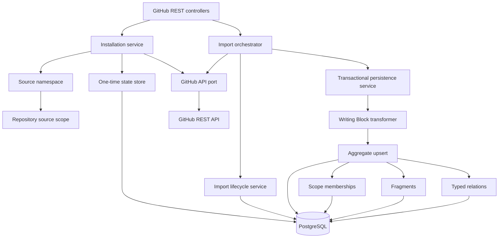
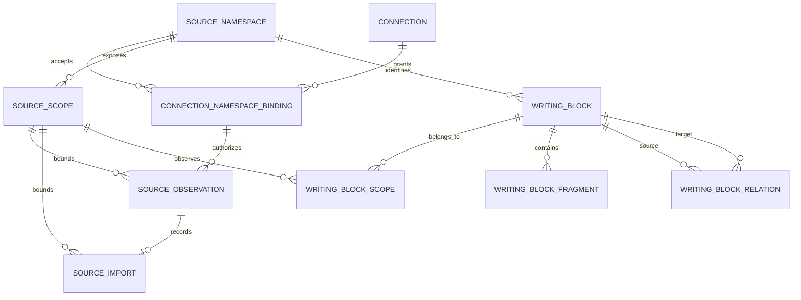
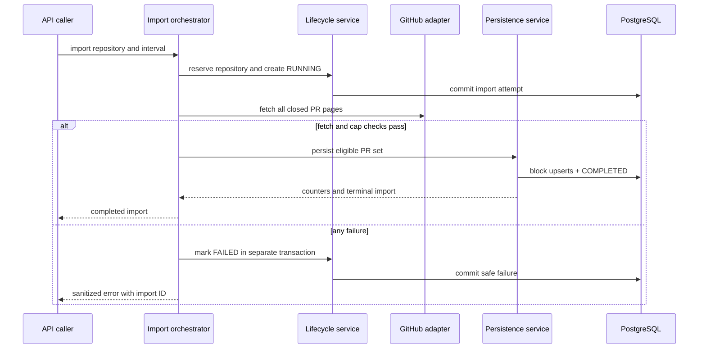
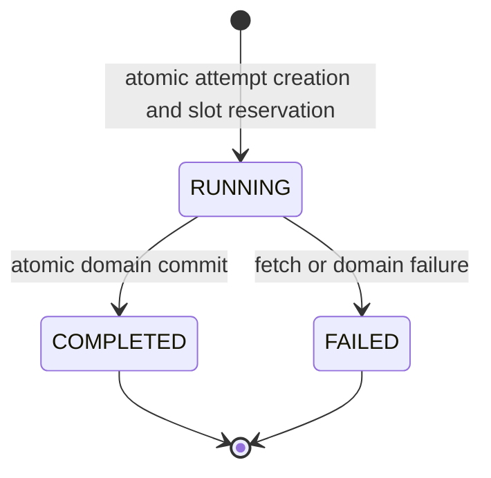

# GitHub Adapter Backend - Plan

## Goal Capsule

- **Objective:** Connect workspace-scoped GitHub App installations, select multiple repositories, and transform merged pull requests into source-managed Writing Block aggregates on a source model that can also represent Slack, Linear, Jira, Drive, and manual inputs.
- **Authority:** The approved design at `docs/superpowers/specs/2026-07-12-github-adapter-backend-design.md`, plus the user's subsequent approved amendments in this session, defines product behavior; this plan defines implementation boundaries. The latest amendment replaces the single-parent source-container assumption with separate connection, namespace, scope, aggregate, fragment, and relation concepts while retaining direct normalization and no provider raw-record table.
- **Execution profile:** Backend-only, test-first at security, transaction, and API seams; no live GitHub calls in automated tests.
- **Stop conditions:** Stop if implementation requires product authentication, frontend behavior, webhook processing, background jobs, or draft generation, or if GitHub's official API cannot support correctness within the agreed import cap.
- **Tail ownership:** Leave the API contracts and processing seam ready for separate frontend, webhook, and background-job plans.

---

## Product Contract

### Summary

Add the first real source adapter to Plot's Kotlin backend while establishing the canonical source model for later providers. A workspace can install the Plot GitHub App, connect multiple granted repositories, manually import a bounded UTC interval, and receive one source-managed Writing Block aggregate for each merged PR without provider raw-record storage, duplicate records, or partial persistence.

**Product Contract preservation:** The GitHub installation and import flow is unchanged. The user approved a substantive source-model amendment: authentication connections, provider identity namespaces, and selected collection scopes are distinct; Writing Blocks are meaningful aggregates; replies and comments are fragments; attachments, sharing, references, and hierarchy are relations; and canonical block identity does not depend on a selected scope.

### Problem Frame

Plot currently has a generic Writing Block CRUD surface but no authenticated source connection, import lifecycle, or idempotent provider normalization path. A repository appears to be a stable parent for a GitHub PR, but that assumption fails for Slack files shared across conversations, Linear issues that move between projects, Jira issue links and subtasks, and Drive files visible through multiple folders or shortcuts. The feature must prove the GitHub flow without encoding that accidental hierarchy into the canonical source identity.

### Actors

- A1. Development workspace operator using the fixed `DevContext` user and workspace.
- A2. GitHub App installation granting repository access to Plot.
- A3. Later frontend client consuming the backend contract; UI implementation is outside this plan.

### Requirements

**Connection and access**

- R1. The backend creates a short-lived, workspace-and-user-bound GitHub App installation request and rejects tampered, expired, cross-context, or reused state.
- R2. A verified callback upserts the GitHub App installation connection and returns the repositories currently granted to that installation.
- R3. A workspace can connect multiple granted repositories, and disconnecting one repository preserves its imports and Writing Blocks.
- R4. Every connection, repository, import, and Writing Block lookup is scoped to `DevContext.devWorkspaceId` before any GitHub call.

**Import behavior**

- R5. A caller can synchronously import one connected repository for a UTC interval satisfying `from < to` and a maximum length of 366 days.
- R6. The adapter imports only pull requests with `from <= merged_at < to`; unmerged and closed-without-merge PRs are excluded.
- R7. GitHub pagination follows the provider's pagination contract, deduplicates by external PR ID, and fails atomically when the configured page cap is exceeded.
- R8. Only one import may run per repository scope; imports for different repository scopes may run concurrently.

**Persistence and source ownership**

- R9. Every accepted import attempt has durable lifecycle state, safe failure details, and eligible/created/updated counters; a repository-overlap rejection occurs before attempt creation and has no import ID.
- R10. Eligible PR DTOs are transformed and upserted directly into Writing Blocks in one domain transaction; any persistence or transformation failure rolls back all changes.
- R11. Re-import preserves Writing Block identities and does not create duplicates; it refreshes mutable GitHub fields and transformation output.
- R12. GitHub-derived Writing Blocks are source-managed and the generic update API rejects attempts to edit them.

**Security and operability**

- R13. GitHub App private keys and installation tokens remain runtime-only and are never stored, logged, or returned.
- R14. GitHub failures map to stable, sanitized application codes; a failed synchronous import response identifies the durable import attempt.
- R15. GitHub configuration is optional for unrelated application startup, while GitHub endpoints fail with a stable not-configured error when required secrets are absent.
- R16. Until production authentication exists, GitHub endpoints are available only in an explicit local development profile and must fail closed in production-like profiles.

**Provider-neutral source model**

- R17. Authentication connections, provider identity namespaces, connection-namespace bindings, and selected source scopes are separate workspace-scoped concepts; either side may have multiple bindings without changing canonical content identity.
- R18. A source-managed Writing Block is unique by workspace, source namespace, source kind, and canonical external object key, independent of every source scope or binding through which it was observed.
- R19. A Writing Block represents a meaningful evidence aggregate; ordered replies and comments are normalized fragments, while attachments, sharing, references, and hierarchy are normalized relations between blocks.
- R20. Scope membership, fragments, and relations are Plot domain data rather than provider raw records, and later adapters reuse the same normalized persistence contract without GitHub dependencies.
- R21. Every normalized observation declares its authority boundary, covered child collection, scope semantics, and whether it is partial or complete; only a newer complete observation or explicit removal event may tombstone rows owned by the same boundary.
- R22. Bounded GitHub imports are partial observations: they add or refresh the repository membership and PR aggregate but never infer deletion from a missing PR, fragment, or relation.

### Key Flows

- F1. Installation and repository connection
  - **Trigger:** A1 requests a GitHub App installation URL.
  - **Steps:** The backend stores a one-time state nonce, GitHub redirects with an installation ID, the backend consumes the state, verifies the installation by minting an installation token, lists granted repositories, and persists the connection. A1 then selects any number of granted repositories.
  - **Outcome:** Each selected repository becomes an active source scope under the verified GitHub namespace.
- F2. Successful manual import
  - **Trigger:** A1 submits a connected repository and `[from, to)`.
  - **Steps:** The backend validates ownership and limits, reserves the per-repository running slot, fetches every permitted GitHub page, filters merged PRs, and atomically transforms and upserts Writing Blocks.
  - **Outcome:** The import is `COMPLETED`, counters are recorded, and results are queryable.
- F3. Failed manual import
  - **Trigger:** GitHub access, pagination, persistence, or transformation fails.
  - **Steps:** No domain changes commit; a separate transaction marks the durable import attempt `FAILED` with safe diagnostics.
  - **Outcome:** The caller receives a non-success response containing the import ID and may submit a new attempt.
- F4. Re-import
  - **Trigger:** A1 imports an overlapping or identical interval again.
  - **Steps:** The same external identities are refreshed in deterministic order.
  - **Outcome:** Import history grows while source and Writing Block cardinality remains stable.

### Acceptance Examples

- AE1. Given a valid callback state used once, when it is submitted again, then the backend rejects it without listing repositories or minting another installation token.
- AE2. Given two repositories in one workspace, when imports start concurrently for different repositories, then both may run; a second import for either active repository is rejected before GitHub access.
- AE3. Given PRs merged exactly at `from`, between the bounds, exactly at `to`, and not merged, when the interval is imported, then only the first two are persisted.
- AE4. Given page one succeeds and a later GitHub page fails, when the import ends, then no Writing Block from that attempt is committed and the import is `FAILED`.
- AE5. Given a previously imported PR changes title or body, when the interval is re-imported, then the existing source and block IDs are preserved while source-managed fields and hashes are refreshed.
- AE6. Given a GitHub-derived Writing Block, when the generic block update endpoint is called, then it returns a stable source-managed conflict and leaves the block unchanged.
- AE7. Given a repository ID from another workspace, when a connection, import, or read operation is attempted, then the backend returns not found and makes no GitHub call.
- AE8. Given one source object observed through two selected scopes in the same namespace, when both scopes are imported, then one Writing Block exists with two scope memberships.
- AE9. Given a Slack-style top-level message and replies, when normalized through the common contract, then the root is one Writing Block aggregate and each reply is an ordered fragment rather than another top-level block.
- AE10. Given a source object moves from one project or folder scope to another, when it is observed in the new scope, then its Writing Block identity remains stable; the old membership changes only after an authoritative removal event or complete old-scope snapshot.
- AE11. Given an external connection is reauthorized or replaced while the provider namespace remains the same, when an existing source object is imported again, then no duplicate Writing Block is created.
- AE12. Given an adapter returns only one page or bounded interval of an aggregate's fragments or relations, when the result is persisted as a partial observation, then previously stored children omitted from that result remain unchanged.
- AE13. Given equal Slack message timestamps in two conversations and one Slack file shared into both conversations, when canonical keys are produced, then the messages remain distinct while the file remains one block with two memberships.

### Scope Boundaries

**Included**

- Kotlin/Spring backend, PostgreSQL schema, GitHub App REST client, source normalization, Writing Block integration, API contracts, and automated tests.
- Multiple active source repositories per workspace and repository-scoped import concurrency.
- Provider-neutral namespace, scope-membership, aggregate, fragment, and relation persistence contracts exercised with synthetic non-GitHub schema cases.
- A documented real-GitHub development smoke procedure.

**Deferred to Follow-Up Work**

- Frontend installation, repository selection, import, and Sources UI.
- Background execution, stale-`RUNNING` recovery, automatic retry, and scheduling.
- Signed GitHub webhooks, delivery deduplication, and reconciliation.
- Repository watches and continuous synchronization.
- OpenAPI-generated TypeScript client work.
- Slack, Linear, Jira, Google Drive, upload, paste, and URL adapter implementations; their object models constrain this plan but their API clients and ingestion policies remain follow-up work.

**Outside this plan**

- Plot sign-in and production authorization.
- GitHub user OAuth.
- Independent commit ingestion.
- Draft, GenerationRun, or update-pack generation.

---

## Planning Contract

### Key Technical Decisions

- KTD1. **Use narrowly scoped installation authentication, not user OAuth.** The App requests only `metadata: read` and `pull_requests: read`. Discovery may use the installation's granted repository set; connect verification and import mint tokens restricted to the target repository ID and read permissions.
- KTD2. **Use Spring's HTTP facilities and JCA unless a narrowly scoped JWT library is proven necessary.** The repository has no GitHub SDK pattern; a small adapter interface keeps provider DTOs and authentication replaceable without introducing an SDK-shaped domain boundary. Use JDBC/jOOQ-style parameterized upserts for new aggregates and Spring Data JPA for ordinary reads; keep both within the same Spring transaction manager and do not mix a JPA-managed entity instance with a native upsert without refresh/clear rules.
- KTD3. **Persist one-time installation state.** Generate a high-entropy nonce, encode a signed state payload with a canonical format, store only the nonce hash with workspace, user, expiry, and consumption time, and compare/consume it atomically in constant time before trusting callback parameters or making an outbound call. Provider failure never restores the state.
- KTD4. **Treat the callback as connection establishment, not repository selection.** A verified callback upserts the installation connection and returns currently granted repository IDs; each later connect request re-verifies the repository grant server-side before activating it.
- KTD5. **Separate access, identity namespace, binding, and collection scope.** `connections` represent credentials or installations, `source_namespaces` represent the provider domain in which canonical object keys are interpreted, and `connection_namespace_bindings` retain every authorization path with principal, capability snapshot, status, and validity interval. `source_scopes` represent user-selected collection boundaries. Reauthorization creates or updates a binding without changing namespace-backed Writing Block identity; Plot-managed imports can use an internal namespace without a binding.
- KTD6. **Scan closed PR pages for correctness and filter locally by `merged_at`.** GitHub's list-pulls endpoint cannot filter by merge time. Request closed PRs with `per_page=100`, follow `Link` pagination, deduplicate immutable PR database IDs, and fail with `IMPORT_TOO_LARGE` before persistence when the configured page cap is exceeded.
- KTD7. **Reserve concurrency atomically in PostgreSQL.** One transaction creates the attempt and acquires `RUNNING` through a partial unique index. The index, not a pre-check, arbitrates races; a losing request creates no accepted import attempt and maps the uniqueness conflict without starting GitHub work.
- KTD8. **Separate network, lifecycle, and domain transactions.** GitHub calls run outside transactions. A dedicated transactional persistence service transforms PR DTOs and upserts source-managed Writing Blocks, counters, and `COMPLETED`; a separate bean records `FAILED` in a new transaction after rollback.
- KTD9. **Use database-native conflict handling for idempotent upsert.** PostgreSQL `ON CONFLICT` through a focused JDBC/jOOQ repository avoids select-then-insert races. Process fetched PRs in stable external-ID order to reduce lock and deadlock variability.
- KTD10. **Key source-managed blocks by namespace and canonical object key, not collection scope.** Each adapter documents how it creates an immutable `external_object_key` that is unique within its namespace and versioned if the provider changes identity rules. Compound keys are allowed: Slack thread/message uses conversation ID plus root/message timestamp, GitHub uses immutable database/node ID rather than PR number, and Jira uses immutable issue ID rather than a mutable key. `writing_block_scopes` records every scope through which the block was observed. Manual blocks keep null source identity and remain editable; imported blocks reject generic PATCH.
- KTD10a. **Normalize aggregates, fragments, memberships, and relations directly.** The provider-neutral import contract lives under the source boundary and carries a Writing Block aggregate, its observed scopes, ordered fragments, and resolvable block relations. GitHub emits one PR aggregate and one repository membership in this slice; later adapters reuse the same transaction without persisting provider response tables.
- KTD11. **Disconnect by status, not deletion.** Disabling a repository blocks new imports but retains connection history, imports, and Writing Blocks. Reconnecting the same external repository reactivates and refreshes it.
- KTD12. **Make provider failure contracts safe and traceable.** Extend the API error envelope compatibly with an optional resource/import ID. Persist bounded diagnostics such as provider status/request ID, never raw response bodies or credentials.
- KTD13. **Fail closed around the deferred-auth boundary.** Fixed `DevContext` scoping is tenancy filtering, not caller authentication. Require an explicit `github.api.enabled` and `github.api.dev-only` configuration, loopback binding for dev-only exposure, and deny GitHub routes or fail startup in production-like profiles until product auth lands. Do not rely on `permitAll` plus workspace filtering.
- KTD14. **Trust only configured GitHub origins.** Installation and callback destinations are fixed configuration, not caller-provided redirects. Authorization-bearing HTTP calls do not follow cross-host redirects, production-like configuration requires HTTPS, and provider-returned HTML URLs are stored as data but never fetched.
- KTD15. **Make persistence identity and lifecycle explicit.** Every new parent has the composite tenant/provider/namespace keys its children need, and every FK uses `RESTRICT`/`NO ACTION` without ORM orphan removal. Writing Block source identity is either entirely manual or entirely managed through an all-null/all-non-null check whose managed predicate exactly matches the partial unique index. Upserts never replace immutable IDs, tenant ownership, creator provenance, creation timestamps, or original ingestion timestamps.
- KTD16. **Use evidence aggregates rather than one block per provider object.** A GitHub PR, Slack top-level message/thread, Linear or Jira issue, Canvas, and document/file are candidate aggregates. Replies, reviews, and comments are fragments when their meaning depends on the aggregate; independently reusable files, canvases, documents, issues, and releases remain blocks.
- KTD17. **Represent cross-object structure as resolvable typed domain relations.** A relation always names its source block and may narrow the source to one fragment; its target stores namespace, kind, and canonical object key plus nullable resolved target block/fragment IDs. This supports reply-level attachments and references, preserves normalized unresolved edge identity, and resolves idempotently when the target arrives without creating placeholder blocks or provider raw rows.
- KTD18. **Reserve “channel” for product output terminology.** Source ingestion uses provider, namespace, scope, aggregate, fragment, and relation. Slack's channel is represented as a conversation-shaped source scope so it does not collide with Plot output channels such as changelog, docs, customer update, or launch post.
- KTD19. **Make scope semantics and reconciliation authority explicit.** Scopes declare `CONTAINER`, `QUERY`, `CORPUS`, or `BATCH`; memberships declare `CONTAINED_IN`, `MATCHED_BY`, or `OBSERVED_VIA`. A normalized observation records binding, authority owner, coverage key, mode, and monotonic generation. Partial observations only upsert what they saw; a complete observation may tombstone only rows owned by its exact authority/coverage boundary after all pages succeed, and stale generations cannot overwrite newer state.
- KTD20. **Resolve concurrent aggregate updates by provider revision, not transaction order.** Adapters supply a comparable provider revision or source-updated instant for canonical fields. Newer revisions win; equal revisions with different normalized content surface a deterministic conflict instead of accepting the last transaction, and scope-specific observations cannot delete children owned by another authority boundary.
- KTD21. **Rewrite the unreleased V2 migration and reset only disposable provisional databases.** `V2__github_adapter.sql` is untracked and the product has not launched, so the canonical migration remains V1-to-revised-V2 rather than adding compatibility strata for an unpublished schema. Migration tests start from populated V1. A local database that already applied the provisional V2 must be recreated; once V2 is committed or shared, future changes use a new migration and never change its checksum. Rollback after normalized data exists is a forward fix or status restoration, not a destructive downgrade.

### High-Level Technical Design

### Data and API Shape

- `github_installation_states` stores hashed nonce, workspace/user bindings, expiry, and consumption time.
- `connections` stores authorization grant or installation identity, permission snapshots, and status without credentials.
- `source_namespaces` stores immutable provider namespace kind and external namespace key. GitHub uses the installation target account, Slack uses a workspace/team, Linear an organization, Jira a cloud site, Drive uses the adapter-documented object identity domain, and managed upload/URL ingestion may use a Plot-owned workspace namespace.
- `connection_namespace_bindings` stores many-to-many authorization paths, external principal identity, capability snapshot, status, and validity interval without making credentials part of content identity.
- `source_scopes` stores scope semantics, selected collection keys, and mutable display attributes. GitHub uses repository containers; Slack uses conversation containers; Linear uses team/project containers; Jira may use a project container or query scope; Drive may use folder containers or corpus scopes.
- `source_observations` stores the binding, scope, authority owner, coverage key, observation mode, monotonic generation, and lifecycle needed to reconcile normalized domain rows safely.
- `source_imports` references its observation and stores interval, counters, safe failure fields, and the one-running-per-scope invariant.
- `writing_blocks.source_namespace_id`, `source_kind`, and `external_object_key` mark source-managed aggregates and obey an all-null/manual or all-non-null/source-managed check.
- `writing_block_scopes` carries `source_namespace_id` and uses composite foreign keys to prove both endpoints share a workspace and namespace; it stores membership kind, first/last seen, tombstone status, and observation provenance.
- `writing_block_fragments` stores stable ordered subcontent such as Slack replies or issue comments, unique by block, fragment kind, and external fragment key. Parent constraints include the owning block; order uses provider order plus a deterministic external-key tie-breaker rather than identity-changing ordinals.
- `writing_block_relations` stores a directed canonical edge from a required source block and optional source fragment to a target namespace/kind/key plus nullable resolved target block/fragment.
- `writing_block_relation_observations` stores each authority boundary that observed the edge. Removing one observation cannot tombstone a relation still supported by another active observation.

Every new parent exposes the composite keys required by its children. Foreign keys enforce connection-binding, binding-namespace, scope-namespace, import-observation, block-namespace, same-namespace membership, same-block fragment parenting, and same-workspace relation endpoints with `RESTRICT`/`NO ACTION` deletion. External identities are exact: connections by provider grant identity, namespaces by `(workspace_id, provider, namespace_kind, external_namespace_key)`, scopes by `(workspace_id, source_namespace_id, scope_semantics, scope_kind, external_scope_key)`, and source-managed blocks by `(workspace_id, source_namespace_id, source_kind, external_object_key)`. The Writing Block check constraint and partial unique-index predicate use the same all-non-null source tuple.

| Provider/input | Namespace | Canonical object key | Selectable scope | Aggregate / fragment / relation examples |
|---|---|---|---|---|
| GitHub | immutable installation target account ID and kind | immutable PR/issue/release database or node ID | repository container | PR aggregate; review/comment fragment; closes/reference relation |
| Slack | workspace/team ID | file ID, Canvas ID, or conversation ID plus root/message timestamp | conversation container | thread aggregate; reply fragment; attachment/shared-in relation |
| Linear | organization ID | immutable model UUID | team or project container | issue/document aggregate; comment fragment; subissue/attachment relation |
| Jira | cloud site ID | immutable issue/attachment ID, never mutable issue key | project container or saved-query scope | issue aggregate; comment fragment; subtask/duplicate/block relation |
| Google Drive | adapter-documented provider identity domain | canonical file ID | folder container, corpus, or shared-drive scope | document/file aggregate; comment fragment; shortcut/reference relation |
| Upload, paste, URL | Plot workspace import namespace | immutable ingest item key; URL refresh semantics deferred to its adapter plan | import batch | document aggregate; extracted fragment; source/attachment relation |

The API groups installation, connection, and import operations under `/api/github`: `POST /installations/requests`, `POST /installations/callback`, `GET /connections`, `PUT /repositories/{id}`, `DELETE /repositories/{id}`, `POST /repositories/{id}/imports`, and `GET /imports/{id}`. Repository route IDs address GitHub repository scopes. Installation request/callback and import failures use `Cache-Control: no-store`; callback accepts only the registered server callback shape and never redirects to caller input. Existing `/api/blocks` remains the result surface and gains source-scope filtering through membership joins; its PATCH behavior changes only for source-managed rows.

### Configuration

Typed GitHub properties cover App ID, slug, private key, API base URL, state-signing secret, state TTL, and import page cap. Missing App credentials do not prevent unrelated application startup. GitHub entry points return a stable `GITHUB_NOT_CONFIGURED` error until configuration is present. Tests inject fake adapters and deterministic time/randomness rather than real secrets.

### System-Wide Impact

- **Data lifecycle:** Stable provider identity lives on Writing Blocks through namespaces, while scope membership, fragments, and relations have independent reconciliation lifecycles. Manual versus provider-managed blocks diverge in mutation policy.
- **Authorization:** Production auth remains deferred, so every service must retain explicit workspace-scoped repository methods despite globally permitted HTTP access.
- **Exposure:** The current globally permitted security configuration cannot safely expose GitHub capabilities; local-profile and listener restrictions are part of this slice, not deployment advice.
- **Operations:** Synchronous imports can leave `RUNNING` attempts after process death; this is observable but unrecovered until the background-job follow-up.
- **External API load:** Correctness-first closed-PR pagination may be expensive for very large repositories, so the page cap is a hard safety boundary rather than silent truncation.
- **Future automation:** Webhook and job triggers must reuse the provider-neutral processing and transactional persistence seams defined here.
- **Terminology:** Product output channels remain distinct from source scopes; APIs and domain names must not expose a generic `channel` concept for both.

### Risks and Mitigations

- **Large repository history:** Closed-PR pagination may hit rate or page limits. Fail atomically with an explicit retryable or size error and no silent partial import.
- **Provider revocation ambiguity:** GitHub can use similar status codes for lost grants and private-resource concealment. Classify only verified installation/repository failures as connection state changes; keep rate-limit and transient errors on the import.
- **Transaction proxy mistakes:** Self-invoked Spring transactional methods would not create the required boundary. Keep lifecycle and persistence transactions on separate injected beans and prove rollback behavior with integration tests.
- **Concurrent upserts:** Overlapping intervals, scopes, or future triggers can touch the same canonical object. Namespace-scoped uniqueness, membership conflict handling, and deterministic fragment/relation reconciliation remain authoritative after scope-level execution serialization.
- **Aggregate drift:** A provider object may gain replies, comments, files, or links over time. Re-import refreshes the same aggregate and reconciles child rows without changing block identity or silently deleting children outside the adapter's observed coverage.
- **Namespace mistakes:** Provider IDs have different uniqueness boundaries. Each adapter must document its namespace key and prove reconnection and multi-scope cases before it can use the shared upsert contract.
- **Canonical-key collisions:** Human-facing numbers, names, and timestamps are not uniformly provider-global. Adapter contracts use immutable IDs or documented compound keys and include collision tests before activation.
- **Authorization races:** Several bindings can authorize one namespace while callbacks, revocations, and imports overlap. Imports record the binding used, revalidate scope/namespace ownership at commit, and never derive block identity from that binding.
- **Over-broad reconciliation:** A boolean complete flag can delete another scope's or newer run's evidence. Authority/coverage keys, monotonic generations, per-boundary serialization, and relation-observation ownership constrain tombstones.
- **Migration checksum drift:** The current V2 is unreleased but may exist in disposable local databases. Migration rehearsal detects it and requires reset; committed/shared migrations are immutable and repaired only through forward migrations.
- **Secret leakage:** Sanitize error storage and logs, normalize PEM input in memory, and assert redaction in tests.
- **Redirect and replay abuse:** Consume callback state before outbound work, disable credential-bearing cross-host redirects, and keep callback output non-cacheable.

### External Contract Notes

- GitHub App JWTs use RS256, backdate `iat` for clock drift, and keep `exp` within GitHub's allowed short lifetime.
- Installation tokens are obtained from the installation access-token endpoint and expire after one hour.
- The list-pulls REST endpoint accepts installation tokens with read pull-request permission, supports up to 100 rows per page, and does not expose a `merged_at` interval filter.

---

## Implementation Units

### U1. Add provider-neutral namespace, scope, and Writing Block aggregate schema

- **Goal:** Introduce tenant-safe source authorization, identity namespace, collection scope, aggregate membership, fragment, relation, and import persistence without provider raw-record tables.
- **Requirements:** R3, R4, R8-R12, R17-R22.
- **Dependencies:** None.
- **Files:**
  - Create `apps/api/src/main/resources/db/migration/V2__github_adapter.sql`.
  - Create provider-neutral namespace, binding, scope, observation, scope-membership, fragment, relation, relation-observation, and normalized-import entity/repository files under `apps/api/src/main/kotlin/com/plot/api/source/` and import lifecycle files under `apps/api/src/main/kotlin/com/plot/api/github/`.
  - Modify `apps/api/src/main/kotlin/com/plot/api/writingblock/WritingBlock.kt`.
  - Modify `apps/api/src/main/kotlin/com/plot/api/writingblock/WritingBlockRepository.kt`.
  - Modify `apps/api/src/main/kotlin/com/plot/api/writingblock/WritingBlockImportService.kt`.
  - Create `apps/api/src/test/kotlin/com/plot/api/github/GitHubSchemaIntegrationTest.kt`.
  - Modify `docs/architecture/data-architecture.md` and `docs/architecture/data-erd.mmd` to replace the single-parent source-container model.
- **Approach:** Rewrite the unreleased V2 migration around provider namespaces, authorization bindings, typed scopes, coverage-aware observations, and normalized aggregate children. Use UUID primary keys, `Instant`, status strings, exact canonical conflict keys, and composite tenant/provider/namespace foreign keys with non-cascading deletes. Replace `connection_id`, `source_container_id`, and `external_id` on Writing Blocks with the checked source tuple `source_namespace_id`, `source_kind`, and `external_object_key`; use separate membership, fragment, directed relation, and relation-observation tables. Rehearse the migration from populated V1, preflight duplicate/partial identity rows, preserve manual data, and document disposable reset for any local database carrying the provisional uncommitted V2 checksum.
- **Execution note:** Start with migration and constraint integration tests; the schema is the authority for idempotency and workspace isolation.
- **Patterns to follow:** `apps/api/src/main/resources/db/migration/V1__core_schema.sql`, `apps/api/src/main/kotlin/com/plot/api/writingblock/WritingBlock.kt`, and the existing UUID/workspace conventions.
- **Test scenarios:**
  1. Insert multiple connections and namespaces with multiple active bindings and scopes; revoke one binding without changing namespace, scope, or block identities.
  2. Reject every child row whose workspace, provider, or namespace differs from its connection, binding, scope, block, fragment, relation, or observation parent.
  3. Reject every partial-null Writing Block source tuple and duplicate namespace-scoped canonical object identity while preserving valid V1 manual rows and equivalent keys in another namespace or workspace.
  4. Covers AE8. Attach one Writing Block to two scopes and reject duplicate membership without duplicating the block.
  5. Reject a second `RUNNING` import for the same scope and permit concurrent `RUNNING` imports for different scopes.
  6. Preserve insertion and update of manual Writing Blocks with null namespace/external identity.
  7. Seed manual blocks under V1, migrate through V2, and prove IDs/data remain intact and editable.
  8. Covers AE9. Reorder fragments without changing IDs; enforce same-block parent FKs, deterministic equal-time ordering, missing-parent policy, self-parent rejection, and cycle detection.
  9. Store reverse directed relations independently, resolve an external target idempotently when its block arrives, and reject foreign-workspace endpoints while allowing legitimate cross-namespace links in one workspace.
  10. Preserve one canonical relation while two authority observations support it; removing one observation cannot tombstone the edge.
  11. Covers AE10 and AE11. Replace or add authorization bindings and reconcile scope membership while preserving namespace-backed block identity; reject stale reauthorization callbacks.
  12. Covers AE12. Persist a partial observation without tombstoning omitted rows, then apply a newer complete observation only to its exact authority/coverage boundary; reject an older completion committed after it.
  13. Covers AE13. Keep equal Slack message timestamps distinct by conversation-qualified object keys while sharing one file block across two conversation memberships.
  14. Attempt hard deletion of every retained parent and relation endpoint and prove `RESTRICT`/`NO ACTION`; status transitions preserve counts, IDs, timestamps, and history.
  15. Rehearse populated V1-to-V2 migration, record row counts and constraint audits, and fail clearly when a disposable database contains the provisional V2 checksum instead of silently rewriting applied history.
- **Verification:** Flyway validates against PostgreSQL, JPA startup validation passes, and database constraints prove all tenant and idempotency invariants.

### U2. Implement GitHub App configuration, state, and API adapter

- **Goal:** Provide a testable GitHub boundary for one-time installation state, App JWTs, installation tokens, repository discovery, and paginated closed-PR retrieval.
- **Requirements:** R1, R2, R6, R7, R13, R15.
- **Dependencies:** None.
- **Files:**
  - Modify `apps/api/src/main/resources/application.properties`.
  - Modify `apps/api/build.gradle.kts` only if the chosen JWT implementation needs a focused dependency.
  - Create `apps/api/src/main/kotlin/com/plot/api/github/GitHubProperties.kt` and guarded configuration.
  - Create files under `apps/api/src/main/kotlin/com/plot/api/github/` for the port, HTTP implementation, provider DTOs, token provider, and error mapping.
  - Create `apps/api/src/test/kotlin/com/plot/api/github/installation/GitHubInstallationStateTest.kt` and `apps/api/src/test/kotlin/com/plot/api/github/GitHubRestClientTest.kt`.
- **Approach:** Inject `Clock`, high-entropy nonce generation, and HTTP transport seams. Persist a nonce hash and sign a compact state payload bound to user/workspace. Build short-lived RS256 App JWTs, mint target-repository-scoped installation tokens only when needed, and send GitHub's recommended media type and version header. Parse `Link` headers, collect at most the configured number of pages, reject cross-host redirects, and expose provider-neutral repository and PR DTOs.
- **Execution note:** Implement security and pagination behavior test-first with deterministic time and a scripted fake HTTP server/transport.
- **Patterns to follow:** `apps/api/src/main/kotlin/com/plot/api/common/UuidGenerator.kt` for deterministic time seams and `apps/api/src/main/kotlin/com/plot/api/common/ApiException.kt` for stable error translation.
- **Test scenarios:**
  1. Covers AE1. Accept a valid state once; reject tampering, expiry, user/workspace mismatch, and second consumption.
  2. Generate an App JWT with RS256, a backdated issue time, bounded expiry, and no private-key material in output or logs.
  3. Exchange a JWT for an installation token and keep the token confined to the adapter call path.
  4. List every granted repository across multiple pages and preserve stable external repository IDs.
  5. Follow closed-PR pagination, deduplicate repeated PR IDs, and retain provider timestamps with full precision.
  6. Expose a provider-neutral page-cap signal to the import orchestrator when another page exists beyond the configured cap; the orchestrator returns `IMPORT_TOO_LARGE` before domain persistence.
  7. Map missing configuration, invalid installation, missing repository grant, rate limit, and provider 5xx into distinct sanitized errors.
  8. Submit simultaneous callbacks and prove one atomic state consumption reaches GitHub; a failed token exchange still leaves the state unusable.
  9. Inspect token requests for the exact read permissions and target repository restriction; reject a cross-host redirect without forwarding authorization.
  10. Reject malformed callback payloads, missing state, caller-provided redirect targets, weak/non-RSA private keys, untrusted production API bases, and non-loopback dev exposure.
- **Verification:** Unit tests prove cryptographic claims, state consumption, pagination, caps, and redaction without accessing GitHub or requiring secrets.

### U3. Add installation and multi-repository connection APIs

- **Goal:** Expose workspace-scoped installation, repository discovery, connect, list, inspect, and disconnect operations for a later frontend.
- **Requirements:** R1-R4, R13-R16; F1.
- **Dependencies:** U1, U2.
- **Files:**
  - Create controllers, services, mappers, and DTOs under `apps/api/src/main/kotlin/com/plot/api/github/`.
  - Extend `apps/api/src/main/kotlin/com/plot/api/common/ApiErrorResponse.kt` and `apps/api/src/main/kotlin/com/plot/api/common/ApiExceptionHandler.kt` only for optional resource/correlation metadata needed by GitHub failures.
  - Create `apps/api/src/test/kotlin/com/plot/api/github/GitHubConnectionApiIntegrationTest.kt`.
  - Modify `apps/api/src/test/kotlin/com/plot/api/common/ApiExceptionHandlerTest.kt` for backward-compatible error envelopes.
  - **Approach:** The callback atomically consumes a valid signed state before token exchange, verifies the installation by minting a token, upserts the authorization connection, resolves the GitHub account namespace by immutable account ID and kind, and activates a connection-namespace binding. A connect request submits only a stable external repository ID; the server re-lists or verifies the current grant and token audience, then upserts that repository as a container-shaped source scope under the namespace. Endpoints are profile-gated as described by KTD13. Disconnect changes scope or binding status and never deletes history. All ID lookups include the development workspace before any adapter invocation.
- **Patterns to follow:** `apps/api/src/main/kotlin/com/plot/api/writingblock/WritingBlockController.kt`, `WritingBlockService.kt`, mapper/DTO patterns, and cross-workspace tests in `apps/api/src/test/kotlin/com/plot/api/writingblock/WritingBlockApiIntegrationTest.kt`.
- **Test scenarios:**
  1. Complete installation callback and return all currently granted repositories without automatically connecting one.
  2. Connect multiple repositories from the verified installation in the same workspace; a later reinstall updates the existing installation identity rather than introducing a second active installation path.
  3. Reconnect the same external repository after rename and preserve its scope ID/history while refreshing mutable attributes.
  4. Reject a repository not present in the installation's current grant list.
  5. Disable one repository scope and preserve its imports, memberships, and blocks while denying new imports.
  6. Covers AE11. Reauthorize the GitHub account namespace through another binding and preserve its scopes and Writing Block identities; reject a stale callback from replacing the newer active grant.
  7. Covers AE7. For foreign-workspace connection/repository IDs, return not found and assert the fake adapter received zero calls.
  8. Leave unrelated APIs bootable when GitHub configuration is absent and return `GITHUB_NOT_CONFIGURED` only from GitHub entry points.
  9. Verify GitHub routes are absent or denied outside the explicit local profile, loopback binding is enforced, and callback/install responses are non-cacheable with no open redirect.
- **Verification:** MockMvc/Testcontainers tests prove the complete connection lifecycle, multiple repository support, status-only disconnect, workspace isolation, and safe errors.

### U4. Build direct PR-to-Writing-Block transformation and upserts

- **Goal:** Deterministically convert in-memory GitHub PR DTOs directly into provider-neutral Writing Blocks and enforce their source-managed mutation policy.
- **Requirements:** R10-R12, R18-R22; F4.
- **Dependencies:** U1.
- **Files:**
  - Use `apps/api/src/main/kotlin/com/plot/api/github/GitHubWritingBlockTransformer.kt` for the pure transformer.
  - Use `apps/api/src/main/kotlin/com/plot/api/writingblock/WritingBlockImportService.kt` for the focused PostgreSQL Writing Block upsert repository.
  - Modify `apps/api/src/main/kotlin/com/plot/api/writingblock/WritingBlockService.kt`.
  - Modify `apps/api/src/main/kotlin/com/plot/api/writingblock/WritingBlockMapper.kt` and `dto/WritingBlockResponse.kt` only if the client needs a source-managed indicator.
  - Create `apps/api/src/test/kotlin/com/plot/api/github/GitHubWritingBlockTransformerTest.kt`.
  - Extend `apps/api/src/test/kotlin/com/plot/api/writingblock/WritingBlockApiIntegrationTest.kt`.
- **Approach:** Map source origin/kind/platform to one GitHub pull-request aggregate, use the canonical HTML URL, preserve title/body/author/source timestamps, compute the existing content hash deterministically, and identify the block by GitHub account namespace, `PULL_REQUEST`, and immutable GitHub PR database ID encoded as the canonical object key. Upsert the aggregate, binding-qualified observation, and repository-scope membership in one transaction, preserving IDs, creation timestamps, and original ingestion time while rejecting stale source revisions. The current PR adapter emits no fragments or relations because reviews, comments, commits, and linked issues remain outside this slice; the normalized contract and persistence path accept them for future adapters.
- **Execution note:** Establish pure transformer tests first, then add the source-managed PATCH guard before import orchestration can create such rows.
- **Patterns to follow:** Existing Writing Block field normalization and hashing in `apps/api/src/main/kotlin/com/plot/api/writingblock/WritingBlockService.kt`.
- **Test scenarios:**
  1. Convert a complete PR into the expected source origin, kind, platform, canonical URL, author, title/body, timestamps, metadata, and content hash.
  2. Handle null PR body and optional author data without violating the title-or-body invariant.
  3. Covers AE5. Re-upsert a changed PR and preserve the Writing Block ID, `createdAt`, and `ingestedAt` while refreshing mutable fields and hash.
  4. Covers AE6. Reject generic PATCH for a source-managed block and leave every stored field unchanged.
  5. Continue allowing create and update for manual blocks.
  6. Covers AE8. Upsert the same namespace/kind/external identity through two synthetic scopes and preserve one block with two memberships.
  7. Reject a normalized aggregate whose namespace and supplied scope belong to different workspaces or provider namespaces.
  8. Covers AE12. Confirm that GitHub's bounded PR observation cannot delete existing scope memberships, fragments, or relations that it did not fetch.
  9. Apply concurrent older and newer representations of one PR and prove the newer provider revision wins regardless of transaction completion order; equal revisions with different normalized content fail visibly.
- **Verification:** Pure tests prove mapping determinism; PostgreSQL integration tests prove stable identity and mutation policy.

### U5. Implement synchronous import lifecycle and atomic persistence

- **Goal:** Orchestrate bounded GitHub retrieval, repository-scoped concurrency, interval filtering, transactional upserts, counters, and terminal failure recording.
- **Requirements:** R5-R11, R14, R21, R22; F2-F4.
- **Dependencies:** U2, U3, U4.
- **Files:**
  - Create orchestrator, lifecycle, failure recorder, persistence service, mapper, and DTO files under `apps/api/src/main/kotlin/com/plot/api/github/GitHubImportService.kt` and adjacent GitHub files.
  - Extend Writing Block read services for source-scope-filtered results through membership joins.
  - Cover the import API in `apps/api/src/test/kotlin/com/plot/api/github/GitHubConnectionApiIntegrationTest.kt` and extend it with lifecycle-specific cases.
- **Approach:** Validate workspace, active namespace binding, repository-scope status, UTC interval, and 366-day maximum before external access. Reserve the per-scope import and partial observation before any GitHub call; the uniqueness loser creates neither accepted resource. Fetch all pages outside transactions, deduplicate by immutable PR database ID, and filter by `merged_at`, then call a separate transactional persistence bean that revalidates binding/scope/namespace consistency and commits aggregate upserts, observed-scope memberships, counters, and `COMPLETED`. Lifecycle transitions use compare-and-set from `RUNNING`; a separate `REQUIRES_NEW` recorder commits `FAILED`. Eligible means post-deduplication and post-filtering; created, updated, and unchanged block counters reconcile to eligible without relying on PostgreSQL system columns. A crash-orphaned `RUNNING` record remains visible in this slice.
- **Execution note:** Build the lifecycle from failing integration tests around exact boundaries, concurrency, and rollback; these are more important than controller happy paths.
- **Patterns to follow:** Transactional service boundaries in `apps/api/src/main/kotlin/com/plot/api/writingblock/WritingBlockService.kt` and direct PostgreSQL assertions in existing API integration tests.
- **Test scenarios:**
  1. Covers AE3. Include `merged_at == from`, exclude `merged_at == to`, exclude null, and preserve sub-second precision.
  2. Reject `from >= to`, intervals over 366 days, disabled repositories, and foreign repositories before adapter calls.
  3. Complete a zero-result import with zero counters and no domain rows.
  4. Import a multi-page eligible set and report eligible and block-created/updated/unchanged counters consistently.
  5. Covers AE2. Reject a second import for one running repository without adapter work while allowing another repository import.
  6. Covers AE4. Fail on a later GitHub page after earlier success and commit no domain rows.
  7. Inject transformer and Writing Block persistence failures; verify rollback and a separately committed `FAILED` attempt containing no secret/provider body.
  8. Re-import identical and overlapping intervals; preserve domain cardinality and append import history.
  9. Revoke access during pagination; fail the whole attempt and classify repository/connection status only when the provider evidence is definitive.
  10. Simulate failure while recording `FAILED`; leave the original `RUNNING` attempt observable and surface the operational error without pretending recovery succeeded.
  11. Run genuinely concurrent reservation transactions and prove exactly one reaches the adapter while the loser creates no attempt.
  12. Begin with an existing block, update it and insert another, then fail before completion; prove the existing row is fully restored, the new row is absent, success counters do not commit, and only `FAILED` persists.
  13. Verify a failed provider/status classification does not disable a connection on rate limit or 5xx, while a definitive revocation updates status in a separate lifecycle transaction and retains imported data.
  14. Reauthorize the namespace while an import using the prior binding is in flight; persistence either completes against the still-valid recorded binding or fails atomically after revalidation, never attaches rows to another namespace.
- **Verification:** Full MockMvc/Testcontainers coverage proves lifecycle, filtering, concurrency, idempotency, atomic rollback, failure traceability, and workspace isolation.

### U6. Complete result APIs and development smoke documentation

- **Goal:** Make connection, import, and repository-scope-filtered Writing Block results inspectable and document the controlled real-GitHub validation path.
- **Requirements:** R2-R4, R9, R14; all acceptance examples as an end-to-end contract.
- **Dependencies:** U3, U5.
- **Files:**
  - Complete controller/DTO files under `apps/api/src/main/kotlin/com/plot/api/github/`.
  - Complete API integration coverage under `apps/api/src/test/kotlin/com/plot/api/github/`.
  - Create `docs/operations/github-app-development-smoke-test.md`.
  - Update `apps/api/README.md` or root `README.md` only with GitHub configuration keys and a link to the smoke procedure.
- **Approach:** Return Writing Blocks observed through the requested repository scope by joining scope membership and ordering by `(source_created_at DESC, external_object_key DESC)`. Import failure responses retain the existing `{error,message}` fields and add an optional import resource ID without exposing workspace IDs, credentials, internal diagnostics, or hashes. The smoke guide covers GitHub App registration, minimum permissions, local callback handoff, repository connection, a bounded import, database/API result verification, and secret cleanup.
- **Patterns to follow:** Existing response mappers omit workspace/internal fields; root operational docs link to focused runbooks rather than embedding secret values.
- **Test scenarios:**
  1. List multiple active repository connections without leaking installation tokens or workspace IDs.
  2. Retrieve terminal import counters and safe failure metadata by workspace-scoped import ID.
  3. Page repository-scope-filtered Writing Blocks in deterministic source-time/external-ID order without duplicates between pages or memberships.
  4. Return a failed import ID in the sanitized error contract while preserving compatibility for existing API errors.
  5. Verify every result endpoint returns not found for foreign-workspace IDs.
  6. Verify serialization and logs never contain test private keys, installation tokens, authorization headers, or raw GitHub bodies.
  7. Capture logs for token exchange, pagination, malformed responses, and unexpected failures; verify callback state, query strings, headers, bodies, JWTs, tokens, and PEM text are absent.
- **Verification:** Automated API tests pass without network access, and a developer can follow the smoke guide against a controlled GitHub repository without needing frontend code.

---

## Verification Contract

| Gate | Applies to | Expected outcome |
|---|---|---|
| `just test-api` | U1-U6 | All JUnit, MockMvc, Flyway, and PostgreSQL integration scenarios pass without GitHub network access, including bindings, canonical keys, multi-scope membership, fragment/relation constraints, and reconciliation generations. |
| `just build-api` | U1-U6 | Kotlin compilation, Spring context startup, JPA validation, tests, and packaging succeed. |
| `just test` | Global | The repository's current aggregate test gate remains green. |
| `just build` | Global | Backend changes do not break the monorepo build or frontend compilation. |
| Real GitHub smoke guide | U2, U3, U5, U6 | A controlled App installation connects multiple repositories and imports a bounded merged-PR interval with no secret leakage. |

Verification must also inspect the database after failure-injection scenarios to prove absence of partial source/block rows, not rely only on HTTP responses. Cross-workspace tests must assert the fake GitHub adapter received zero calls.

Migration verification snapshots IDs, row counts, source tuples, memberships, fragment/relation status, and timestamps before and after populated V1-to-V2 rehearsal. Reconciliation rollback tests compare the complete pre-state and post-failure state, including tombstones and observation generations, using genuinely separate database transactions for race cases.

When Docker is unavailable, the test-only `TestcontainersConfiguration` can be
disabled with `PLOT_TESTCONTAINERS_ENABLED=false` and the same gates can target
a temporary local PostgreSQL instance through `SPRING_DATASOURCE_URL` and
`SPRING_DATASOURCE_USERNAME`; production configuration is unchanged.

---

## Definition of Done

- R1-R22 and AE1-AE13 are covered by implementation units and passing tests.
- Multiple active GitHub repositories can coexist in one development workspace.
- Installation state is one-time, context-bound, and expiry-checked.
- Every external access occurs after workspace/repository validation and uses a short-lived installation token.
- Import interval, pagination cap, repository-scoped concurrency, and `merged_at` boundaries behave exactly as specified.
- Writing Block persistence is idempotent and atomic, with stable namespace-backed identities across re-import, reauthorization, and scope changes.
- Connection-namespace bindings retain authorization history without participating in canonical object identity.
- Canonical block identity excludes source scope; one block can retain multiple observed-scope memberships.
- Every provider adapter documents namespace kind and canonical object-key encoding, and collision/rename/move tests prove the declared uniqueness boundary.
- Writing Block fragments have stable ordered identity within their aggregate, and relations cannot cross workspace boundaries.
- Partial observations never tombstone omitted evidence; complete observations reconcile only their exact authority and coverage generation, and stale completions cannot overwrite newer state.
- GitHub PR imports exercise the shared aggregate and membership path without creating placeholder fragments, relations, or provider raw rows.
- Source-managed Writing Blocks cannot be changed through generic PATCH while manual blocks retain existing behavior.
- Failure responses and stored diagnostics identify the attempt without exposing provider bodies or secrets.
- Automated verification runs without GitHub credentials or network access; the real-provider path is documented separately.
- No frontend, authentication, webhook, background-job, watch, commit-ingestion, or generation code enters the diff.
- The unreleased V2 migration is validated from populated V1; provisional local V2 databases are reset, and no applied shared migration checksum is rewritten.
- Abandoned experiments, unused dependencies, dead code, temporary fixtures, and secret-bearing local artifacts are removed before completion.

---

## Sources and Research

- Origin: `docs/superpowers/specs/2026-07-12-github-adapter-backend-design.md`.
- Existing domain and transaction pattern: `apps/api/src/main/kotlin/com/plot/api/writingblock/`.
- Existing schema and workspace composite-FK pattern: `apps/api/src/main/resources/db/migration/V1__core_schema.sql`.
- Existing API integration-test pattern: `apps/api/src/test/kotlin/com/plot/api/writingblock/WritingBlockApiIntegrationTest.kt`.
- [GitHub Docs: Authenticating as a GitHub App](https://docs.github.com/en/apps/creating-github-apps/authenticating-with-a-github-app/authenticating-as-a-github-app).
- [GitHub Docs: Authenticating as a GitHub App installation](https://docs.github.com/en/apps/creating-github-apps/authenticating-with-a-github-app/authenticating-as-a-github-app-installation).
- [GitHub Docs: Generating a JSON Web Token](https://docs.github.com/en/apps/creating-github-apps/authenticating-with-a-github-app/generating-a-json-web-token-jwt-for-a-github-app).
- [GitHub Docs: Choosing permissions for a GitHub App](https://docs.github.com/en/apps/creating-github-apps/registering-a-github-app/choosing-permissions-for-a-github-app).
- [GitHub Docs: REST API endpoints for pull requests](https://docs.github.com/en/rest/pulls/pulls?apiVersion=latest).
- [Slack Developer Docs: Conversation object](https://docs.slack.dev/reference/objects/conversation-object/).
- [Slack Developer Docs: Retrieving messages and threads](https://docs.slack.dev/messaging/retrieving-messages/).
- [Slack Developer Docs: File object, including Canvas and multi-conversation sharing](https://docs.slack.dev/reference/objects/file-object/).
- [Linear Developers: GraphQL model and team-based issues](https://linear.app/developers/graphql?noRedirect=1).
- [Linear Developers: Webhook-supported issues, comments, attachments, projects, updates, and documents](https://linear.app/developers/webhooks).
- [Jira Cloud REST API: Issues, subtasks, comments, attachments, and links](https://developer.atlassian.com/cloud/jira/platform/rest/v3/).
- [Google Drive API: Files, folders, shared drives, multi-parent files, and shortcuts](https://developers.google.com/workspace/drive/api/guides/about-files).
- No `docs/solutions/` institutional learning corpus exists in this worktree; current code, architecture docs, the approved design, and official GitHub documentation are the planning evidence.
