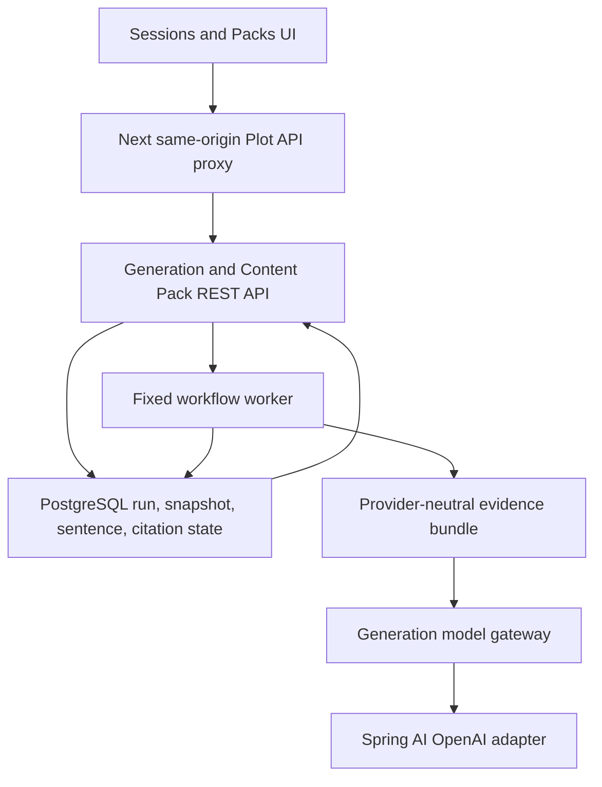
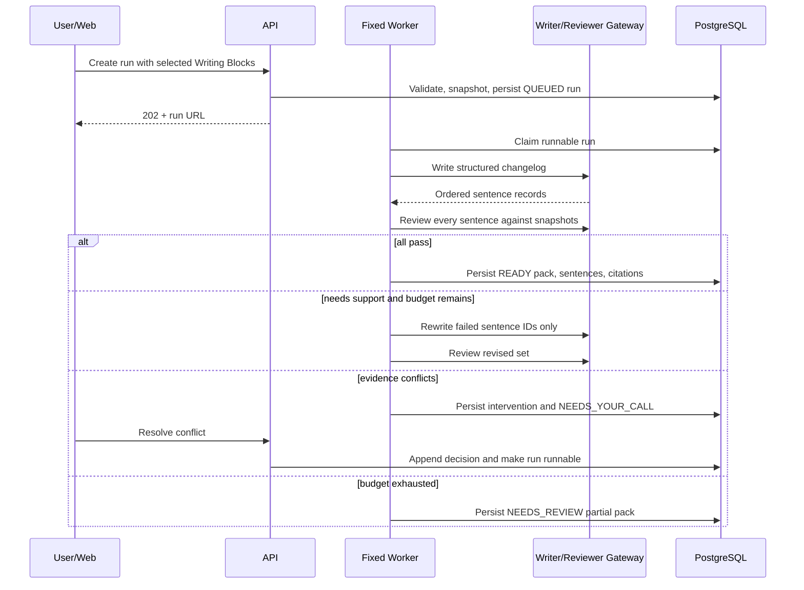
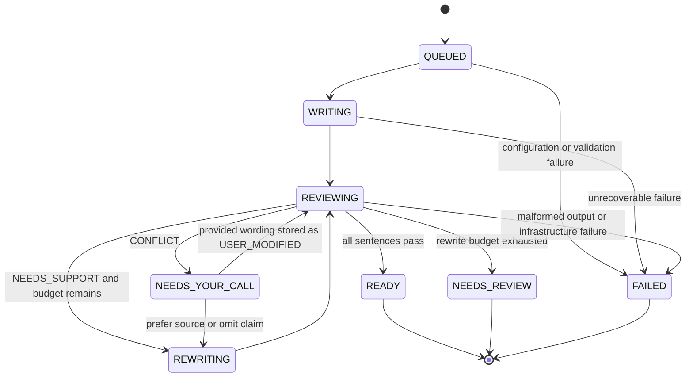
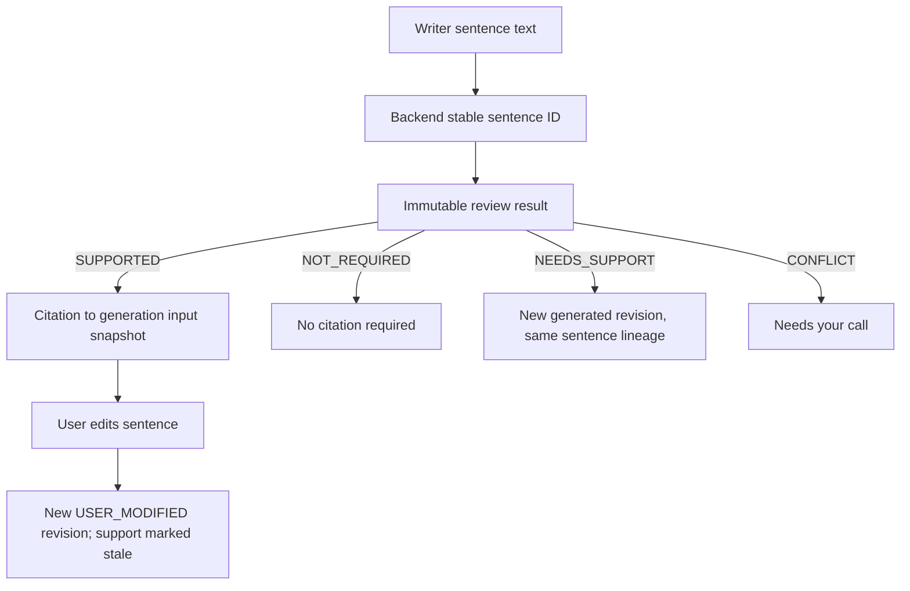

# Generation Citation Workflow - Plan

## Goal Capsule

- **Objective:** Deliver the first real Plot value loop from selected GitHub Writing Blocks to an inspectable, editable, source-cited changelog.
- **Authority:** The confirmed conversation scope and Product Contract in this plan override broader future-state architecture where they differ; `docs/product/roadmap.md` and `docs/product/product-definition.md` provide the product boundary; current repository conventions govern implementation details.
- **Execution profile:** Implement a backend-owned fixed workflow with an OpenAI adapter, durable checkpoints, explicit model-call budgets, sentence-level review, and a real web experience through the shared API contract.
- **Stop conditions:** Stop and surface a blocker if implementation would require Slack/Linear ingestion, a general-purpose agent runtime, autonomous publishing, or a product decision that contradicts the sentence-level citation and human-conflict-resolution contract.
- **Tail ownership:** The work includes schema, backend workflow/API, shared TypeScript client, web citation/review/export UX, deterministic tests, an opt-in real-model smoke path, and the corresponding architecture/operations documentation.

---

## Product Contract

### Summary

Plot will turn user-selected, imported GitHub pull requests into a changelog whose factual sentences are independently checked against immutable generation-time evidence snapshots. The user can inspect inline citations, resolve genuine source conflicts, edit individual sentences, and copy or download a Markdown export without losing the distinction between verified, unsupported, conflicting, and user-modified text.

### Problem Frame

The repository can import GitHub pull requests as provider-neutral Writing Blocks, but generation, model invocation, content packs, citations, and real web-to-API integration do not exist. The current mock UI only links whole drafts to a reference list, so it cannot prove which source supports a sentence or prevent a plausible but unsupported claim from looking verified. A first implementation must make grounding visible without prematurely building the dynamic planner, tool registry, multi-source connectors, voice system, or full template platform described by the long-range architecture.

### Actors

- A1. A workspace member selects imported shipped-work records, requests a changelog, inspects the result, resolves source conflicts, edits sentences, and exports the draft.
- A2. The fixed Plot workflow prepares evidence, writes, reviews, and rewrites within server-owned limits.
- A3. A future external agent uses the same workspace-scoped API and durable artifacts as the web UI; no MCP or A2A surface is included now.

### Requirements

**Run and evidence lifecycle**

- R1. A generation request accepts a source scope, selected Writing Block IDs, an optional changelog instruction, and a required `Idempotency-Key` header. It validates workspace/source readability and snapshots the selected evidence before queueing. The same key plus the same canonical request returns the original run; reuse with different inputs or options returns `409`.
- R2. Each generation input preserves the source provider, source kind, display label/title, reviewed body or excerpt, original URL, source revision timestamps, content hash, and capture time without later mutation when the Writing Block changes or is archived.
- R3. The run records workflow, prompt, output-schema, provider, model, and budget versions plus every logical model invocation, result, usage, latency, and machine-readable failure.

**Fixed generation and review loop**

- R4. Backend code owns the fixed `prepare evidence → write → review → targeted rewrite → review` state machine, completion rules, maximum three semantic rewrite attempts, transport retry policy, schema retry policy, and run-level model-call/token/time budgets.
- R5. Writer, reviewer, and rewriter receive only server-authored task instructions, the current sentence artifact, the run's untrusted evidence snapshots, and—when resuming a conflict—the recorded resolution instruction. They receive no connector credentials, tools, callbacks, or external/general-knowledge retrieval path.
- R6. The writer produces an ordered structured changelog; the backend assigns stable sentence IDs, and the independent reviewer returns exactly one verdict per sentence: `SUPPORTED`, `NOT_REQUIRED`, `NEEDS_SUPPORT`, or `CONFLICT`.
- R7. `SUPPORTED` requires one or more valid evidence IDs from the run; headings, transitions, greetings, and genuinely non-factual copy may be `NOT_REQUIRED`; unknown, missing, duplicate, or cross-run sentence/evidence references invalidate the model result.
- R8. A rewrite may replace only the failed sentence IDs and must preserve the lineage and text of non-targeted sentences; every draft, review, and rewrite artifact remains inspectable.
- R9. Exhausting the semantic rewrite limit produces a visible `NEEDS_REVIEW` partial draft with failed sentences and reasons instead of success or an opaque failure.

**Conflict and user editing**

- R10. A genuine source conflict creates a `Needs your call` intervention and pauses the run without presenting a definitive sentence as final.
- R11. The user resolves a conflict with one constrained action: `PREFER_SOURCE`, `OMIT_CLAIM`, or `PROVIDE_WORDING`. The versioned decision is stored separately from source evidence and the same run resumes from its checkpoint; stale or duplicate resolutions return `409`. User-provided wording becomes `USER_MODIFIED`/unverified, never `SUPPORTED` merely because the user supplied it.
- R12. The user edits the draft through stable sentence units; an edited sentence becomes `USER_MODIFIED` and unverified, its generated citations become stale for export, and the generation-time reviewer loop does not restart automatically.

**Citation and export experience**

- R13. The Plot editor renders label-style inline citations beside supported sentences and opens an internal evidence popover containing the generation-time snapshot excerpt, provider/source name, and original link.
- R14. `NEEDS_SUPPORT`, `CONFLICT`, and `USER_MODIFIED` sentences are visually distinguishable and expose their reason or required decision without hiding the rest of the draft.
- R15. Copy and download use the same backend-generated Markdown payload with deterministic numeric inline references and a final Sources list containing source name/title and original URL only; snapshot excerpts never leave through export.
- R16. Export of a draft with unresolved or user-modified sentences is rejected until the user explicitly confirms the warning, and that confirmation is recorded with the export event.

**Access and compatibility**

- R17. All run, artifact, citation, intervention, edit, and export reads/writes remain workspace-scoped and reuse the current source-managed access boundary before evidence capture.
- R18. The generation contract remains provider-neutral and includes GitHub, Slack, and Linear source identity values, while this implementation executes and verifies only the GitHub ingestion-to-citation path.

### Key Flows

- F1. Generate a supported changelog
  - **Trigger:** A1 selects readable imported PRs and submits a changelog request.
  - **Steps:** The API snapshots inputs, returns a run, A2 writes and reviews the draft, and polling exposes the terminal pack.
  - **Outcome:** A1 receives a `READY` draft whose factual sentences have inline citations to the reviewed snapshots.
  - **Covered by:** R1–R8, R13, R17–R18
- F2. Repair unsupported claims
  - **Trigger:** The reviewer marks one or more factual sentences `NEEDS_SUPPORT`.
  - **Steps:** A2 rewrites only those sentences and reviews the revised sentence set again until it passes or the rewrite budget is exhausted.
  - **Outcome:** The draft becomes `READY` or an inspectable `NEEDS_REVIEW` partial result.
  - **Covered by:** R4, R6–R9
- F3. Resolve conflicting evidence
  - **Trigger:** The reviewer reports incompatible sources for a sentence.
  - **Steps:** The run pauses, A1 sees the conflict and its evidence, records a choice, and A2 resumes with the decision as a separate instruction artifact.
  - **Outcome:** No unsupported definitive claim is shown before the user decision.
  - **Covered by:** R10–R11, R14
- F4. Edit and export
  - **Trigger:** A1 edits one sentence or requests copy/download.
  - **Steps:** The edit marks that sentence unverified; the backend formats the current sentence order and citations; unresolved output requires explicit acknowledgment.
  - **Outcome:** The exported Markdown contains numeric citations and a clean Sources list, while internal snapshot excerpts remain private.
  - **Covered by:** R12–R16

### Acceptance Examples

- AE1. Given two imported PRs that support every factual sentence, when the workflow completes, then the draft is `READY`, each factual sentence is `SUPPORTED`, and each inline citation opens the exact generation-time snapshot.
- AE2. Given a reviewer response that cites an evidence ID from another run, when the backend validates it, then the invocation fails as malformed output and no false citation is persisted.
- AE3. Given one unsupported sentence and two supported sentences, when targeted rewriting runs, then only the unsupported sentence receives a new revision and the supported sentence text and IDs remain unchanged.
- AE4. Given three unsuccessful rewrite attempts, when review still fails, then the user receives a `NEEDS_REVIEW` draft with failed sentences visibly marked.
- AE5. Given GitHub evidence says a change shipped and another snapshot says public release is delayed, when review detects the conflict, then the run pauses at `Needs your call` without a definitive final sentence.
- AE6. Given a source Writing Block changes after the run starts, when the citation popover is opened, then it shows the immutable generation-time snapshot and the stored original link.
- AE7. Given a user edits a supported sentence, when the draft is rendered, then that sentence is `USER_MODIFIED`, its generated support is stale, and no automatic review loop begins.
- AE8. Given an unresolved draft, when export is requested without acknowledgment, then export is refused; after explicit acknowledgment, the returned Markdown has numeric references and a Sources list without snapshot excerpts.
- AE9. Given source text contains instructions to ignore prior rules or emit an attacker URL, when the workflow runs, then the text is treated as evidence data, no tool is called, and all exported citation URLs are reconstructed from stored canonical source URLs.

### Success Criteria

- The real GitHub-import-to-source-cited-changelog path works through the web UI with an explicitly configured OpenAI model.
- Deterministic CI covers every terminal workflow state and all acceptance examples without external network calls.
- Unsupported-claim recall, citation precision, conflict recall, `NOT_REQUIRED` false-positive rate, model calls, token usage, latency, and estimated cost can be measured from persisted eval/run data.
- No prompt, completion, evidence body, connector credential, or snapshot excerpt is emitted to general application logs, traces, or exported Sources.

### Scope Boundaries

#### Included now

- One fixed changelog workflow and one versioned prompt/schema contract.
- GitHub Writing Blocks as the real source path; Slack and Linear only as provider-neutral contract fixtures.
- Polling-based progress, restart recovery, one conflict intervention type, structured sentence editing, Markdown copy and download.
- Spring AI 2.0 OpenAI adapter, deterministic fake gateway, provider contract fixtures, and an opt-in real-model smoke/eval path.

#### Deferred to Follow-Up Work

- Slack and Linear connectors, additional output templates, voice profiles/rules/samples, source-selection proposal agents, scheduled refresh, SSE progress, richer model eval automation, retention/purge administration, and asynchronous sharing/comments.
- General-purpose planning, arbitrary tool selection, dynamic re-planning, multi-agent handoffs, MCP/A2A exposure, and a reusable AgentStep runtime.

#### Outside this slice

- Autonomous publishing, external send/post actions, real-time collaborative editing, full span-level citation annotation, organization-wide search, and a broad template marketplace.

---

## Planning Contract

### Key Technical Decisions

- KTD1. **Use a DB-backed asynchronous run resource with an explicit reload contract.** `POST` validates and snapshots inputs transactionally, then exposes the run as `QUEUED` and returns `202` plus `Location`; a bounded in-process worker conditionally claims runnable rows, checkpoints after each stage, and recovers stale work at startup. The externally visible lifecycle is `QUEUED → WRITING → REVIEWING ↔ REWRITING → READY | NEEDS_YOUR_CALL | NEEDS_REVIEW | FAILED`. From `NEEDS_YOUR_CALL`, `PREFER_SOURCE` and `OMIT_CLAIM` resume targeted rewrite, while `PROVIDE_WORDING` appends a `USER_MODIFIED` revision and advances without a model rewrite. `GET` returns the current state, attempt, structured artifacts, pending intervention, and poll hint. Polling is the v1 progress contract; raw model token streaming is not.
- KTD2. **Keep orchestration deterministic and models tool-free.** Code owns transitions, retries, budgets, validation, pause/resume, and terminal status. Writer/reviewer prompts own prose and judgment only, and source text is delimited as untrusted data.
- KTD3. **Use provider-neutral application ports.** The domain depends on a generation model gateway; a Spring AI 2.0 adapter uses auto-configured `ChatClient.Builder` with separate writer and reviewer clients. Missing model configuration fails the run with `MODEL_NOT_CONFIGURED` rather than preventing API startup.
- KTD4. **Store logical calls, not an accumulated retry counter.** Transport retries, malformed-schema retries, and semantic rewrites are separate bounded concepts. Every logical call is created before invocation and closed with its own status, provider request metadata, usage, latency, redacted artifacts, and failure code.
- KTD5. **Make sentence structure canonical.** Writer output is a top-level object containing ordered sentence/block records; the backend assigns stable IDs. Rewrites create immutable sentence revisions, while a current projection supports editing and rendering without character offsets.
- KTD6. **Bind citations to generation inputs.** A citation targets a sentence revision and a generation input snapshot, with the original Writing Block retained for lineage. The server supplies the source label and URL; model-supplied URLs are ignored.
- KTD7. **Keep generated and edited truth separate.** The terminal generated body and attempts are immutable. User edits create a new current sentence revision marked `USER_MODIFIED`; they do not rewrite the generation record or silently retain a `SUPPORTED` verdict.
- KTD8. **Use one backend export formatter.** Copy and download consume the same Markdown export response. Numeric labels are derived from final sentence order and cited input order, never stored as citation identity.
- KTD9. **Use the shared client through a same-origin web proxy.** `packages/api-client` owns DTOs and the fetch client; a Next Route Handler proxies `/api/plot/*` to the loopback Spring API so browser code does not depend on permissive CORS or a development-only cross-origin contract.
- KTD10. **Implement the roadmap slice, not the entire future ERD.** The migration implements generation, inputs, steps/invocations, packs, variants, sentence revisions/evaluations, citations, interventions, and export audits with fixed prompt/model snapshots. It does not require unimplemented Voice, Template, AgentRun, or TaskArtifact foreign keys.

### High-Level Technical Design

#### Component topology

#### Workflow sequence

#### Run state machine

#### Sentence and citation lifecycle

### Data and privacy constraints

- Evidence snapshots and model artifacts are append-only during normal product use, but the schema must not prevent a future workspace deletion or retention purge path.
- General logs and Micrometer/OpenTelemetry spans contain IDs, statuses, provider/model, timing, retry, and token metadata only. Prompt/completion and source-content observation remain disabled.
- Persisted model payloads are redacted of credentials and unnecessary provider headers. API keys live only in runtime configuration.
- The web renders generated/source content as text and validated links; it does not use `dangerouslySetInnerHTML`, and citation URLs allow only `https`/`http`.

### Sequencing

U1 establishes the database invariants. U2 defines the provider-neutral application contracts and validation. U3 adds the OpenAI adapter. U4 implements the fixed durable workflow. U5 exposes and verifies the REST/export surface. U6 establishes the shared web client, proxy, polling, and frontend test harness. U7 delivers the citation/review/edit/export experience. U8 closes the loop with model contract fixtures, an opt-in smoke/eval path, and documentation alignment.

### Assumptions

- The first real provider is OpenAI through the existing Spring AI starter, but the model name has no hard-coded product default and must be supplied by deployment configuration.
- Conflict resolution supports `PREFER_SOURCE`, `OMIT_CLAIM`, or `PROVIDE_WORDING`; the user decision is an instruction artifact, never a citation source. Provided wording is stored as a user revision and remains unverified.
- The first export formats are clipboard Markdown and downloadable Markdown produced from one server response.
- Structured sentence editing replaces the current whole-document textarea for generated changelogs; non-generation mock documents may retain their current display until migrated.
- Authentication remains the existing development workspace context for this slice, but every repository query and foreign key remains workspace-scoped so later auth does not require a data rewrite.

### Risks and Mitigations

- **False grounding:** A plausible citation may not support the claim. Bind citations to reviewed snapshots, validate all IDs server-side, preserve reviewer reasons, and include unsupported/conflict eval cases.
- **Retry multiplication and cost:** Spring AI transport and schema retries can multiply the semantic loop. Configure small explicit retry ceilings and enforce run-level model-call/token/time budgets.
- **JVM restart or duplicate work:** Fire-and-forget async execution can strand or duplicate runs. Use database claims, conditional transitions, per-step checkpoints, startup recovery, canonical request fingerprints, and version-checked idempotent creation/resolution.
- **Ambiguous budget exhaustion:** Infrastructure failure and semantic review failure can otherwise collapse into one status. End timeout/call/token exhaustion as `FAILED` unless a reviewed partial draft is already durable; if one exists, expose it as `NEEDS_REVIEW` with its exact failed sentence reasons.
- **Indirect prompt injection:** PR bodies are untrusted model input. Delimit them as data, expose no tools or secrets to models, validate structured output, rebuild URLs from snapshots, and include adversarial fixtures.
- **Citation drift after edits:** Character offsets break when text changes. Use stable sentence lineage and mark edited revisions unverified instead of carrying generated support forward.
- **Sensitive snapshot leakage:** Evidence can outlive connector access. Enforce workspace access, keep content out of telemetry, exclude excerpts from exports, and document future retention/purge work.
- **Structured-output drift:** Kotlin schema generation and provider support can change. Pin Spring AI 2.0.0, snapshot the generated schemas, validate actual model capability in an opt-in contract test, and avoid complex polymorphic output.

---

## Implementation Units

### U1. Persist the fixed workflow and citation invariants

- **Goal:** Add the durable relational foundation for generation runs, immutable evidence and execution artifacts, sentence-level reviews/citations, interventions, and export acknowledgments.
- **Requirements:** R1–R4, R6–R12, R16–R18
- **Dependencies:** None
- **Files:**
  - Create `apps/api/src/main/resources/db/migration/V3__generation_citation_workflow.sql`
  - Create `apps/api/src/test/kotlin/com/plot/api/generation/GenerationCitationSchemaIntegrationTest.kt`
  - Modify `docs/architecture/data-architecture.md`
- **Approach:** Extend the existing workspace-composite-key and check-constraint conventions. Model generation runs, immutable inputs, workflow steps/model calls, working artifacts, packs/variants, stable sentence lineages and revisions, sentence evaluations, citations bound to generation inputs, one pending conflict intervention per run, and append-only export events. Use status constraints, order uniqueness, same-workspace composite foreign keys, conditional uniqueness for idempotency/claims, and optimistic transition/version fields. Do not introduce mandatory Voice, Template, AgentRun, or TaskArtifact dependencies.
- **Execution note:** Start with failing schema integration tests before writing the migration because later units depend on these cross-table invariants.
- **Patterns to follow:** `apps/api/src/main/resources/db/migration/V2__github_adapter.sql`; `apps/api/src/test/kotlin/com/plot/api/github/GitHubSchemaIntegrationTest.kt`.
- **Test scenarios:**
  1. Insert a complete same-workspace run/input/sentence/review/citation chain and read it back.
  2. Reject a citation whose sentence and generation input belong to different runs or workspaces.
  3. Reject duplicate active idempotency keys, duplicate sentence order within a variant, and a second pending intervention for one run.
  4. Permit multiple immutable revisions and review attempts for one stable sentence lineage while preventing in-place identity drift.
  5. Enforce allowed run, step, verdict, intervention, revision-origin, pack, variant, and export states.
  6. Preserve a generation input after its source Writing Block is archived, while retaining the lineage foreign key.
- **Verification:** Flyway validates from an empty database and the schema integration test proves the invariants without relying on JPA behavior.

### U2. Define evidence, sentence, review, and export domain contracts

- **Goal:** Establish provider-neutral Kotlin contracts and deterministic validators/renderers before model or HTTP integration.
- **Requirements:** R2, R5–R9, R12–R16, R18
- **Dependencies:** U1
- **Files:**
  - Create `apps/api/src/main/kotlin/com/plot/api/generation/model/GenerationContracts.kt`
  - Create `apps/api/src/main/kotlin/com/plot/api/generation/EvidenceSnapshotService.kt`
  - Create `apps/api/src/main/kotlin/com/plot/api/generation/ModelOutputValidator.kt`
  - Create `apps/api/src/main/kotlin/com/plot/api/citation/CitationProjectionService.kt`
  - Create `apps/api/src/main/kotlin/com/plot/api/contentpack/MarkdownExportService.kt`
  - Create `apps/api/src/test/kotlin/com/plot/api/generation/EvidenceSnapshotServiceTest.kt`
  - Create `apps/api/src/test/kotlin/com/plot/api/generation/ModelOutputValidatorTest.kt`
  - Create `apps/api/src/test/kotlin/com/plot/api/contentpack/MarkdownExportServiceTest.kt`
- **Approach:** Treat Writing Blocks as normalized inputs and emit immutable evidence IDs independent of provider DTOs. Use simple top-level structured-output records for writer, reviewer, and targeted rewrite. The backend assigns sentence IDs, requires complete one-to-one review coverage, validates evidence references, and forbids rewriter changes outside requested IDs. The Markdown formatter derives numeric references from final sentence order, filters stale citations, and excludes snapshot excerpts.
- **Patterns to follow:** `apps/api/src/main/kotlin/com/plot/api/github/GitHubWritingBlockTransformer.kt`; `apps/api/src/main/kotlin/com/plot/api/writingblock/WritingBlockService.kt`.
- **Test scenarios:**
  1. Snapshot GitHub, Slack, and Linear-shaped Writing Blocks into the same provider-neutral evidence contract while exercising GitHub as the real input.
  2. Reject blank snapshots, unsupported URL schemes, unknown/cross-run evidence IDs, missing or duplicate sentence verdicts, and `SUPPORTED` without evidence.
  3. Accept `NOT_REQUIRED` only without a support requirement and preserve multiple citations for one sentence.
  4. Apply a targeted rewrite that returns exactly the requested sentence IDs and reject extra, missing, or reordered non-targeted changes.
  5. Render deterministic Markdown with numeric citations and a deduplicated Sources list containing only source labels and original links.
  6. Refuse unresolved export without acknowledgment and record that acknowledged output contains no snapshot excerpt.
  7. Treat prompt-injection text inside evidence as inert serialized data and ignore model-returned citation URLs.
- **Verification:** Pure domain tests prove the semantic contract without Spring context or external models.

### U3. Add the configured Spring AI OpenAI adapter

- **Goal:** Invoke a real OpenAI model through a fakeable provider boundary with typed output, bounded retries, redacted persistence metadata, and safe disabled behavior.
- **Requirements:** R3–R8, R17
- **Dependencies:** U2
- **Files:**
  - Create `apps/api/src/main/kotlin/com/plot/api/ai/provider/GenerationModelGateway.kt`
  - Create `apps/api/src/main/kotlin/com/plot/api/ai/provider/SpringAiOpenAiGenerationGateway.kt`
  - Create `apps/api/src/main/kotlin/com/plot/api/ai/provider/DisabledGenerationModelGateway.kt`
  - Create `apps/api/src/main/kotlin/com/plot/api/ai/prompt/ChangelogPromptFactory.kt`
  - Create `apps/api/src/main/kotlin/com/plot/api/config/PlotAiProperties.kt`
  - Modify `apps/api/src/main/resources/application.properties`
  - Modify `apps/api/src/test/resources/application.properties`
  - Create `apps/api/src/test/kotlin/com/plot/api/ai/provider/SpringAiOpenAiGenerationGatewayTest.kt`
  - Create `apps/api/src/test/resources/ai-schema/writer-output.schema.json`
  - Create `apps/api/src/test/resources/ai-schema/reviewer-output.schema.json`
  - Create `apps/api/src/test/resources/ai-schema/rewrite-output.schema.json`
- **Approach:** Inject the auto-configured prototype `ChatClient.Builder`, build separate writer/reviewer clients, use synchronous typed calls inside the background worker, opt into provider-native structured output only through the adapter, and schema-validate with a deliberately small correction budget. Keep model name, timeout, temperatures, output limits, transport retry policy, and total budgets in `plot.ai.*` configuration; do not store the API key. Map transient, non-transient, malformed-output, and disabled-provider failures separately.
- **Patterns to follow:** Existing opt-in `plot.github.*` configuration and disabled guard behavior; Spring AI 2.0 `ChatClient`/OpenAI configuration documented in Sources and Research.
- **Test scenarios:**
  1. With AI disabled or the key/model absent, API startup succeeds and a model call returns `MODEL_NOT_CONFIGURED` without leaking configuration.
  2. Writer, reviewer, and rewrite responses deserialize from representative provider fixtures and retain response ID, actual model, finish reason, tokens, and latency metadata.
  3. Generated JSON schemas match golden files and keep required Kotlin fields non-null and top-level outputs object-shaped.
  4. A transient provider error follows the small transport retry policy; a 4xx/non-transient error fails immediately; malformed structured output is classified separately.
  5. Prompt construction clearly separates instructions from untrusted evidence and supplies no tools or connector credentials.
  6. Prompt/completion/source bodies are absent from logs and observation metadata in the tested configuration.
- **Verification:** Adapter contract tests pass without network access; an actual model is required only by the opt-in U8 smoke path.

### U4. Implement the durable fixed writer-reviewer workflow

- **Goal:** Coordinate evidence preparation, writing, independent review, bounded targeted rewrite, conflict pause/resume, recovery, and terminal pack creation.
- **Requirements:** R1–R12, R17–R18
- **Dependencies:** U1–U3
- **Files:**
  - Create `apps/api/src/main/kotlin/com/plot/api/generation/GenerationWorkflowService.kt`
  - Create `apps/api/src/main/kotlin/com/plot/api/generation/GenerationRunService.kt`
  - Create `apps/api/src/main/kotlin/com/plot/api/generation/GenerationRunWorker.kt`
  - Create `apps/api/src/main/kotlin/com/plot/api/generation/GenerationRunRecovery.kt`
  - Create `apps/api/src/main/kotlin/com/plot/api/generation/GenerationPersistence.kt`
  - Create repositories/entities under `apps/api/src/main/kotlin/com/plot/api/generation/`, `apps/api/src/main/kotlin/com/plot/api/contentpack/`, and `apps/api/src/main/kotlin/com/plot/api/citation/`
  - Create `apps/api/src/test/kotlin/com/plot/api/generation/GenerationWorkflowServiceTest.kt`
  - Create `apps/api/src/test/kotlin/com/plot/api/generation/GenerationRunRecoveryIntegrationTest.kt`
- **Approach:** Validate and snapshot inputs transactionally before exposing a `QUEUED` run, then let a bounded executor claim it with a conditional database transition. Commit after each stage and logical model call. Use a scripted gateway in tests. Persist a working artifact during pauses and failed reviews, but create the immutable terminal generated variant only at `READY` or `NEEDS_REVIEW`. Conflict resolution appends a versioned decision artifact and schedules only the affected run. Recovery resumes from the last completed checkpoint and does not re-import or rebuild evidence.
- **Execution note:** Implement the state machine test-first because terminal-state and retry behavior are easier to prove before introducing controllers and polling.
- **Patterns to follow:** `apps/api/src/main/kotlin/com/plot/api/github/GitHubImportService.kt` reservation/failure-recording transactions; existing workspace-scoped services and `UuidGenerator`.
- **Test scenarios:**
  1. Covers F1 / AE1. A scripted writer/reviewer pass creates a `READY` pack with supported and `NOT_REQUIRED` sentences.
  2. Covers F2 / AE3. A failed sentence is rewritten, reviewed again, and preserves every non-targeted sentence ID/text and each attempt artifact.
  3. Covers AE4. Three failed semantic rewrite attempts end in `NEEDS_REVIEW` with reasons and no false success.
  4. Covers F3 / AE5. Conflicting evidence pauses exactly once; `PREFER_SOURCE` and `OMIT_CLAIM` resume targeted rewrite from the same snapshot, while `PROVIDE_WORDING` creates an unverified user revision.
  5. A stale intervention version or second resolution returns a conflict and cannot enqueue duplicate work.
  6. A restart at every persisted checkpoint resumes without repeating a completed logical model call or rebuilding evidence.
  7. Transport/schema retry exhaustion ends in `FAILED` when no reviewed partial exists; budget exhaustion with a durable reviewed partial ends in `NEEDS_REVIEW` and preserves failed-sentence reasons.
  8. Covers AE9. Adversarial source instructions cannot alter workflow stages, tools, or citation URLs.
- **Verification:** Pure workflow tests cover every branch; Testcontainers recovery tests prove persistence and concurrency semantics.

### U5. Expose workspace-scoped generation, inspection, editing, intervention, and export APIs

- **Goal:** Provide one coherent REST contract for the UI and future agents to start, poll, inspect, resolve, edit, and export the same durable objects.
- **Requirements:** R1–R3, R9–R18
- **Dependencies:** U4
- **Files:**
  - Create `apps/api/src/main/kotlin/com/plot/api/generation/GenerationController.kt`
  - Create request/response DTOs under `apps/api/src/main/kotlin/com/plot/api/generation/dto/`
  - Create `apps/api/src/main/kotlin/com/plot/api/contentpack/ContentPackController.kt`
  - Create request/response DTOs under `apps/api/src/main/kotlin/com/plot/api/contentpack/dto/`
  - Modify `apps/api/src/main/kotlin/com/plot/api/common/ApiExceptionHandler.kt`
  - Create `apps/api/src/test/kotlin/com/plot/api/generation/GenerationApiIntegrationTest.kt`
  - Create `apps/api/src/test/kotlin/com/plot/api/contentpack/ContentPackApiIntegrationTest.kt`
- **Approach:** Require `Idempotency-Key`. Return `202` plus `Location` for new runs, return the existing run for the same key/canonical fingerprint, and return `409` when a key is reused with different inputs/options. Make run detail include state, current attempt, partial/final pack, sentence revisions, citations, pending intervention, and poll hint so polling needs one read. Provide optimistic-versioned sentence edits and append-only intervention resolution, rejecting stale/double submissions with `409`. Use one export endpoint returning filename/media type/text plus audit metadata. Apply `no-store` to generation/content responses containing private evidence.
- **Patterns to follow:** Existing Spring MVC controllers/DTOs, `ApiException`, `ApiExceptionHandler`, `DevContext`, `SourceManagedAccessGuard`, and MockMvc/Testcontainers integration tests.
- **Test scenarios:**
  1. Covers R1. Valid selected blocks return `202` and a run URL; repeating a canonical request with the same idempotency key returns the original run; changing any selected block, scope, or option under that key returns `409`.
  2. Reject unknown, inactive, cross-workspace, cross-scope, or unreadable Writing Blocks before any model invocation.
  3. Polling returns monotonic progress and the complete partial/final sentence/citation/intervention projection without internal credentials or raw provider payloads.
  4. Covers AE6. Changing or archiving a Writing Block after capture does not change the run detail snapshot.
  5. Resolve only the run's current pending intervention once; reject stale, duplicate, cross-workspace, or invalid resolution options.
  6. Covers AE7. Editing one sentence creates `USER_MODIFIED`, stales its generated citations, and leaves other sentence verdicts unchanged.
  7. Covers AE8. Export without acknowledgment returns `EXPORT_CONFIRMATION_REQUIRED` with exact affected sentence IDs; every acknowledged copy/download action creates its own audit event, both payloads match, and neither contains excerpts.
  8. Generation/model/evidence responses are `no-store` and use stable machine-readable errors for disabled model, malformed output, budget exhaustion, and invalid transitions.
- **Verification:** MockMvc integration tests prove the public API contract, workspace isolation, snapshot immutability, and export privacy against PostgreSQL.

### U6. Establish the shared web client, same-origin proxy, polling, and frontend tests

- **Goal:** Replace the generation path's mock-only boundary with typed real API access without opening the Spring API to permissive browser CORS.
- **Requirements:** R1, R10–R18
- **Dependencies:** U5
- **Files:**
  - Modify `packages/api-client/package.json`
  - Modify `packages/api-client/src/index.ts`
  - Modify `apps/web/package.json`
  - Modify `pnpm-lock.yaml`
  - Create `apps/web/src/app/api/plot/[...path]/route.ts`
  - Modify `apps/web/src/lib/api-client.ts`
  - Create `apps/web/src/lib/generation-polling.ts`
  - Create `apps/web/vitest.config.ts`
  - Create `apps/web/src/test/setup.ts`
  - Create `packages/api-client/src/index.test.ts`
  - Create `apps/web/src/lib/generation-polling.test.ts`
- **Approach:** Put provider-neutral DTOs, error parsing, create/get/edit/resolve/export calls, and abort support in `@plot/api-client`. Proxy only the allowlisted Plot API path/method surface through a Route Handler whose upstream base URL is server-only configuration. Poll active runs with cancellation and bounded backoff, stop at terminal/interaction states, and preserve existing mocks for unrelated screens during migration. Add Vitest and Testing Library as the minimum web behavioral harness.
- **Patterns to follow:** `apps/web/src/lib/api-client.ts` as the app boundary, `apps/web/src/app/api/waitlist/route.ts` for Route Handler shape, and local Next.js 16 docs required by `apps/web/AGENTS.md`.
- **Test scenarios:**
  1. Serialize create/edit/resolve/export requests and parse every run/sentence/citation/intervention status without provider-specific fields.
  2. Convert structured API errors into stable client errors while preserving `MODEL_NOT_CONFIGURED` and `EXPORT_CONFIRMATION_REQUIRED` details.
  3. Proxy only allowlisted paths and methods, omit hop-by-hop headers, preserve `Location`/`no-store`, and reject arbitrary upstream URLs.
  4. Poll until `READY`, `NEEDS_REVIEW`, `NEEDS_YOUR_CALL`, or `FAILED`; abort on component disposal and do not duplicate a create request.
  5. Keep Slack/Linear as parseable source kinds without exposing an ingestion action in the UI.
- **Verification:** Shared client and polling tests pass; web lint/build succeed under Next.js 16 with no direct browser request to the Spring origin.

### U7. Deliver inline citation, review, conflict, edit, and export UX

- **Goal:** Make grounding and unresolved claims visible where the user reads and edits the changelog.
- **Requirements:** R9–R16
- **Dependencies:** U6
- **Files:**
  - Modify `apps/web/src/features/sessions/sessions-workspace.tsx`
  - Modify `apps/web/src/features/sessions/session-composer.tsx`
  - Modify `apps/web/src/features/sessions/session-side-panel.tsx`
  - Modify `apps/web/src/features/packs/packs-workspace.tsx`
  - Create `apps/web/src/features/citations/cited-draft-editor.tsx`
  - Create `apps/web/src/features/citations/inline-citation.tsx`
  - Create `apps/web/src/features/citations/evidence-popover.tsx`
  - Create `apps/web/src/features/citations/sentence-review-state.tsx`
  - Create `apps/web/src/features/citations/intervention-panel.tsx`
  - Create `apps/web/src/features/citations/export-dialog.tsx`
  - Create `apps/web/src/features/citations/cited-draft-editor.test.tsx`
  - Create `apps/web/src/features/citations/intervention-panel.test.tsx`
  - Create `apps/web/src/features/citations/export-dialog.test.tsx`
- **Approach:** Let the session composer select current references and start a real run, show fixed-stage progress, and open the resulting pack. Render ordered sentence units rather than a whole-document textarea. Supported sentences get compact provider-label citations; the popover shows internal snapshot text and an original-link action. Failed/conflicting/user-modified states are sentence-local. Conflict resolution offers choose evidence, omit claim, or add direction. Copy and download call the same export endpoint and show an explicit confirmation dialog when unresolved state exists.
- **Patterns to follow:** Existing Sessions side-panel/open-document behavior, Packs detail layout, current accessibility roles, and the previously agreed Astryx label-inline/numeric-export citation distinction.
- **Test scenarios:**
  1. Covers AE1. A supported sentence renders label citations inline; keyboard/click activation opens the matching snapshot and original link.
  2. `NOT_REQUIRED` renders no citation badge, while multiple sources render multiple distinguishable citations without mixing label and numeric variants in the editor paragraph.
  3. Covers AE4. `NEEDS_SUPPORT` sentences are marked with the reviewer reason and the draft remains readable.
  4. Covers AE5. `CONFLICT` opens `Needs your call`, submits each allowed resolution, disables duplicate submission, and resumes polling.
  5. Covers AE7. Editing one structured sentence marks only that sentence `USER_MODIFIED` and removes the appearance of confirmed support.
  6. Covers AE8. Export without unresolved state copies/downloads immediately; unresolved export shows a warning and proceeds only after explicit confirmation.
  7. Snapshot text and generated text render as text nodes, unsafe link schemes are not actionable, and no raw HTML injection path exists.
- **Verification:** Component tests cover citation, keyboard access, conflict, edit, and export flows; browser smoke verification confirms the agreed inline visual hierarchy in Sessions and Packs.

### U8. Add model contract evaluation and align operational documentation

- **Goal:** Prove the configured real model can satisfy the structured grounding contract and leave maintainers with an explicit safe-run and evaluation path.
- **Requirements:** R3–R9, R13–R18
- **Dependencies:** U3–U7
- **Files:**
  - Create `apps/api/src/test/kotlin/com/plot/api/ai/provider/OpenAiGenerationContractSmokeTest.kt`
  - Create `apps/api/src/test/resources/evals/generation-citation-cases.json`
  - Create `docs/operations/generation-citation-smoke-test.md`
  - Modify `docs/architecture/project-structure.md`
  - Modify `docs/product/roadmap.md`
  - Modify `README.md`
  - Modify `README.ko.md`
  - Modify `justfile`
- **Approach:** Keep the real-model test opt-in and excluded from normal CI. Seed a compact eval corpus covering supported/unsupported/non-factual/multi-source/conflict/numeric/date/prompt-injection/partial-rewrite cases, record model/version/usage/latency and outcome metrics, and fail safely without printing evidence. Document required runtime configuration, provider data-handling considerations, local GitHub-import-to-export smoke steps, disabled behavior, and the separation between transport/schema/semantic retries.
- **Patterns to follow:** `docs/operations/github-app-development-smoke-test.md`; root `justfile` task naming; current README architecture summaries.
- **Test scenarios:**
  1. The opt-in configured model returns writer/reviewer/rewrite payloads that satisfy the golden schemas and server validators.
  2. The eval corpus measures unsupported-claim recall, citation precision, conflict recall, `NOT_REQUIRED` false positives, calls, tokens, latency, and cost metadata without exposing source text in output logs.
  3. Normal `just test` never requires an API key or external network; the explicit smoke target fails with a clear configuration message when disabled.
  4. The documented end-to-end smoke creates/imports GitHub evidence, generates, inspects citation snapshots, exercises a conflict/partial fixture, edits a sentence, and verifies private-vs-exported citation content.
- **Verification:** Normal test/lint/build gates remain hermetic, the opt-in model contract test passes with configured credentials, and documentation accurately reflects shipped scope and deferred dynamic-agent work.

---

## System-Wide Impact

- **Data lifecycle:** Generation-time snapshots become sensitive workspace data independent of current connector readability. Normal updates are append-only; future retention/purge administration remains required.
- **API and agent parity:** The web and future agents share the same create, inspect, resolve, edit, and export resources. No UI-only resolution or client-only formatter is allowed.
- **Operations:** The API gains a bounded background executor and restart recovery path but remains one deployable Spring service; PostgreSQL is the coordination source of truth.
- **Cost and performance:** Every run has explicit call/token/time limits and persisted usage. Polling uses bounded backoff and stops at interaction/terminal states.
- **Security:** External source content becomes untrusted prompt input. Models have no tools or source credentials, URLs are server-derived, private content is excluded from telemetry, and all data access remains workspace-scoped.
- **Frontend architecture:** The first real product path crosses the empty shared client boundary and adds a same-origin BFF plus web behavioral tests; unrelated mock screens can migrate later.

---

## Verification Contract

| Gate | Applies to | Expected proof |
|---|---|---|
| `just test-api` | U1–U5, U8 hermetic tests | Schema, domain, workflow, recovery, API, export, and provider-fixture tests pass against Testcontainers PostgreSQL with no network. |
| `pnpm --filter @plot/api-client test` | U6 | Shared request/response contract and error parsing tests pass. |
| `pnpm --filter @plot/web test` | U6–U7 | Polling, citation editor, conflict, editing, and export component tests pass. |
| `just lint-web` | U6–U7 | Next.js/React/TypeScript lint passes. |
| `just build-api` | U1–U5, U8 | Spring Boot compiles with AI disabled by default and Flyway/JPA validation aligned. |
| `just build-web` | U6–U7 | Next.js 16 production build succeeds through the shared client/proxy boundary. |
| Opt-in generation contract smoke | U3, U8 | Configured OpenAI model satisfies structured schemas and server semantic validation without emitting sensitive content to logs. |
| Browser product smoke | U7–U8 | GitHub evidence produces a visible source-cited changelog; inline popovers, failed sentences, `Needs your call`, editing, copy, download, and warning confirmation behave as specified. |

The implementing agent should use test-first proof for the schema and state machine, deterministic scripted model responses for the main suite, and the real provider only after all hermetic gates pass.

---

## Definition of Done

- R1–R18 and AE1–AE9 are implemented or directly proven by the named automated/browser gates.
- GitHub-imported Writing Blocks can produce a real changelog through the configured OpenAI adapter and the resulting run is inspectable after request completion or restart.
- Every factual generated sentence is visibly `SUPPORTED`, `NEEDS_SUPPORT`, or `CONFLICT`; legitimate non-factual sentences are `NOT_REQUIRED`; edited sentences are visibly `USER_MODIFIED`.
- Evidence snapshots, model calls, attempts, reviews, rewrites, decisions, and exports are durable, workspace-scoped, versioned, and free of credential leakage.
- Conflict resolution pauses and resumes the fixed workflow; rewrite exhaustion produces a marked partial draft; duplicate creates/claims/resolutions are safe.
- Editor citations use source labels and internal snapshot popovers; Markdown copy/download uses numeric citations and a source-name/original-link-only Sources list.
- Unresolved export cannot proceed silently and its explicit acknowledgment is recorded.
- Spring AI/OpenAI is optional at process startup, fakeable in normal tests, bounded in retries/budgets, and verified by an opt-in contract smoke.
- Shared client, same-origin proxy, web polling, frontend behavioral tests, API tests, lint, and production builds pass.
- Architecture, roadmap, README, and operations documentation match the implemented fixed-workflow scope and clearly defer dynamic agent planning/tools.
- Experimental or abandoned code, duplicate formatters, client-side citation truth, debug payload logging, and obsolete mock generation paths introduced during implementation are removed before completion.

---

## Sources and Research

- Repository product direction: `docs/product/product-definition.md`, `docs/product/roadmap.md`, `docs/product/agentic-ux.md`.
- Repository architecture: `docs/architecture/data-architecture.md`, `docs/architecture/project-structure.md`, `docs/decisions/0001-monorepo-generated-apps.md`.
- Existing source/import patterns: `apps/api/src/main/kotlin/com/plot/api/github/GitHubImportService.kt`, `apps/api/src/main/kotlin/com/plot/api/github/GitHubWritingBlockTransformer.kt`, `apps/api/src/main/kotlin/com/plot/api/writingblock/WritingBlockService.kt`.
- [Spring AI 2.0.0 GA](https://spring.io/blog/2026/06/12/spring-ai-2-0-0-GA-available-now/) and [Spring AI reference](https://docs.spring.io/spring-ai/reference/).
- [Spring AI ChatClient and structured output](https://docs.spring.io/spring-ai/reference/api/chatclient.html), [OpenAI chat configuration](https://docs.spring.io/spring-ai/reference/api/chat/openai-chat.html), and [Spring AI observability](https://docs.spring.io/spring-ai/reference/observability/).
- [Spring AI evaluation testing](https://docs.spring.io/spring-ai/reference/api/testing.html) and [LLM-as-a-Judge guidance](https://docs.spring.io/spring-ai/reference/guides/llm-as-judge.html).
- [RFC 9110 `202 Accepted`](https://datatracker.ietf.org/doc/rfc9110/), [OpenAI API data controls](https://platform.openai.com/docs/models/default-usage-policies-by-endpoint), and [OWASP LLM01 Prompt Injection](https://genai.owasp.org/llmrisk/llm01-prompt-injection/).
