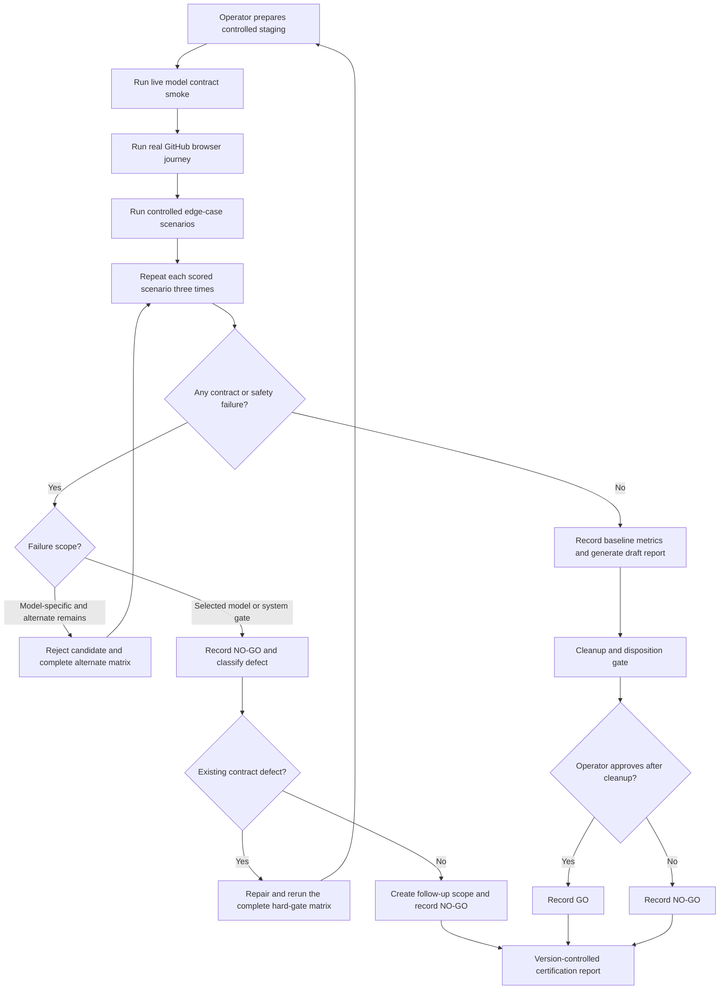
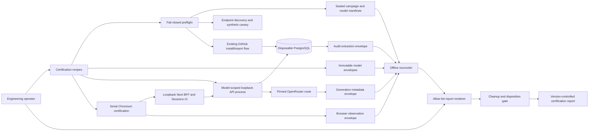
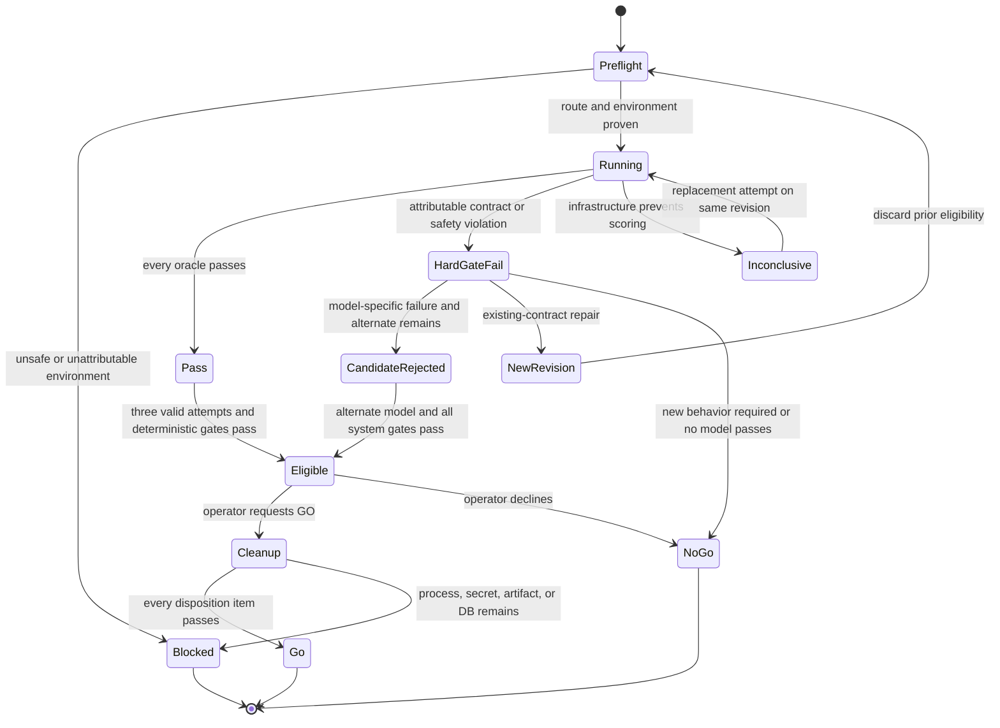
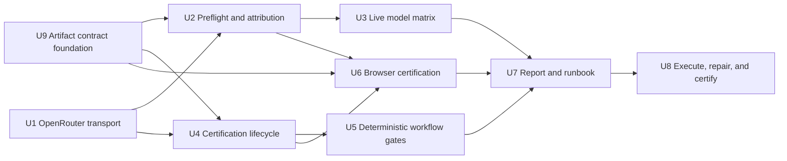

# Production Generation Smoke - Plan

## Goal Capsule

- **Objective:** Establish a repeatable, operator-run release certification for Plot's production generation workflow before the first design partner is onboarded.
- **Product authority:** The existing backend-managed generation and citation workflow, its human-controlled publishing rules, and the agreed source-snapshot contract remain authoritative.
- **Decision authority:** An engineering operator runs the certification in controlled staging and records the final GO or NO-GO decision.
- **Execution profile:** Deep, operator-run staging certification spanning the API, browser, external model route, persisted audit data, and release report.
- **Stop conditions:** Do not load credentials or source data unless both listeners and the disposable database are proven isolated. Do not run scored scenarios when canonical external origins, approved source scope, sensitive-data scan, OpenRouter route, or ZDR policy cannot be proven; fallback, content logging, mixed revisions, or unscoped secrets also stop the run.
- **Tail ownership:** The implementing agent owns the certification harness and deterministic tests. The engineering operator owns credentials, the real GitHub import, transient artifact cleanup, and the final GO/NO-GO decision.
- **Open blockers:** None for implementation. Exact OpenRouter endpoint attribution is deliberately resolved by fail-closed preflight with the operator's account immediately before a scored run.

---

## Product Contract

### Summary

Provide an executable certification bundle that an engineering operator can run in controlled staging before the first design-partner release.
It must exercise the real GitHub import-to-export path, reproducible failure cases, production configuration, and live OpenRouter model contracts, then preserve a version-controlled GO/NO-GO report.

### Problem Frame

Plot has automated contract coverage and a manual runbook, but those artifacts do not yet prove that the deployed system can complete a realistic generation workflow against a live model and real GitHub data.
The browser-facing flow also lacks a durable end-to-end release result, while model quality, latency, token use, and cost have no production baseline.
Onboarding a design partner without this evidence would rely on mocked or fixture-only confidence at the exact point where citation safety, recovery, and export behavior matter most.

### Key Decisions

- **Operator-run certification, not a permanent CI gate:** The first design-partner release needs repeatable evidence without making nondeterministic model execution, external credentials, and staging availability part of every CI run.
- **Real happy path plus controlled edge cases:** Real Plot GitHub pull requests demonstrate the integration path, while reproducible fixtures make conflict, insufficient-evidence, prompt-injection, and rewrite-exhaustion behavior testable on demand.
- **Scenario hard gate with baseline metrics:** A model-specific violation rejects that candidate; a selected-model or system-level contract/safety violation produces overall NO-GO. Quality, cost, and latency are recorded as an initial baseline rather than converted into arbitrary automated thresholds.
- **Cost-first model promotion:** `openai/gpt-5.4-nano` is the primary release candidate because the former GPT-5 Nano snapshot is scheduled to shut down on 2026-12-11. `openai/gpt-4o-mini-2024-07-18` is the comparison and promotion target when Nano cannot satisfy the same gate.
- **Reproducible private routing:** Certification resolves and pins one ZDR-compatible upstream endpoint per model, requires structured-output support, and disables model and provider fallback during scored runs.
- **Bounded repair scope:** Defects in the certification bundle and defects that violate the current generation/citation contract are fixed and re-run in this work. Findings that require new product behavior remain NO-GO items with follow-up scope.

### Actors

- A1. **Engineering operator:** Configures staging, starts the certification, reviews evidence, records defects, and owns the final GO/NO-GO decision.
- A2. **Plot workflow:** Imports source material, generates the changelog, validates sentence-level evidence, manages rewrite and review states, and enforces export rules.
- A3. **OpenRouter model endpoint:** Serves the pinned OpenAI model through an OpenAI-compatible contract and returns model output plus usage metadata.
- A4. **Design partner:** Receives the release only after certification is GO; partner authentication and self-service operation are not part of this certification.

### Certification Flow

- F1. **Prepare staging certification**
  - **Trigger:** A1 intends to certify a release candidate for design-partner use.
  - **Actors:** A1, A2, A3
  - **Steps:** Validate production-like configuration, verify required credentials without exposing them, pin the model and upstream provider, and identify the report run.
  - **Outcome:** The run begins from a known, attributable environment.
  - **Covered by:** R1, R2, R3, R15
- F2. **Exercise the real partner-shaped journey**
  - **Trigger:** F1 completes successfully.
  - **Actors:** A1, A2, A3
  - **Steps:** Import real Plot GitHub data, generate and review the changelog in the browser, inspect citations, and exercise blocked and explicitly confirmed export behavior.
  - **Outcome:** The user-visible path is proven against a live model and real source data.
  - **Covered by:** R4, R5, R6, R7
- F3. **Exercise deterministic failure paths**
  - **Trigger:** The real-data journey completes or yields an attributable failure.
  - **Actors:** A1, A2, A3
  - **Steps:** Run controlled inputs for unsupported claims, conflicting evidence, rewrite exhaustion, stale citations after user edits, prompt injection, and restart recovery.
  - **Outcome:** Safety and recovery behavior can be reproduced independently of changing external content.
  - **Covered by:** R8, R9, R10, R11, R12, R13
- F4. **Decide and preserve release status**
  - **Trigger:** Every scored scenario has completed three attempts for each candidate model still under consideration.
  - **Actors:** A1
  - **Steps:** Apply the hard gate, compare Nano with the promotion target, record defects and reruns, and publish the version-controlled certification report.
  - **Outcome:** The release has an auditable GO or NO-GO decision and a selected model when GO.
  - **Covered by:** R13, R14, R15, R16, R17, R18, R19, R20, R21, R22

### Requirements

**Execution and environment**

- R1. The certification must run in an ephemeral, operator-only environment with both the API and Next listener bound to loopback, no tunnel or reverse proxy, and no public or design-partner ingress.
- R2. The bundle must validate every production-relevant configuration dependency before scored scenarios begin and must fail clearly when a required dependency is absent or unsafe.
- R3. The live model contract smoke must use OpenRouter through its OpenAI-compatible API and prove that the response required by Plot's generation contract can be parsed and evaluated.
- R4. The operator must perform a real GitHub installation and import through the existing backend runbook, after which browser automation must exercise the imported Writing Blocks through generation, review, citation inspection, and export decision.
- R5. The real-data journey must use actual Plot pull-request data rather than substituting fixture content for the integration happy path.

**Citation, safety, and recovery gates**

- R6. A factual sentence that requires support must retain sentence-level citations grounded in its generation-time source snapshot, while a sentence that does not require evidence may remain uncited.
- R7. Export must be blocked while unresolved review failures or conflicts remain and may proceed only after the existing explicit confirmation path permits it.
- R8. An unsupported claim must fail review and re-enter bounded rewriting rather than being presented as confirmed text.
- R9. Rewrite exhaustion must preserve the failed revision for audit while excluding it from the generated result and export.
- R10. Conflicting evidence must omit the disputed claim instead of selecting a definitive sentence or asking the user to operate the review loop.
- R11. A user edit that invalidates prior support must make the affected citation stale or otherwise require revalidation before confirmed export.
- R12. The workflow must recover from a service restart at its persisted checkpoint without losing the evidence snapshot, review state, or export safety decision.
- R13. Source content and prompt-injection text must not alter the fixed workflow, acquire new capabilities, introduce active unapproved Markdown or HTML, substitute unapproved links, or bypass validation and export controls.

**Model evaluation and decision**

- R14. Every live-model core scenario, including the real GitHub journey, must produce three scored attempts per evaluated model; model-independent deterministic workflow gates must pass on the same source revision.
- R15. The evaluation must test `openai/gpt-5.4-nano` and compare it with the pinned `openai/gpt-4o-mini-2024-07-18` snapshot under the same corpus, scenario oracles, routing policy, and application revision while recording each model's supported request profile.
- R16. GPT-5.4 Nano must be selected when it passes every hard gate; GPT-4o Mini may be selected only when Nano fails and GPT-4o Mini passes the same gate.
- R17. Each attempt must end as `PASS`, `HARD_GATE_FAIL`, or `INCONCLUSIVE`; an attributable contract or safety violation is a hard-gate failure, while setup or infrastructure failure invalidates the attempt and still prevents GO until replaced by a valid scored attempt.
- R22. Any code, prompt, schema, configuration, corpus, or routing repair invalidates prior passing comparisons and requires a complete hard-gate matrix rerun on the new revision before GO.

**Reporting and baseline**

- R18. Each certification must produce a version-controlled Markdown report containing the environment identity, source revision, prompt and schema versions, model and upstream provider, scenario outcomes, defects, reruns, and final GO/NO-GO decision.
- R19. The report must record per-scenario and aggregate native token classes, authoritative OpenRouter cost, cold-versus-warm attempt latency, rewrite count, contract metrics, operator quality rubric, and outcome so the first successful run establishes the production baseline.
- R20. The committed report must not contain source bodies, evidence snapshot text, credentials, private repository names, private titles, private URLs, raw provider request identifiers, reversible hashes of private values, or transient browser artifacts; it may retain per-certification opaque aliases, safe identifiers, exact model and upstream attribution, and aggregate metrics.
- R21. A failed scenario that requires new product behavior must remain a documented NO-GO finding with follow-up scope rather than expanding this certification branch implicitly.

### Acceptance Examples

- AE1. **Covers R3, R14, R15, R18, R19.**
  - **Given:** OpenRouter credentials and a pinned release-candidate route are valid.
  - **When:** The operator runs the model contract smoke three times.
  - **Then:** Each response satisfies the expected structured contract, each attempt is attributable to its model and upstream provider, and usage metrics appear in the report.
- AE2. **Covers R4, R5, R6, R7.**
  - **Given:** A real Plot pull request contains claims that require evidence and prose that does not.
  - **When:** The operator completes the browser journey.
  - **Then:** Supported factual sentences show valid inline citations, evidence-free prose is not forced to cite, unresolved content blocks export, and a permitted confirmed export excludes snapshot text.
- AE3. **Covers R8, R9, R17.**
  - **Given:** A controlled source cannot support one generated factual sentence.
  - **When:** Review rejects the sentence until the rewrite limit is reached.
  - **Then:** The sentence is absent from the generated result and export, the attempt is a hard-gate failure if the system presents it as confirmed, and the failure is recorded with its rerun history.
- AE4. **Covers R10, R17.**
  - **Given:** Two preserved sources materially disagree about the same release claim.
  - **When:** The workflow reviews the generated sentence.
  - **Then:** The disputed claim is omitted from the generated result, and any automatic definitive claim produces NO-GO.
- AE5. **Covers R11, R12.**
  - **Given:** A supported sentence has completed review and the workflow has persisted its checkpoint.
  - **When:** The user changes the sentence or the service restarts.
  - **Then:** User modification triggers revalidation, restart restores the prior snapshot and state, and neither path bypasses export safety.
- AE6. **Covers R13, R17, R20.**
  - **Given:** Imported source text contains instructions to change the workflow, disclose hidden evidence, or use a substituted external URL.
  - **When:** Generation and review process that source.
  - **Then:** The instructions remain untrusted content, the fixed workflow and approved source link remain unchanged, and no hidden source body appears in the report or export.
- AE7. **Covers R15, R16, R19.**
  - **Given:** GPT-5.4 Nano and GPT-4o Mini have completed the same scored scenarios using their recorded, supported request profiles.
  - **When:** Nano passes every hard gate.
  - **Then:** Nano is selected even if GPT-4o Mini has higher subjective quality, and both models' quality, rewrite, latency, token, and cost results remain available for later comparison.
- AE8. **Covers R16, R21.**
  - **Given:** Nano fails a hard gate and GPT-4o Mini passes it, but another scenario reveals a missing product capability.
  - **When:** The operator closes the certification.
  - **Then:** GPT-4o Mini is the model candidate, the overall release remains NO-GO, and the missing capability is handed off as separate scope.
- AE9. **Covers R17, R22.**
  - **Given:** A scored attempt exposed an existing-contract defect and the implementation, prompt, schema, corpus, route, or configuration was changed.
  - **When:** The operator evaluates the repaired revision.
  - **Then:** Earlier passing attempts remain immutable history, none count toward the new revision, and GO requires a complete new hard-gate matrix.

### Success Criteria

- The release is GO only when one pinned model passes every hard-gate scenario in all three attempts and the real GitHub browser journey completes successfully.
- A second operator can repeat the certification from its run instructions and reach an attributable result without relying on undocumented setup knowledge.
- The report is sufficient to explain the release decision, compare the evaluated models, reproduce a failed scenario, and verify a repair without exposing protected source content.
- The successful run establishes a credible quality, rewrite, latency, token, and cost baseline without pretending that one release corpus defines permanent numerical thresholds.
- Final GO is impossible until listeners are stopped, temporary credentials are revoked or disposed, transient artifacts and browser state are deleted, and the disposable database is destroyed or transferred to an explicitly owned restricted retention location.

### Scope Boundaries

- Design-partner authentication, authorization, workspace onboarding, and self-service operation are deferred to a separate branch.
- Dynamic agent planning, self-directed tool selection, and open-ended agent loops remain deferred; certification covers the current fixed backend-managed workflow.
- Permanent CI enforcement and scheduled production certification are deferred until the operator-run contract is stable.
- Broad multi-model or multi-provider benchmarking is excluded; only GPT-5.4 Nano and the pinned GPT-4o Mini snapshot are evaluated for this release decision.
- Product enhancements discovered by the certification are not absorbed unless they repair an existing generation/citation contract violation.
- Numeric release thresholds for quality, cost, and latency are deferred until production baselines provide enough evidence to set them responsibly.

### Dependencies and Assumptions

- The operator can run an ephemeral loopback-bound stack that reaches GitHub and OpenRouter while remaining unreachable to design partners and the public internet.
- The operator has authorized access to suitable real Plot pull requests and can use them without copying protected source bodies into the report.
- OpenRouter endpoint discovery and generation metadata expose the model, eligible ZDR route, actual upstream provider, native token usage, cost, and routing behavior needed to attribute a scored run; absence of that evidence blocks certification rather than weakening the policy.
- Existing generation, citation, review, rewrite, conflict, checkpoint, and export contracts remain the source of truth; this work certifies them rather than redefining them.

### Sources and Research

- `docs/plans/2026-07-14-001-feat-generation-citation-workflow-plan.md` defines the generation, sentence-level citation, review, conflict, recovery, and export product contract under certification.
- OpenRouter's API reference documents its OpenAI-compatible request and response contract: <https://openrouter.ai/docs/api/reference/overview>.
- OpenRouter's provider-routing documentation defines provider pinning and fallback controls used for attributable certification: <https://openrouter.ai/docs/guides/routing/provider-selection>.
- OpenRouter's endpoint inventory, ZDR, generation metadata, and privacy documentation define preflight and report attribution: <https://openrouter.ai/docs/api/api-reference/endpoints/list-endpoints>, <https://openrouter.ai/docs/guides/features/zdr>, <https://openrouter.ai/docs/api/api-reference/generations/get-generation>, and <https://openrouter.ai/docs/guides/privacy/data-collection>.
- Spring AI 2.0's OpenAI chat documentation defines base URL, request extensions, custom headers, native structured output, model-specific options, and retry configuration: <https://docs.spring.io/spring-ai/reference/api/chat/openai-chat.html>.
- Playwright's isolation, web-server, trace, and reporter documentation defines the serial browser certification posture: <https://playwright.dev/docs/browser-contexts>, <https://playwright.dev/docs/test-webserver>, <https://playwright.dev/docs/trace-viewer>, and <https://playwright.dev/docs/test-reporters>.
- OpenAI's deprecation schedule and model reference explain the GPT-5 Nano shutdown and GPT-5.4 Nano successor: <https://developers.openai.com/api/docs/deprecations> and <https://developers.openai.com/api/docs/models/gpt-5.4-nano>.
- OpenRouter's model pages provide the capability anchors for `openai/gpt-5.4-nano` and the concrete GPT-4o Mini snapshot: <https://openrouter.ai/openai/gpt-5.4-nano> and <https://openrouter.ai/openai/gpt-4o-mini-2024-07-18>.

---

## Planning Contract

### Confirmed Scope

This plan covers the complete Product Contract. It extends Plot's existing Spring AI transport, fixed generation workflow, durable persistence, and Sessions UI rather than introducing a second generation stack or an autonomous agent runtime.

The real GitHub proof is intentionally hybrid: installation and import remain operator-driven through the existing backend runbook, while the browser gate starts from the imported Writing Blocks and covers generation through export. Controlled fault cases use synthetic source data but enter through the production Writing Block and generation boundaries.

### Key Technical Decisions

#### KTD1. Keep Spring AI as the OpenAI-compatible transport

`SpringAiStructuredChatTransport` remains the sole production model transport. OpenRouter routing is added through Spring AI 2.0 request extensions and custom headers, avoiding a parallel raw chat-completions client and preserving the current schema validation, retry accounting, and invocation persistence.

The transport records gateway `openrouter`, requested model, served model, and response ID. OpenRouter-specific router metadata is diagnostic only; the certification metadata client is the sole authority for observed upstream, native tokens, and actual cost.

#### KTD2. Use capability-aware, pinned model profiles

The candidate profile is `openai/gpt-5.4-nano`; preflight records its canonical concrete slug when OpenRouter exposes one. The comparison profile is the concrete `openai/gpt-4o-mini-2024-07-18` snapshot.

GPT-5-family calls omit `temperature` and use supported completion-token controls. GPT-4o Mini retains the existing role-specific temperature. The report hashes and records the effective non-secret request profile for each model rather than claiming identical unsupported parameters.

#### KTD3. Resolve and pin a ZDR-compatible upstream at preflight

The operator does not type a display-name guess into the scored run. Preflight queries OpenRouter's model endpoint inventory with the certification account, verifies the exact provider slug, structured-output support, ZDR eligibility, model expiration, credits, and route availability, then seals the resolved route into the model-execution manifest.

Before private content is allowed, each model completes a non-sensitive structured canary through the production transport and request profile. Its generation metadata must prove served model, one pinned upstream, no fallback, ZDR-compatible routing, native-token accounting, and cost attribution. Every scored call then uses that same policy; missing or contradictory evidence blocks the run before source content is sent.

#### KTD4. Separate live-model variability from deterministic workflow safety

The live model matrix evaluates both models against the versioned citation corpus and the real GitHub journey three times. Deterministic workflow tests force rewrite exhaustion, conflict, stale edit, prompt injection, restart, and duplicate-effect cases without asking a nondeterministic model to fail on command.

Both layers are release gates. A live aggregate score cannot hide a single unsafe case, and a passing deterministic workflow test cannot substitute for a real OpenRouter response.

#### KTD5. Use a sealed campaign manifest and immutable evidence envelopes

One certification campaign fixes the source revision, corpus, report, approved source scope, and environment. Each model execution owns its model profile, pinned upstream, API process start, isolated source/idempotency namespace, and three attempts because `PlotAiProperties.model` is startup-scoped.

Preflight creates and seals a versioned campaign/model-execution manifest, then records its hash. Model, browser, audit, restart, and cleanup stages never mutate that manifest; each writes a separate immutable envelope containing the campaign ID, model-execution ID, manifest hash, artifact type, and schema version. No schema migration is planned. Existing IDs and snapshot hashes map one-to-one; ambiguity fails reconciliation.

#### KTD6. Persisted workflow state is the release authority

Browser automation emits only a redacted observation envelope. A test-only database extraction task emits a separate audit envelope, and the offline reconciler compares them after browser execution. Browser success remains `OBSERVED` rather than `PASS` until reconciliation succeeds; any mismatch is a hard-gate failure.

The public `GenerationRunResponse` remains a safe product projection and must not expose model, cost, provider-routing, or raw audit details. Certification reads the database through test-only audit code and enriches response IDs through OpenRouter's generation-metadata endpoint.

#### KTD7. Keep certification controls out of the production artifact and public API

Fixture loading, checkpoint pausing, audit extraction, and report tooling live in a separate certification source set or launcher that is absent from the production `bootJar`. Production code contains only the smallest generic checkpoint-observer seam with a default no-op implementation. Certification tooling calls existing services directly and never adds a fixture route or widens the BFF allowlist.

Both Next and API must bind loopback and reject external Host or forwarded-host values. Preflight verifies actual listeners and the absence of tunnels or reverse proxies before loading credentials. It disables the existing development bootstrap and requires a fresh disposable database with an expected fingerprint and empty certification-owned baseline.

#### KTD8. Treat attempts as `PASS`, `HARD_GATE_FAIL`, or `INCONCLUSIVE`

`PASS` means all case-level oracles completed and passed. `HARD_GATE_FAIL` requires an attributable product, model, or safety contract violation. `INCONCLUSIVE` covers credential, quota, route, provider, GitHub, process, or runner failure that prevented a valid score.

An inconclusive attempt stays in the audit trail and is replaced until three valid scored attempts exist. It never becomes a pass. A code, prompt, schema, corpus, routing, or configuration change starts a new certification revision and requires the complete hard-gate matrix again.

#### KTD9. Generate a redacted report from allow-listed fields

The committed Markdown is generated from the sealed manifest, immutable evidence envelopes, and an explicit operator decision. The renderer accepts only typed, enumerated safe fields and rejects unknown fields. Private values use per-certification opaque aliases or keyed pseudonyms whose key is never committed; operator notes cannot be auto-populated from source or provider text.

OpenRouter's `GET /api/v1/generation` response is used for authoritative provider, native-token, latency, and cost attribution. The content endpoint is never called. Raw machine outputs remain untracked and are deleted before final GO. Real-source browser runs disable trace, screenshot, video, HTML report, DOM/body-rich assertion output, and stored authentication state; diagnostics are allowed only in a separate synthetic reproduction with no GitHub or OpenRouter credential.

#### KTD10. Keep release approval human-owned

Automation computes whether the hard gates are eligible for GO but does not approve the release. The report records the operator, timestamp, underlying computed status, override or export decisions, defects, and final GO/NO-GO. A human override cannot erase or reclassify a hard-gate failure.

#### KTD11. Minimize source and credential exposure before live execution

The real-data set prefers explicitly approved public or non-sensitive Plot pull requests. Otherwise the data owner approves an exact repository and PR allowlist, bounded fields, and time window. A local pre-send scan rejects secrets, credentials, customer identifiers, and sensitive personal data without copying matched text into artifacts; ZDR is not permission to disclose unsafe input.

GitHub and OpenRouter use dedicated least-privilege, revocable credentials. The orchestrator passes each secret only to the subprocess that needs it, never through command arguments, `.env` files, Playwright, manifests, reports, or inherited child environments. GitHub and OpenRouter origins are exact allow-listed canonical origins; redirects, userinfo, alternate ports, and unapproved enterprise hosts are rejected.

#### KTD12. Make cleanup and disposition a release gate

Eligibility precedes cleanup, not GO. Final GO and report commit require stopped listener processes, revoked or disposed temporary credentials, deleted raw artifacts and browser state, and destruction of the disposable database or transfer to an encrypted, access-restricted location with an owner and expiry. A safe cleanup envelope records booleans and aliases only; any unresolved item blocks GO.

### High-Level Technical Design

The production request path stays `Sessions UI -> Next BFF -> Spring generation workflow -> Spring AI -> OpenRouter`. Certification adds orchestration, correlation, deterministic fixtures, browser automation, audit extraction, and report rendering around that path without changing who can publish or approve a release.

### Attempt and Release State Model

### Artifact and Authority Map

| Artifact | Location | Authority | Retention |
|---|---|---|---|
| Sealed campaign/model manifest | `apps/api/build/certification/<campaign-id>/manifest.json` | Revision, schema, source scope, and model-execution identity | Untracked; delete after final report |
| Immutable evidence envelopes | `apps/api/build/certification/<campaign-id>/evidence/` | Model, provider, audit, restart, and cleanup evidence | Untracked; delete before final GO |
| Persisted workflow state | Disposable PostgreSQL generation, invocation, citation, intervention, and export records | Product behavior and exactly-once evidence | Destroy before GO or transfer with owner, encryption, and expiry |
| Browser observation | `apps/web/test-results/certification/<campaign-id>/results.json` | User-visible observation pending audit reconciliation | Untracked; delete before final GO |
| Synthetic-only diagnostics | `apps/web/test-results/certification/<campaign-id>/synthetic-artifacts/` | Diagnostic evidence with no real source or credentials | Untracked; delete before final GO |
| Certification report | `docs/operations/certifications/YYYY-MM-DD-<source-sha>.md` | Release decision and redacted baseline | Version controlled |

### Implementation Constraints

- Read `apps/web/AGENTS.md` and the repository-bundled Next.js 16 documentation before changing App Router, environment, or Route Handler behavior.
- Do not introduce OpenAI Evals or hosted Graders; the OpenAI Evals platform is deprecated and the repository-owned harness is the durable boundary.
- Set framework-level evaluation retries to one. Plot's schema retry, semantic rewrite, transport recovery, and top-level repetitions must remain separately countable.
- Do not enable Spring AI prompt or completion observation content. Preserve all existing content-logging flags as false.
- Do not commit real PR titles, repository names, URLs, prompts, completions, source snapshots, authentication state, browser diagnostics, raw JSON artifacts, or reversible hashes of private values.
- Use a fresh disposable database for each campaign. Do not point certification controls at shared local, staging, or production data.
- Bind both web and API listeners to loopback and reject external Host or forwarded-host values. API loopback alone is insufficient because the unauthenticated BFF exposes product operations.
- Allow credential-bearing calls only to exact canonical GitHub and OpenRouter origins. Reject redirects, userinfo, alternate ports, and unapproved enterprise endpoints.
- Pass dedicated least-privilege secrets only to the subprocess that needs them. Do not store them in `.env`, command arguments, manifests, Playwright, reporters, or inherited child environments.
- Do not add authenticated partner staging, GitHub administration UI, a public certification endpoint, dynamic planning, tool selection, or open-ended agent loops.
- Do not fix newly discovered product gaps inside this branch. Record them as NO-GO follow-ups unless they violate the already agreed generation/citation contract.

### Dependency Order

U9 lands first so Kotlin, Playwright, and the orchestrator share one sealed manifest and envelope contract. U7 must not infer missing evidence from console text; it begins only after the preceding units produce valid immutable envelopes.

### Traceability Matrix

| Requirement group | Primary units | Release evidence |
|---|---|---|
| R1-R3 environment and live contract | U1, U2, U3, U7 | Preflight manifest, wire-contract tests, live matrix |
| R4-R7 real GitHub and browser flow | U4, U6, U8 | Import IDs, Playwright JSON, persisted generation/export audit |
| R8-R13 safety and recovery | U4, U5, U6 | Deterministic integration tests, browser state, database reconciliation |
| R14-R17 and R22 model decision and reruns | U2, U3, U7, U8 | Three valid attempts per model, lineage, full-matrix result |
| R18-R21 reporting and bounded repair | U7, U8 | Redaction validation, committed report, defect disposition |

### System-Wide Impact and Risks

| Area | Impact or risk | Mitigation |
|---|---|---|
| Privacy | Real private PR text can leak through provider policy, logs, traces, or reports. | ZDR preflight, content logging disabled, allow-list serialization, untracked artifacts, cleanup gate. |
| Source disclosure | ZDR still sends unsafe source text to a provider. | Data-owner allowlist and local sensitive-data scan before any real-source model call. |
| Credential exfiltration | Configurable API origins or inherited environments can redirect or spread tokens. | Canonical-origin pinning, no redirects, least-privilege subprocess-scoped credentials, revocation gate. |
| Provider attribution | Requested route may differ from the served route or cache replay may omit router metadata. | Pin one discovered route and enrich every response ID through generation metadata; missing attribution blocks scoring. |
| Model compatibility | GPT-5.4 Nano and GPT-4o Mini accept different sampling and token options. | Model-specific request profiles with local wire tests and recorded profile hashes. |
| Retry accounting | Hidden framework retries can make cost and pass counts misleading. | One framework attempt; separate counters for transport, schema, rewrite, and top-level attempts. |
| Shared staging state | Browser contexts do not isolate the database or external quotas. | One worker, sealed campaign/model identities, fresh disposable database, serial execution. |
| Restart recovery | The normal claim timeout makes an immediate crash test nondeterministic. | Certification-only checkpoint pause plus a validated short claim-timeout envelope; assert exactly-once continuation. |
| UI/API disagreement | A green browser can mask incorrect persisted state or duplicated effects. | Offline-reconcile the browser observation with the independent audit envelope; mismatch is a hard failure. |
| External volatility | GitHub, OpenRouter, credits, or rate limits can fail independently of the product. | Classify as inconclusive, preserve evidence, replace the attempt, and block GO while unresolved. |
| Repair drift | Selective reruns can combine passing evidence from different revisions. | New manifest lineage and complete hard-gate rerun after any material change. |
| Active Markdown | Generated prose or labels can introduce malicious links, HTML, or image beacons downstream. | Deterministic export/browser hard gates and canonical HTTPS source-link validation. |
| Residual data | A GO decision can outlive listeners, secrets, raw artifacts, or a sensitive database. | Cleanup/disposition envelope is required before final GO or commit. |

---

## Implementation Units

### U9. Define the sealed certification artifact contract

**Goal:** Give every language and process one versioned identity and evidence contract before any stage writes certification data.

**Requirements:** R1-R3, R14-R20, R22

**Dependencies:** None. This is the first implementation unit; its ID is U9 because U1-U8 were already assigned before confidence deepening.

**Files:**

- Add `docs/specs/production-generation-certification-artifacts.schema.json`.
- Add `apps/api/src/test/kotlin/com/plot/api/certification/CertificationArtifactContract.kt`.
- Add `apps/api/src/test/kotlin/com/plot/api/certification/CertificationArtifactContractTest.kt`.
- Add `apps/web/e2e/support/certification-artifact.ts`.
- Add `apps/web/e2e/support/certification-artifact.test.ts` if the web test runner can validate the shared schema offline; otherwise validate through the Playwright support-unit test path configured in U6.

**Approach:**

1. Define a campaign manifest, model-execution manifest, and immutable evidence-envelope family with an explicit schema version.
2. The campaign owns revision, corpus/profile hashes, approved opaque source aliases, environment fingerprint, and report identity. Each model execution owns the exact model profile, pinned upstream, process identity, source namespace, and attempts.
3. Preflight is the only stage that creates and seals manifests. All later stages reference the manifest hash and write a new envelope; they never append to or rewrite the manifest.
4. Restrict payloads by artifact type and reject unknown fields. The contract contains safe identifiers, enums, counts, timings, hashes of non-private configuration, and opaque aliases only.
5. Define lineage between inconclusive replacements and new-revision reruns without allowing earlier evidence to satisfy later eligibility.

**Test Scenarios:**

- Kotlin and TypeScript accept the same valid campaign, model execution, and evidence envelopes.
- A changed manifest after sealing, wrong manifest hash, unknown field, duplicate artifact identity, or cross-campaign reference is rejected.
- An envelope cannot contain source bodies, private labels/URLs, provider bodies, secrets, free-form operator narrative, or raw request IDs.
- A model execution cannot mix model profile, route, API process, or idempotency namespace across attempts.
- Rerun lineage preserves prior hard failures and inconclusive attempts without counting them toward the new revision.

**Verification:**

- `cd apps/api && ./gradlew test --tests '*CertificationArtifactContractTest'`
- `pnpm --filter @plot/web test`

### U1. Make the production transport OpenRouter-aware and model-capability-aware

**Goal:** Route Plot's existing structured model calls through OpenRouter with explicit provider policy while preserving current generation semantics and safe metadata.

**Requirements:** R2, R3, R13, R15

**Dependencies:** None.

**Files:**

- Modify `apps/api/src/main/kotlin/com/plot/api/config/PlotAiProperties.kt`.
- Modify `apps/api/src/main/resources/application.properties`.
- Modify `apps/api/src/main/kotlin/com/plot/api/ai/provider/SpringAiOpenAiGenerationGateway.kt`.
- Modify `apps/api/src/main/kotlin/com/plot/api/ai/provider/GenerationModelGateway.kt` only if safe metadata types need explicit gateway, requested-model, and observed-route fields.
- Modify `apps/api/src/test/kotlin/com/plot/api/ai/provider/SpringAiOpenAiGenerationGatewayTest.kt`.
- Add `apps/api/src/test/kotlin/com/plot/api/ai/provider/OpenRouterWireContractTest.kt`.

**Approach:**

1. Represent OpenRouter as the gateway while retaining Spring AI's OpenAI model provider and configurable base URL. Validate that enabled generation cannot ambiguously report `provider=openai` when the gateway is OpenRouter.
2. Add an immutable routing policy to the generated `OpenAiChatOptions`: one resolved provider slug, fallback disabled, required parameters enforced, and ZDR enabled.
3. Enable current `X-OpenRouter-Metadata` response metadata. Attribution headers may identify Plot but must not include private workspace or source values.
4. Select request options by model capability. GPT-5.4 Nano omits temperature and uses its supported completion limit; GPT-4o Mini retains the existing role temperatures. Both retain provider-native strict JSON Schema and Plot's explicit validation.
5. Keep framework-hidden validation correction disabled and keep certification retry attempts at one so existing Plot counters remain authoritative.
6. Preserve only response ID, requested model, served model, and normalized usage as production evidence. Any top-level OpenRouter metadata is diagnostic and cannot determine scoring or provider attribution.

**Test Scenarios:**

- A Nano writer, reviewer, and rewriter request omits `temperature`, preserves each role's schema, and uses the configured completion limit.
- A GPT-4o Mini request preserves the existing role-specific temperature and strict schema.
- A local fake OpenAI-compatible server receives the provider-only route, `allow_fallbacks=false`, `require_parameters=true`, ZDR policy, current metadata header, and no secret-bearing attribution value.
- A representative OpenRouter response retains response ID, served model, token metadata, finish reason, and the allow-listed router fields while discarding unknown and content-like fields.
- Missing provider pin, enabled fallback, incompatible base URL, or enabled content logging fails configuration before a model call.
- Existing schema and transient-provider retry accounting tests remain unchanged in meaning.

**Verification:**

- `cd apps/api && ./gradlew test --tests '*SpringAiOpenAiGenerationGatewayTest' --tests '*OpenRouterWireContractTest'`
- `just test-api`

### U2. Add fail-closed OpenRouter preflight and authoritative attribution

**Goal:** Prove the model endpoint, ZDR route, structured-output capability, and per-call provider/cost metadata before results can be scored.

**Requirements:** R1-R3, R14-R20

**Dependencies:** U9 and U1.

**Files:**

- Add `apps/api/src/test/kotlin/com/plot/api/certification/OpenRouterCertificationClient.kt`.
- Add `apps/api/src/test/kotlin/com/plot/api/certification/OpenRouterCertificationModels.kt`.
- Add `apps/api/src/test/kotlin/com/plot/api/certification/OpenRouterPreflightTest.kt`.
- Add `apps/api/src/test/kotlin/com/plot/api/certification/OpenRouterGenerationMetadataClientTest.kt`.
- Add `apps/api/src/test/kotlin/com/plot/api/certification/CanonicalExternalOriginPolicyTest.kt`.
- Add `apps/api/src/test/kotlin/com/plot/api/certification/SensitiveSourcePreflightTest.kt`.
- Modify `apps/api/build.gradle.kts` to register opt-in preflight and live-smoke test tasks without adding them to normal unit-test execution.
- Modify `justfile` to add `generation-certification-preflight` while preserving `generation-contract-smoke` as an explicit opt-in command.

**Approach:**

1. Read `OPENROUTER_API_KEY` directly in certification code and reject absent credentials without printing their value. Keep any mapping to Spring AI process-local.
2. Before loading secrets, validate exact canonical OpenRouter and GitHub origins. Reject redirects, userinfo, alternate ports, DNS/origin mismatch, and unapproved GitHub Enterprise endpoints.
3. Query the model and endpoint inventory for each requested slug. Validate canonical model identity, expiration, structured-response support, ZDR eligibility, account routing compatibility, and one exact upstream provider slug.
4. Run one non-sensitive structured canary per model through the production transport. Seal the model-execution manifest only after generation metadata proves the served model, one pinned upstream, no fallback, and usable native-token/cost attribution.
5. Prefer an approved public/non-sensitive PR set. Otherwise require data-owner approval for the exact repository/PR window and locally scan the generation-time snapshots for secrets, credentials, customer identifiers, and sensitive personal data. Record only pass/fail and opaque source aliases.
6. Fetch `GET /api/v1/generation?id=<response-id>` after every scored call and allow-list provider name, served model, native token classes, total cost, latency, generation time, finish data, hashed upstream ID, and BYOK status.
7. Never call OpenRouter's generation-content endpoint. Treat missing attribution, served-model mismatch, fallback, or multiple upstream attempts as an invalid certification result.
8. Give the API and preflight subprocesses dedicated least-privilege credentials through per-step environment allowlists. Do not expose secrets to Playwright, reporters, manifests, command arguments, `.env`, or child environments.
9. Classify credential, credits, rate limit, provider outage, and malformed endpoint-inventory responses as preflight block or `INCONCLUSIVE`, not a model contract failure.

**Test Scenarios:**

- Endpoint discovery resolves exactly one ZDR-compatible provider supporting the required structured response and writes its canonical identifiers without source content.
- A non-sensitive canary proves the actual production request profile, exact served route, no fallback, and generation metadata before real PR text is eligible.
- No ZDR endpoint, expired model, unsupported response format, fallback-enabling account policy, or ambiguous provider inventory blocks preflight.
- Any noncanonical GitHub/OpenRouter origin, redirect, userinfo, alternate port, or DNS/origin mismatch is rejected before a credential-bearing request occurs.
- Sensitive-source canaries including PEM keys, access tokens, emails/customer identifiers, and hidden instructions block the source without writing the match into artifacts or errors.
- Child environment snapshots, process arguments, logs, Gradle reports, JSON, and errors contain neither provider nor GitHub secret.
- Generation metadata returns actual cost and native prompt, completion, reasoning, and cache token counts; the allow-listed projection excludes content and raw private identifiers.
- Requested/served model mismatch or upstream-provider mismatch invalidates the attempt.
- Cache replay without router metadata still succeeds only when generation metadata supplies authoritative attribution.
- Authentication, quota, rate-limit, and transient provider responses are classified without leaking response bodies or credentials.

**Verification:**

- `cd apps/api && ./gradlew test --tests '*OpenRouterPreflightTest' --tests '*OpenRouterGenerationMetadataClientTest'`
- With authorized credentials: `just generation-certification-preflight`

### U3. Convert the live contract smoke into a scored two-model matrix

**Goal:** Produce case-level, attributable results for three valid attempts of each candidate model without letting aggregate metrics hide a safety failure.

**Requirements:** R3, R6, R8, R10, R13-R19

**Dependencies:** U9 and U2.

**Files:**

- Refactor `apps/api/src/test/kotlin/com/plot/api/ai/provider/OpenAiGenerationContractSmokeTest.kt`.
- Modify `apps/api/src/test/kotlin/com/plot/api/ai/provider/GenerationCitationEvalCorpusTest.kt`.
- Extend `apps/api/src/test/resources/evals/generation-citation-cases.json`.
- Add `apps/api/src/test/kotlin/com/plot/api/certification/CertificationAttempt.kt`.
- Add `apps/api/src/test/kotlin/com/plot/api/certification/LiveModelResultWriter.kt`.
- Modify `apps/api/build.gradle.kts` and `justfile` for the matrix output path and explicit opt-in controls.

**Approach:**

1. Run both pinned models against the same versioned corpus and scoring rules. Generate three valid top-level attempts per model without a fixed seed.
2. Exercise writer and reviewer for every applicable corpus case and exercise the rewriter whenever review requests rewriting. Record each provider call separately from semantic rewrite counts.
3. Emit one immutable model evidence envelope per attempt and case containing only campaign/model-execution IDs, manifest hash, safe case IDs, profile hashes, route attribution, contract outcomes, rewrite counts, native tokens, actual cost, and latency.
4. Grade schema validity, known citation IDs, unsupported factual claims, conflict detection, evidence-not-required behavior, prompt-injection resistance, and link preservation deterministically. A single violation sets `HARD_GATE_FAIL` regardless of aggregate precision or recall.
5. Preserve citation precision, supported-claim recall, conflict recall, unnecessary-citation rate, cold/warm latency, token classes, rewrite count, and operator prose-quality fields as baselines rather than permanent automatic thresholds.
6. Leave interrupted or external-infrastructure attempts in the manifest as `INCONCLUSIVE` and create replacement attempts until each model has three valid results.

**Test Scenarios:**

- All corpus cases run writer and reviewer rather than only the first writer case.
- A rewritten sentence is rescored and cannot inherit the original sentence's passing result.
- One fabricated citation or unsupported confirmed claim fails the attempt even when aggregate precision exceeds the old threshold.
- Non-factual prose can pass without citations and does not reduce citation recall.
- Prompt-injection text cannot alter schemas, route selection, provider links, retry bounds, or report fields.
- Cold and warm attempts remain individually visible; cached tokens are not blended into a misleading average.
- An infrastructure failure yields `INCONCLUSIVE`, while a parseable but contract-violating model response yields `HARD_GATE_FAIL`.

**Verification:**

- `cd apps/api && ./gradlew test --tests '*GenerationCitationEvalCorpusTest'`
- With authorized credentials after U2 preflight: `just generation-contract-smoke`
- Inspect `apps/api/build/certification/<campaign-id>/evidence/` through the redaction validator added in U7, not by committing it.

### U4. Add an isolated certification lifecycle, fixtures, and audit envelope

**Goal:** Drive controlled source data through production workflow boundaries and correlate every run without adding a public administrative API.

**Requirements:** R1, R2, R5, R8-R13, R17-R20, R22

**Dependencies:** U9 and U1.

**Files:**

- Add `apps/api/src/certification/kotlin/com/plot/api/certification/CertificationProperties.kt`.
- Add `apps/api/src/certification/kotlin/com/plot/api/certification/CertificationFixtureBootstrap.kt`.
- Add `apps/api/src/certification/kotlin/com/plot/api/certification/CertificationCheckpointGate.kt`.
- Add `apps/api/src/certification/resources/generation-workflow-cases.json`.
- Add `apps/api/src/main/kotlin/com/plot/api/generation/GenerationCheckpointObserver.kt` with a production default no-op implementation.
- Modify `apps/api/src/main/kotlin/com/plot/api/generation/GenerationWorkflowService.kt` only to notify the generic observer after existing persisted checkpoint boundaries.
- Modify `apps/api/src/main/kotlin/com/plot/api/generation/GenerationRunRecovery.kt` only if the certification claim-timeout envelope cannot use existing configuration safely.
- Modify `apps/api/build.gradle.kts` to register the certification source set/launcher and prove it is excluded from `bootJar`.
- Add `apps/api/src/test/kotlin/com/plot/api/certification/CertificationFixtureBootstrapIntegrationTest.kt`.
- Add `apps/api/src/test/kotlin/com/plot/api/certification/CertificationAuditProjectionIntegrationTest.kt`.
- Modify `.gitignore` for certification manifests and transient artifacts.

**Approach:**

1. Compile certification components outside the production source set. Activate them only in the dedicated launcher when both listeners are loopback, development bootstrap is disabled, the one-time campaign ID is present, and a fresh disposable database passes fingerprint and empty-baseline checks.
2. Load synthetic Writing Blocks through `WritingBlockImportService` so hashing, source membership, snapshots, and update semantics match production. Fixtures contain no real partner or private repository content.
3. Use certification-prefixed idempotency keys and manifest mappings to join scenario, model, attempt, source, generation run, and export event without a new database table.
4. Add a default no-op checkpoint gate at already persisted workflow boundaries. The certification profile can pause after a named checkpoint so the operator can stop and restart the API deterministically.
5. Produce a test-only allow-listed audit envelope from existing generation, invocation, sentence evaluation, citation, intervention, and export records. Do not serialize entities or API DTOs wholesale.
6. Require a fresh disposable database per campaign. Certification refuses known shared/production hosts or non-certification tenant state; disposal ownership and expiry are part of the cleanup envelope.

**Test Scenarios:**

- Default, production, and ordinary local profiles cannot activate fixtures or checkpoint pauses.
- The production `bootJar` and ordinary application context contain no certification fixture, checkpoint, audit, or report class/bean.
- A certification launcher refuses either listener bound beyond loopback, external Host/forwarded-host, enabled development bootstrap, missing campaign ID, or a non-disposable/non-empty database.
- Fixture bootstrap is idempotent inside one campaign/model execution and creates distinct data for another execution.
- Imported fixture Writing Blocks preserve source hashes and enter the normal generation workflow.
- The checkpoint gate pauses only after durable state is committed and does nothing when disabled.
- Audit projection joins one manifest attempt to the exact run, invocations, sentence states, citations, interventions, and export events while excluding source/snapshot bodies and private URLs.
- Duplicate run or export mappings fail reconciliation instead of choosing one arbitrarily.

**Verification:**

- `cd apps/api && ./gradlew test --tests '*CertificationFixtureBootstrapIntegrationTest' --tests '*CertificationAuditProjectionIntegrationTest'`
- `just test-api`

### U5. Promote deterministic safety and recovery scenarios into release gates

**Goal:** Prove the fixed workflow's bounded rewrite, conflict, edit, injection, checkpoint, and exactly-once invariants independently of model variance.

**Requirements:** R6-R13, R17, R20

**Dependencies:** U4.

**Files:**

- Modify `apps/api/src/test/kotlin/com/plot/api/generation/GenerationWorkflowServiceTest.kt`.
- Modify `apps/api/src/test/kotlin/com/plot/api/generation/GenerationRunRecoveryIntegrationTest.kt`.
- Modify `apps/api/src/test/kotlin/com/plot/api/generation/GenerationApiIntegrationTest.kt`.
- Modify `apps/api/src/test/kotlin/com/plot/api/contentpack/MarkdownExportServiceTest.kt`.
- Modify `apps/api/src/test/kotlin/com/plot/api/ai/provider/GenerationCitationEvalCorpusTest.kt` for cross-checks shared with the live corpus.
- Add `apps/api/src/test/kotlin/com/plot/api/certification/DeterministicGenerationCertificationTest.kt`.

**Approach:**

1. Compose existing fake-gateway and Testcontainers seams into a named deterministic certification suite rather than duplicating workflow logic in a script.
2. Force each safety state at its earliest stable production boundary and record any bypass in the machine result. Only the real GitHub path claims connector coverage.
3. Use the existing same-process recovery seam to prove checkpoint continuation and exactly-once invariants. Reserve the actual API process stop/start against retained PostgreSQL for U7/U8 release evidence.
4. Reconcile the final API-safe state with database audit state and assert no repeated completed writer call, duplicated citation/intervention, or duplicated export event.
5. Keep the user's explicit export warning and override separate from model scoring. An override records the underlying failure and never turns it into a model pass.

**Test Scenarios:**

- Unsupported factual claim re-enters bounded rewriting and cannot appear confirmed before support passes.
- Rewrite exhaustion preserves the failed sentence as visible review-needed draft content and blocks unconfirmed export.
- Conflicting snapshots omit the disputed claim without exposing an internal review step.
- Editing a supported sentence marks its citation stale or requires revalidation before export.
- Prompt injection cannot change workflow order, retry limits, model/route selection, source link, review result, or report projection.
- Same-process recovery resumes from the named checkpoint with unchanged snapshot hash, prior decision state, and invocation counts.
- Recovery and repeated export requests do not duplicate model invocations, citations, interventions, content packs, or export events.
- Export contains source name and permitted original link but never snapshot text, prompt content, or hidden review evidence.
- Export rejects or neutralizes generated `javascript:`/`data:` links, raw scripts, image beacons, autolinks to unapproved targets, and malicious source labels; only approved HTTPS GitHub source links remain active.

**Verification:**

- `cd apps/api && ./gradlew test --tests '*DeterministicGenerationCertificationTest' --tests '*GenerationRunRecoveryIntegrationTest' --tests '*MarkdownExportServiceTest'`
- `just test-api`

### U6. Add a serial Playwright certification for the real GitHub journey

**Goal:** Prove the actual user-visible generation, inline citation, review, conflict, edit, and export behavior against imported Plot pull requests and persisted backend state.

**Requirements:** R1, R4-R7, R10-R14, R17-R20

**Dependencies:** U9, U2, U4, and an operator-completed real GitHub installation/import.

**Files:**

- Modify `apps/web/package.json` and `pnpm-lock.yaml` to pin `@playwright/test` and expose an opt-in certification script.
- Add `apps/web/playwright.config.ts`.
- Add `apps/web/e2e/production-generation-smoke.spec.ts`.
- Add `apps/web/e2e/support/certification-manifest.ts`.
- Modify `apps/web/src/features/sessions/sessions-workspace.tsx` only if a real accessibility or state-reconciliation defect prevents stable semantic automation.
- Modify citation components under `apps/web/src/features/citations/` only for discovered existing-contract defects, not test-only hooks.
- Modify `packages/api-client/src/index.ts` only if an existing product operation used by Sessions lacks a typed client method; do not add GitHub installation/import mutation to the browser client.

**Approach:**

1. Run production-built Next.js against the loopback API through the existing BFF. Require a loopback same-host base URL and sealed model-execution manifest; reject external Host/forwarded-host values and never use seeded `devContext` content as release evidence.
2. Configure one Chromium project, one worker, and zero Playwright retries. Each attempt receives a fresh browser context and unique server-side idempotency key.
3. Treat GitHub installation/import as setup evidence from the existing runbook. Verify in-browser that the recorded imported Writing Blocks are discoverable before generation begins.
4. Use accessible roles, labels, and web-first assertions. Do not use fixed sleeps or automate github.com UI.
5. Inspect inline source labels, popover snapshot display, safe original links, automatic conflict omission, stale edit behavior, blocked export, explicit confirmation, and final Markdown content.
6. For real-source runs, disable traces, screenshots, video, HTML reports, stored auth state, and assertion output that includes DOM or response bodies. Emit only a redacted browser observation envelope keyed by campaign, model execution, manifest hash, and generation run.
7. Keep diagnostic capture in a separate synthetic-fixture reproduction mode with no GitHub/OpenRouter secret. U7 performs offline reconciliation with the independent audit envelope; U6 cannot declare `PASS` by itself.

**Test Scenarios:**

- Imported real PR Writing Blocks appear in Sessions and generation uses their recorded IDs rather than fixture or seeded client data.
- Supported factual sentences render inline source labels and open the corresponding snapshot popover and permitted original link.
- Evidence-free prose is not forced to display a citation.
- An unresolved failed sentence or conflict blocks export; the allowed warning path requires explicit operator confirmation.
- Conflicting claims remain absent after a page reload.
- Editing a cited sentence produces stale/revalidation UI and prevents it from silently remaining confirmed.
- Exported/copied Markdown preserves safe source labels and original links while excluding snapshot excerpts and hidden evidence.
- Browser observations contain the safe IDs and states needed for U7 to reconcile the same run, sentence states, citation snapshot hashes, human decisions, and export event.
- The real GitHub journey completes three valid attempts per model or records an attributable hard failure/inconclusive result.
- Unique private-source canaries are absent from stdout, stderr, JSON, test results, assertion errors, and all diagnostic paths in real-source mode.
- Synthetic active-content cases do not render unapproved links, raw HTML, scripts, images, or malicious labels as active output.

**Verification:**

- `pnpm --filter @plot/web test`
- `pnpm --filter @plot/api-client test`
- One-time controlled runner setup: `pnpm --filter @plot/web exec playwright install chromium`
- With the isolated stack and manifest: `pnpm --filter @plot/web e2e:certification`

### U7. Build the operator orchestration, redacted report, and runbook

**Goal:** Turn model, workflow, browser, persistence, and operator evidence into one repeatable command sequence and version-controlled decision record.

**Requirements:** R1, R2, R12, R14-R22

**Dependencies:** U3, U5, U6.

**Files:**

- Add `apps/api/src/test/kotlin/com/plot/api/certification/CertificationReportRenderer.kt`.
- Add `apps/api/src/test/kotlin/com/plot/api/certification/CertificationReportRendererTest.kt`.
- Add `apps/api/src/test/kotlin/com/plot/api/certification/CertificationRedactionValidator.kt`.
- Add `apps/api/src/test/kotlin/com/plot/api/certification/CertificationRedactionValidatorTest.kt`.
- Add `apps/api/src/certification/kotlin/com/plot/api/certification/CertificationAuditExtractor.kt`.
- Add `apps/api/src/test/kotlin/com/plot/api/certification/CertificationEvidenceReconciler.kt`.
- Add `apps/api/src/test/kotlin/com/plot/api/certification/CertificationEvidenceReconcilerTest.kt`.
- Add `apps/api/src/test/kotlin/com/plot/api/certification/CertificationCleanupGateTest.kt`.
- Modify `apps/api/build.gradle.kts` to expose audit extraction and report rendering as explicit opt-in tasks.
- Modify `justfile` to add `generation-certification` and focused preflight, deterministic, browser, report, and cleanup recipes.
- Replace `docs/operations/generation-citation-smoke-test.md` with the complete operator certification runbook while retaining a short live-contract-only section.
- Cross-link `docs/operations/github-app-development-smoke-test.md` for real installation/import setup.
- Add `docs/operations/certifications/README.md` documenting the committed report schema and privacy rules.
- Modify `.gitignore` for Playwright auth, JSON, traces, screenshots, and API certification build artifacts.

**Approach:**

1. Make the top-level recipe validate git revision, clean report identity, both actual loopback listeners, external Host/forwarded-host rejection, absence of tunnels, disposable database fingerprint, canonical external origins, least-privilege secret scope, approved source window, logging posture, model profiles, artifact paths, and required binaries before live calls.
2. Sequence the sealed campaign, deterministic gates, per-model preflight/canary, per-model API restart and three-attempt matrix, operator GitHub import confirmation, serial browser observations, process-level restart gate against retained PostgreSQL, audit extraction, provider metadata enrichment, offline reconciliation, draft report, and cleanup/disposition.
3. Render the report from typed envelopes. Include source revision, opaque environment/source aliases, profile and corpus hashes, exact model and observed upstream, attempt states, scenario outcomes, native token classes, actual cost, latency, rewrite counts, contract metrics, safe defect codes, reruns, and enumerated/numeric operator rubric fields.
4. Require an explicit operator identity and GO/NO-GO input. Reject GO when computed eligibility is false or evidence comes from multiple revisions/configurations.
5. Run the redaction validator before writing and again against the final Markdown. Private values use opaque aliases or keyed pseudonyms, and unknown/free-form source-derived fields are rejected.
6. Run a real process-level recovery gate by pausing at a persisted checkpoint, stopping the API process, retaining the disposable PostgreSQL volume, restarting the same model execution with the validated claim-timeout envelope, and reconciling exactly-once continuation.
7. Render only a draft decision before cleanup. Final GO and report commit require stopped listeners, revoked/disposed credentials and state secrets, deleted raw/browser artifacts, and destroyed database or approved restricted retention with owner and expiry.

**Test Scenarios:**

- Reconciler joins immutable envelopes through one campaign/model-execution manifest hash and rejects missing, duplicate, stale, cross-model, or mixed-revision inputs.
- Report shows each hard failure and inconclusive attempt plus rerun lineage; a later pass does not erase earlier evidence.
- Operator cannot mark GO when either model lacks three valid attempts, deterministic gates fail, browser/audit reconciliation fails, or unresolved inconclusive evidence remains.
- Redaction validator detects source excerpts, snapshot text, credentials, private URL/title patterns, reversible private hashes, raw request IDs, unknown fields, and browser diagnostic references.
- Report contains exact served model, upstream alias, native tokens, actual cost, latency, rewrite count, baseline metrics, and final decision without content bodies.
- Process-level restart preserves checkpoint/snapshot identity and creates no duplicate model, citation, intervention, content-pack, or export effect.
- Cleanup gate detects any live listener, unrevoked credential/state secret, raw artifact, browser state, or undisposed database and prevents GO.
- A second operator can follow the runbook from a clean checkout without undocumented steps.

**Verification:**

- `cd apps/api && ./gradlew test --tests '*CertificationReportRendererTest' --tests '*CertificationRedactionValidatorTest'`
- `cd apps/api && ./gradlew test --tests '*CertificationReportRendererTest' --tests '*CertificationRedactionValidatorTest' --tests '*OpenRouterPreflightTest'`
- `just lint`
- `just build`

### U8. Execute the certification, repair only current-contract defects, and record the release decision

**Goal:** Produce the first attributable production baseline and a committed GO/NO-GO report on one final source revision.

**Requirements:** R1-R22

**Dependencies:** U7 and authorized operator credentials.

**Files:**

- Add the generated `docs/operations/certifications/YYYY-MM-DD-<source-sha>.md`.
- Modify only source and test files directly responsible for an observed violation of the existing Product Contract.
- Add follow-up issues or planning artifacts for findings that require new product behavior; do not absorb those changes into this unit.

**Approach:**

1. Run local verification and preflight before any real source or paid model call.
2. Create a fresh campaign, start a separate API process and sealed model execution for each candidate, and execute deterministic gates, both live-model matrices, and the real GitHub browser journey under the same revision and corpus identity.
3. Classify failures with evidence. Replace inconclusive attempts without deleting them; do not relabel them as passes.
4. When a current-contract defect is found, preserve the failed run, repair it with focused regression coverage, establish a new clean source revision, seal a new campaign, and rerun the complete hard-gate matrix for both models.
5. When a finding requires new behavior, leave the release NO-GO and hand it off separately.
6. Generate and validate a draft report, then stop listeners, revoke or dispose temporary credentials/state secrets, delete transient artifacts/browser state, and destroy or explicitly transfer the disposable database.
7. Validate the cleanup envelope, have the engineering operator record the final decision, and write a report-only follow-up revision that names the immutable certified source revision. Any later non-report change starts a new campaign.

**Test Scenarios:**

- A clean run produces three valid attempts per model, deterministic gate results, browser results, audit reconciliation, actual cost/latency metrics, and one report under the same revision.
- A transient GitHub or OpenRouter failure remains inconclusive and is replaced without consuming one of the three scored attempts.
- A repaired contract defect forces a full new-revision matrix; prior successes remain history but do not contribute to final eligibility.
- A missing product capability keeps the report NO-GO even if one model passes every model-specific gate.
- The selected model follows the cost-first rule: GPT-5.4 Nano when it passes, otherwise GPT-4o Mini only when it passes and all system gates pass.
- The final repository diff contains no credentials, source bodies, private URLs/titles, raw JSON, auth state, trace, screenshot, or abandoned experimental code.
- A GO run leaves no live certification process, active temporary credential, undisposed database, or unowned retained evidence.

**Verification:**

- `just generation-certification`
- `just test-api`
- `pnpm --filter @plot/web test`
- `pnpm --filter @plot/api-client test`
- `just lint`
- `just build`
- Inspect the generated report and `git status --short`; only intentional code, tests, runbook, and the redacted report may remain.

---

## Verification Contract

### Local deterministic gate

These checks must pass before external credentials are loaded:

1. `just test-api`
2. `pnpm --filter @plot/web test`
3. `pnpm --filter @plot/api-client test`
4. `just lint`
5. `just build`
6. Focused artifact-contract, OpenRouter wire, preflight-stub, deterministic certification, audit-envelope, report renderer, and redaction tests from U9 and U1-U7.

The normal test suite must remain offline and deterministic. Opt-in live tests must continue to skip or fail with a clear setup message when authorization is absent; they must never silently call an external provider in CI.

### External preflight gate

`just generation-certification-preflight` must prove all of the following without sending PR content to a model:

- Both API and Next are actually listening only on loopback, reject external Host/forwarded-host values, and have no configured tunnel or reverse proxy.
- Git revision, working-tree policy, campaign/model-execution identity, report path, fresh disposable database fingerprint, and model/corpus/profile hashes are fixed.
- Dedicated least-privilege credentials exist without being printed or inherited by unrelated subprocesses; content logging remains disabled.
- GitHub and OpenRouter origins exactly match the approved canonical origins and cannot redirect credential-bearing calls.
- Each model resolves to a non-expired canonical slug and exactly one structured-output-capable ZDR route.
- A non-sensitive structured canary proves provider/model fallback is disabled and the actual route can be attributed through generation metadata.
- GitHub installation exposes only the approved repository set; the bounded PR window has data-owner approval and passes the local sensitive-data scan.
- Artifact directories are ignored and writable; the committed report path is clean.

Any failure stops the run before scored calls.

### Live model gate

`just generation-contract-smoke` must produce three valid attempts for each model. Every individual case must satisfy schema, citation-ID, grounding, conflict, evidence-not-required, prompt-injection, route-attribution, and content-redaction oracles.

Aggregate precision, recall, prose rubric, tokens, cost, and latency are reported but cannot offset a case-level hard failure. Infrastructure failures are inconclusive and must be replaced while remaining visible in lineage.

### Browser and persisted-state gate

`pnpm --filter @plot/web e2e:certification` runs serial Chromium with zero retries against loopback production-built web and API processes. The browser uses real imported Plot Writing Blocks and emits a redacted observation envelope; the offline reconciler compares it with the independent persisted audit envelope.

Real-source runs disable traces, screenshots, video, HTML reports, stored auth state, and body-rich errors. Synthetic no-secret reproduction may create diagnostics outside Git, but they must be deleted before final GO. A browser observation with an audit mismatch is a hard failure.

### Full certification gate

`just generation-certification` is the only command sequence that can produce release eligibility. It must fail when any evidence is missing, stale, mixed-revision, unattributable, unredacted, or unresolved. It also performs the process-level API restart against retained PostgreSQL; same-process integration coverage alone does not satisfy R12.

A material repair creates a new certification revision and restarts the complete gate. Targeted reruns may diagnose a defect but cannot establish GO. Eligibility advances to final GO only after cleanup/disposition proves listener shutdown, credential revocation, artifact deletion, and database destruction or explicitly owned restricted retention.

### Behavioral review gate

The operator reviews generated prose for factual usefulness, changelog clarity, unnecessary hedging, and citation placement. The report stores only enumerated or numeric rubric values and safe defect codes; this baseline cannot override deterministic evidence correctness.

The operator also verifies that human decisions remain attributable, export warnings require explicit confirmation, and neither the model nor automation records release approval.

---

## Definition of Done

### Global completion criteria

- The artifact remains traceable to one campaign, one source revision, sealed per-model executions, versioned corpus/profile hashes, exact served model snapshots, and pinned observed upstream routes.
- GPT-5.4 Nano and GPT-4o Mini each have three valid scored attempts for every live core scenario, or the report is explicitly NO-GO.
- All deterministic workflow, prompt-injection, citation, conflict, edit, export, active-content, and exactly-once gates pass on the final revision, and a separate API process restart passes against retained PostgreSQL; otherwise the report is NO-GO.
- The real GitHub journey uses approved and locally scanned imported Plot PR data and completes generation-to-export browser validation with offline persisted-state reconciliation.
- Provider attribution, native token classes, actual cost, cold/warm latency, rewrite counts, contract metrics, and operator quality rubric are present in the report.
- The final GO/NO-GO is entered by an attributable engineering operator and cannot contradict computed eligibility without remaining NO-GO.
- The committed report passes the redaction validator and contains no private source labels, URLs, titles, bodies, snapshot excerpts, credentials, raw request IDs, reversible private hashes, free-form source-derived narrative, or transient artifact references.
- Normal offline tests, API tests, web tests, API-client tests, lint, and build pass.
- All failed experiments, dead code, temporary bypasses, raw manifests, browser state, diagnostics, and model outputs are removed from the final diff and artifact directories.
- Final GO has a passing cleanup envelope proving listener shutdown, temporary credential/state-secret revocation, artifact deletion, and disposable database destruction or explicitly owned restricted retention.

### Per-unit completion criteria

- **U9:** Kotlin and TypeScript enforce the same sealed manifest and immutable envelope schema; later stages cannot mutate identity or smuggle unknown/private fields.
- **U1:** Both model profiles serialize the correct OpenRouter route and supported options, local wire tests prove headers/body/metadata behavior, and existing generation retry semantics remain intact.
- **U2:** Preflight fails closed on listener/origin isolation, source sensitivity, privacy, capability, route, expiration, attribution, credit, or secret-scope problems; the synthetic canary and generation metadata prove the actual route before real content.
- **U3:** Both models run the complete corpus three valid times with case-level hard gates, explicit inconclusive handling, and redacted machine results.
- **U4:** Certification tooling is excluded from the production `bootJar`, activates only with loopback listeners and a fresh disposable database, enters through production services, and emits an unambiguous audit envelope without a public endpoint or migration.
- **U5:** Deterministic scenarios prove bounded rewriting, user-owned conflict resolution, stale edit handling, injection and active-content resistance, same-process checkpoint recovery, and exactly-once invariants.
- **U6:** Serial Chromium proves the approved real-data generation-to-export path and emits a redacted observation envelope with no real-source diagnostics or test-only product hooks.
- **U7:** Offline reconciliation and real process restart pass; report generation rejects mixed or unsafe evidence, and cleanup blocks GO while any process, secret, artifact, or database disposition remains.
- **U8:** The final report records an attributable decision and baseline on one revision; any repair received full-matrix rerun coverage and any new product gap remains separate NO-GO scope.
