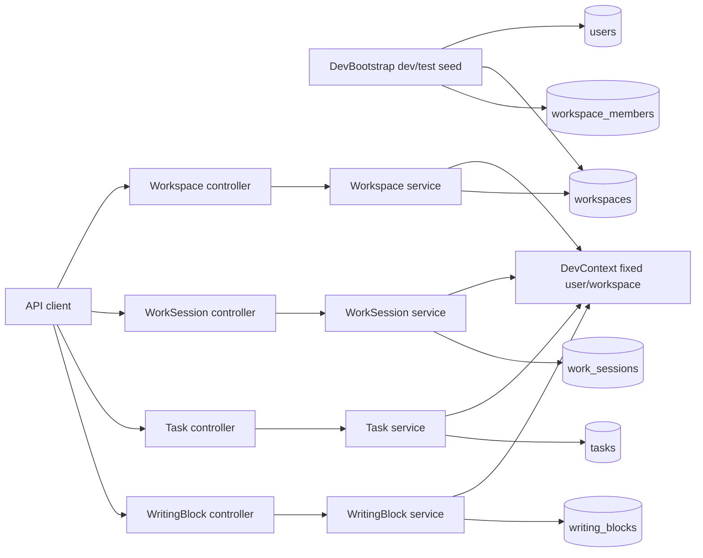
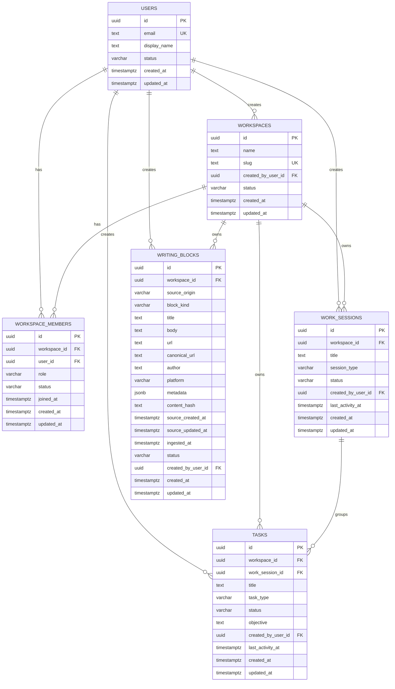

# API Domain Foundation Design

Date: 2026-07-04

## Purpose

Build the first Kotlin Spring Boot backend domain foundation for Plot. This
work establishes the workspace-scoped API shape that later authentication,
source adapters, agent execution, generation, packs, and source citation flows
can build on.

This is not the full v0 domain model. It intentionally stops at identity and
tenancy basics, durable work sessions and tasks, and the first source-material
object.

## Scope

Implement these packages under `apps/api/src/main/kotlin/com/plot/api/`:

```txt
common/
dev/
workspace/
worksession/
task/
writingblock/
```

Use full domain names in code where ambiguity matters:

- `WorkSession`, package `worksession`
- `WritingBlock`, package `writingblock`

Keep external API paths short:

- `/api/sessions` maps to `WorkSession`
- `/api/blocks` maps to `WritingBlock`

## Out Of Scope

Do not implement these in this foundation pass:

- authentication or authorization
- workspace member management APIs
- delete endpoints
- archive, cancel, ignore, or restore endpoints
- agent runs
- generation runs
- content packs or variants
- citations or source references
- source repositories, repository watches, repository imports, or connections
- scheduled or batch automation recipes and run history
- pagination

## Architecture

Controllers own HTTP concerns and request/response DTOs. Services own domain
defaults, workspace scoping, validation, and repository orchestration.
Repositories are Spring Data JPA interfaces. Entities are persistence-only and
must not be returned directly from controllers.

The `dev` package is temporary infrastructure for unauthenticated development.
It provides a fixed user and workspace context until real authentication is
introduced. Domain packages should depend on the current context abstraction,
not embed development-only IDs directly.



## Database Schema

Create Flyway migration `V1__core_schema.sql` as schema only. Do not seed
development data in Flyway.

Tables:

```txt
users
workspaces
workspace_members
work_sessions
tasks
writing_blocks
```

Use PostgreSQL `uuid` columns for all IDs. IDs are generated by the application,
not by database defaults.

Shared conventions:

- primary key `id uuid`
- `created_at timestamptz not null`
- `updated_at timestamptz not null` where rows are mutable
- workspace-scoped tables include `workspace_id uuid not null`
- workspace-scoped tables include `unique (workspace_id, id)`
- `status varchar not null`
- no `is_deleted`
- no `deleted_at`
- no `DELETED` status value
- no `default gen_random_uuid()`

### ID Policy

Use UUIDv7 for generated IDs. Keep the database type as PostgreSQL `uuid`.
Generate IDs in application code through `common/UuidGenerator`.

Development constants may use fixed UUID values for repeatability. New domain
records created by services should receive IDs from `UuidGenerator`.

### Tables

`users`:

- `id`
- `email`
- `display_name`
- `status`
- timestamps

`workspaces`:

- `id`
- `name`
- `slug`
- `created_by_user_id`
- `status`
- timestamps

`workspace_members`:

- `id`
- `workspace_id`
- `user_id`
- `role`
- `status`
- `joined_at`
- timestamps

`work_sessions`:

- `id`
- `workspace_id`
- `title`
- `session_type`
- `status`
- `created_by_user_id`
- `last_activity_at`
- timestamps

`tasks`:

- `id`
- `workspace_id`
- `work_session_id`
- `title`
- `task_type`
- `status`
- `objective`
- `created_by_user_id`
- `last_activity_at`
- timestamps

`writing_blocks`:

- `id`
- `workspace_id`
- `source_origin`
- `block_kind`
- `title`
- `body`
- `url`
- `canonical_url`
- `author`
- `platform`
- `metadata`
- `content_hash`
- `source_created_at`
- `source_updated_at`
- `ingested_at`
- `status`
- `created_by_user_id`
- timestamps

Do not add nullable repository, import, or connection foreign keys yet. Those
belong with the first source adapter implementation.

### Core ERD



## Development Context

Introduce `DevContext` with fixed:

- `devUserId`
- `devWorkspaceId`

Introduce `DevBootstrap` for dev/test execution. It should ensure, idempotently:

- a dev user exists
- a dev workspace exists
- a workspace membership connects the user to the workspace

The bootstrap-created membership should use role `OWNER` and status `ACTIVE`.

Flyway remains schema-only; development seed data belongs to `DevBootstrap`.

## Status Ownership

Status is a lifecycle field owned by domain services, not a generic mutable
property in update requests.

Initial statuses:

- `Workspace`: `ACTIVE`
- `WorkspaceMember`: `ACTIVE`
- `WorkSession`: `OPEN`
- `Task`: `QUEUED`
- `WritingBlock`: `ACTIVE`

Update request DTOs must not include `status`. Status transition endpoints can
be added later as explicit domain commands.

## API Contract

Implement these endpoints:

```txt
GET    /api/workspaces
GET    /api/workspaces/{id}
PATCH  /api/workspaces/{id}

GET    /api/sessions
POST   /api/sessions
GET    /api/sessions/{id}
PATCH  /api/sessions/{id}

GET    /api/tasks
POST   /api/tasks
GET    /api/tasks/{id}
PATCH  /api/tasks/{id}

GET    /api/blocks
POST   /api/blocks
GET    /api/blocks/{id}
PATCH  /api/blocks/{id}
```

Do not implement `POST /api/workspaces`. The dev workspace is provided by
bootstrap, and unauthenticated workspace creation would blur tenancy semantics.

All API reads and writes must operate within `DevContext.devWorkspaceId`.
Requests for resources outside the dev workspace should return `404 Not Found`.

### DTO Policy

Each domain API should define request and response DTOs:

- `CreateXRequest`
- `UpdateXRequest`
- `XResponse`

Entities must not be serialized directly.

Expose `workspace.id` from workspace responses. Do not expose `workspaceId` from
session, task, or writing block responses during the dev-context foundation.

### Workspace API

`GET /api/workspaces` returns the current dev workspace list. For this phase it
will normally contain one workspace.

`PATCH /api/workspaces/{id}` allows content updates such as `name` and `slug`.
It does not allow status changes.

### Work Session API

Create/update fields:

- `title`

The request DTO does not need to expose `sessionType` in this foundation pass.
The service should set `sessionType` to `CHAT` and `status` to `OPEN`.

### Task API

Create/update fields:

- `sessionId`
- `title`
- `taskType`
- `objective`

If `sessionId` is provided, it must identify a work session in the current dev
workspace. `status` defaults to `QUEUED`.

### Writing Block API

Create/update fields:

- `sourceOrigin`
- `blockKind`
- `title`
- `body`
- `url`
- `canonicalUrl`
- `author`
- `platform`
- `metadata`
- `sourceCreatedAt`
- `sourceUpdatedAt`

`status` defaults to `ACTIVE`. `ingestedAt` is set by the service when a block
is created.

## Validation And Errors

Minimum validation:

- workspace `name` and `slug` must not be blank
- task `title` and `taskType` must be present
- task `sessionId`, when provided, must belong to the current workspace
- writing block must include at least one of `title` or `body`
- writing block `sourceOrigin` and `blockKind` must be present

Use a small common error response:

```json
{
  "error": "NOT_FOUND",
  "message": "Work session not found"
}
```

Use `404 Not Found` for missing resources and resources outside the current dev
workspace. Use `400 Bad Request` for invalid request payloads or invalid
references in create/update payloads.

## Testing

`just test-api` should run Spring Boot integration tests backed by
Testcontainers PostgreSQL, Flyway, JPA, and MockMvc.

Use the existing `TestcontainersConfiguration` with `pgvector/pgvector:pg16`.

Test coverage should include:

- application context starts
- Flyway V1 applies to PostgreSQL
- `DevBootstrap` creates dev user, workspace, and membership
- `DevBootstrap` is idempotent
- `/api/workspaces` list, detail, and update
- `/api/sessions` create, list, detail, and update
- session responses do not expose `workspaceId`
- `/api/tasks` create, list, detail, and update
- task creation rejects invalid `sessionId`
- task responses do not expose `workspaceId`
- `/api/blocks` create, list, detail, and update
- block creation rejects payloads where both `title` and `body` are blank
- block responses do not expose `workspaceId`
- rows in another workspace do not appear in dev-context API reads

Use `@SpringBootTest`, `@AutoConfigureMockMvc`, and
`@Import(TestcontainersConfiguration::class)` for API integration tests.

## Implementation Notes

Prefer explicit repository methods that include `workspaceId`, such as
`findByWorkspaceIdAndId`, for workspace-scoped resources. This keeps tenant
scoping visible in service code.

Use PostgreSQL `jsonb` for JSON-like columns such as `metadata`. Keep their
structure unconstrained in this foundation pass, but preserve JSON-shaped
request and response fields in the API contract.

Scheduled and batch automation should be modeled later as a separate recipe/run
domain rather than as a generic task mode. A future scheduled automation can
create tasks or task runs, but this foundation keeps `Task` as a single
user-visible work item.

Do not add task due dates in this foundation. Plot tasks are short-running
update-generation or citation-preparation units, not long-lived
project-management tasks with deadline workflows.

Do not add task priority in this foundation. Plot tasks are not a general
project-management queue, and there is no priority-based scheduler or SLA in
the product model.

Do not model review as a selectable `review_mode`. Plot should provide
source-cited generated content and human-controlled publishing, not a formal
in-product approval workflow. Future source support should use citations,
source references, and content metadata rather than a review mode enum.

Do not add generic `source_scope` fields to work sessions or tasks in this
foundation. Source range belongs to future source/import, recipe, and generation
models where it can be validated against real connected sources.

Avoid introducing general abstractions until duplication becomes meaningful.
The first implementation should optimize for clear domain boundaries over a
generic CRUD framework.
